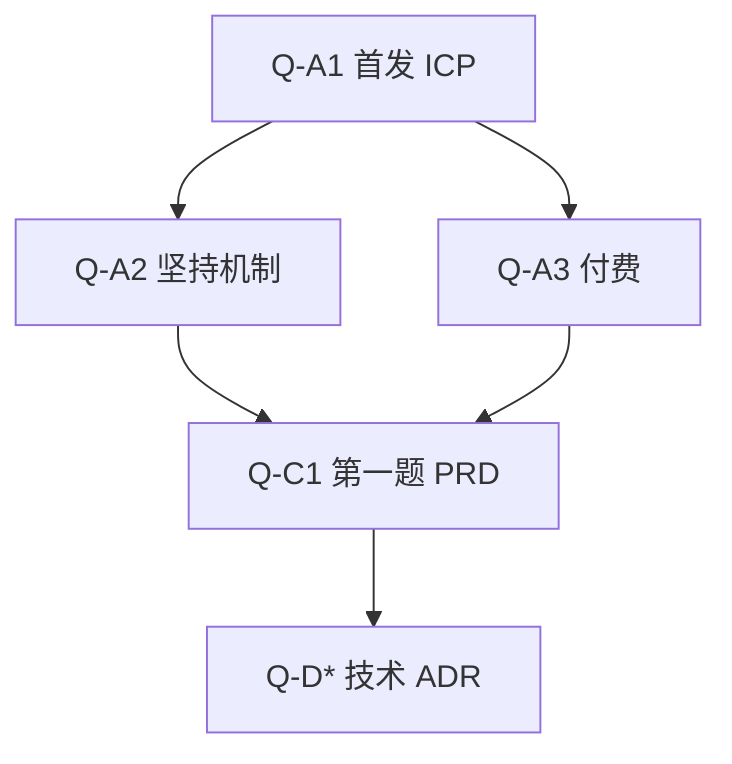

# Open Questions — 未决问题

记录**尚未决定**或**证据不足**的问题。  
解决问题后：移入决策记录 / ADR / 假设台账结果，并更新本页与 [[Project_Dashboard]]。

状态：`Open` | `Blocked` | `Resolved`

---

## A. 产品发现（P0）

| ID | 问题 | 状态 | 关联 | 如何关闭 |
|----|------|------|------|----------|
| Q-A1 | 第一个 MVP 服务哪类用户？ | Open | H8, ICP | 10 访谈 + 框架打分 |
| Q-A2 | 用户坚持失败的主因是什么？ | Open | H2 | 断裂时间线编码 |
| Q-A3 | 用户是否更愿为反馈/效率付费？ | Open | H4 | 付费事实访谈 |
| Q-A4 | 能力不可见是否驱动囤课？ | Open | H3 | 「如何证明你会」 |
| Q-A5 | 用户对 AI 辅导的信任边界？ | Open | H5 | AI 使用经历追问 |
| Q-A6 | 动态路径是否真优于固定课表？ | Open | H6 | 情境二选一 |
| Q-A7 | 游戏化对进阶者是否反噬？ | Open | H7 | 分群感受 |

## B. 市场与定位

| ID | 问题 | 状态 | 关联 | 如何关闭 |
|----|------|------|------|----------|
| Q-B1 | AI Native 成长系统空隙是否真实存在于目标用户心智？ | Open | Market | 访谈概念探针 |
| Q-B2 | 相对通用 AI 聊天，用户愿为「带路径的系统」多付多少？ | Open | H4/H5 | 付费意愿（行为优先） |
| Q-B3 | 中国与海外用户差异？ | Open | — | 分样本或后续研究 |
| Q-B4 | 可服务市场规模（TAM/SAM/SOM）？ | Open | — | 需专门研究（非本阶段） |

## C. 产品边界（PRD 前）

| ID | 问题 | 状态 | 如何关闭 |
|----|------|------|----------|
| Q-C1 | 问题级 PRD 的第一题应聚焦哪一痛点？ | Open | ICP + MVP Review 后 |
| Q-C2 | 「有效成长会话」的用户可感知最小定义？ | Open | 调研 + NSM 校准 |
| Q-C3 | 免费/付费价值边界？ | Open | MVP Freemium Review + 访谈 |
| Q-C4 | 原则 9 Growth Before Monetization 正式内容 | **Resolved** | [[Decision_Log]] D-031 |
| Q-C5 | 付费「更强问题」列表细节 | Open | PRD + 持续验证 |
| Q-C6 | 目标驱动八步环是否产品真源 | **Resolved** = Core Growth Loop v1.0 | [[Decision_Log]] D-033 |

## D. 技术（全部未决 — 禁止提前锁死）

| ID | 问题 | 状态 | 如何关闭 |
|----|------|------|----------|
| Q-D1 | 前端技术栈？ | Open | Phase 2 ADR |
| Q-D2 | 后端技术栈？ | Open | Phase 2 ADR |
| Q-D3 | 数据存储？ | Open | Phase 2 ADR |
| Q-D4 | AI 模型/服务商？ | Open | Phase 2 ADR + H5 |
| Q-D5 | 部署与云？ | Open | Phase 2/运维 ADR |

## E. 治理与运营

| ID | 问题 | 状态 | 如何关闭 |
|----|------|------|----------|
| Q-E1 | License？ | Open | 法律/策略决定 |
| Q-E2 | 默认 Git 主分支命名（master/main）？ | Open | 团队约定 |
| Q-E3 | 是否需要远程 Git 托管？ | Open | 创始人决定 |

---

## 优先级视图

**当前只应推进 A 类（发现）；D 类禁止用实现去「顺便决定」。**
