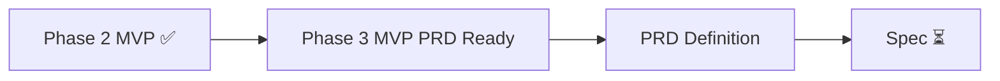

---
title: LeapMa 项目仪表盘
type: project
status: active
owner: ""
created: 2026-07-20
updated: 2026-07-21
tags:
  - project
  - dashboard
  - leapma
---

# Project Dashboard — 项目总览

> **AI 与人类的默认入口。** 会话开始先读本页。

最后更新：`2026-07-21`  
本地 Git 根：`LeapMa/ai-engineer-os/`

---

## 1. 项目当前阶段

| 项 | 值 |
|----|-----|
| **阶段** | **Phase 3 — MVP PRD Definition Ready** |
| **Phase 2** | ✅ 定稿（待本轮 Finalization Founder Review 确认文档落盘） |
| **SDD 位置** | Vision ✅ → Research 🔄 → Product ✅（MVP 模型）→ **PRD ⏳** → Spec ❌ → Code ❌ |

---

## 2. 当前目标

1. Founder **确认 Phase 2 Finalization 落盘**（原则 9 / Loop v1.0 / Decision Log）  
2. 确认后立即开始 **MVP PRD Definition**  
3. Continuous Validation 并行（不阻塞）  
4. 禁止：代码 / DB / API / 技术选型 / UI  

---

## 3. 已完成事项

| 项 | 入口 |
|----|------|
| Phase 0–1.7 | 体系 / 愿景 / 调研 / 治理 |
| Phase 2 MVP 模型 | [[MVP/README]] |
| 原则 9 Growth Before Monetization | [[Product_Principles]] |
| Core Growth Loop **v1.0** 产品真源 | [[Core_Growth_Loop]] |
| Monetization Signal + WTP | [[Success_Metrics]] |
| Decision Log Phase 0–2 | [[Decision_Log]] |

---

## 4. 进行中事项

| 事项 | 状态 |
|------|------|
| Phase 2 Finalization Founder Review | **等待中**（按要求未 commit） |
| MVP PRD Definition | **Ready to start**（Review 通过后） |
| Continuous Validation | 并行 |

---

## 5. 下一步计划

| 顺序 | 行动 |
|------|------|
| 1 | Founder 确认本轮定稿文档 |
| 2 | 撰写 MVP PRD（功能须映射 GL-1…GL-8） |
| 3 | PRD 批准 → Spec（仍无代码） |

---

## 6. 产品真源（速查）

| 真源 | 文档 |
|------|------|
| 愿景 | [[LeapMa_Vision]] |
| 原则 | [[Product_Principles]]（含 P9） |
| 成长环 v1.0 | [[Core_Growth_Loop]] |
| NSM | [[Product_North_Star]] |
| 决策 | [[Decision_Log]] |

---

## 7. 当前风险

| 风险 | 备注 |
|------|------|
| R4/R1 AI 沦为聊天 | 仍最高优先 Hypothesis |
| PRD 不映射 Growth Loop | 违反 D-033 |
| 过早变现拆环 | 违反 P9 |

---

## 8. Review 清单

- [ ] Phase 2 Finalization 通过  
- [ ] 通过后可 commit  
- [ ] 启动 MVP PRD  
