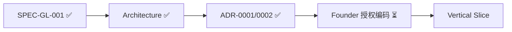

---
title: LeapMa 项目仪表盘
type: project
status: active
owner: ""
created: 2026-07-20
updated: 2026-07-21
tags:
  - project
  - dashboard
  - leapma
---

# Project Dashboard — 项目总览

最后更新：`2026-07-21`

---

## 1. 项目当前阶段

| 项 | 值 |
|----|-----|
| **阶段** | **Phase 5 — Architecture Approved（待授权编码）** |
| **SDD** | Vision ✅ → Product ✅ → Spec ✅ → **Arch ✅** → Code ⏳ |

---

## 2. 当前目标

1. Founder **显式授权**后，实现 SPEC-GL-001 垂直切片  
2. Continuous Validation 并行（AQ-003/004 仍 Hypothesis）  
3. **本任务不 commit**；未授权前仍禁止业务代码  

---

## 3. 已完成

| 项 | 入口 |
|----|------|
| SPEC-GL-001 | **Approved** |
| Architecture | [[SPEC-GL-001_Architecture]] **Approved** |
| ADR-0001 | Python 单应用 **Accepted** |
| ADR-0002 | MySQL Primary Store **Accepted** |
| AQ-001 / AQ-002 | Resolved（SSR Web；可替换 LLM Provider） |

---

## 4. 进行中

| 事项 | 状态 |
|------|------|
| 垂直切片实现 | **等待 Founder 显式授权**（未开始） |
| 文档 commit（建议） | **等待中**（Execution 不执行） |

---

## 5. 下一步

| 顺序 | 行动 |
|------|------|
| 1 |（建议）commit Spec + Arch + ADR Accepted |
| 2 | Founder 授权垂直切片 Prompt |
| 3 | Python SSR 最小环实现（对齐 AC-01…04） |

---

## 6. 真源速查

| 真源 | 文档 |
|------|------|
| Spec | [[features/SPEC-GL-001_First_Growth_Experience]] |
| Arch | [[SPEC-GL-001_Architecture]] |
| ADR | [[ADR-0001_Runtime_Stack_for_SPEC-GL-001]] · [[ADR-0002_Primary_Store_for_SPEC-GL-001]] |

---

## 7. Review

- [x] Architecture Approved  
- [x] ADR-0001 / ADR-0002 Accepted  
- [ ] Founder 授权编码  
- [ ] **按要求：不要 commit**  
