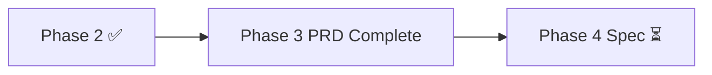

---
title: LeapMa 项目仪表盘
type: project
status: active
owner: ""
created: 2026-07-20
updated: 2026-07-21
tags:
  - project
  - dashboard
  - leapma
---

# Project Dashboard — 项目总览

最后更新：`2026-07-21`

---

## 1. 项目当前阶段

| 项 | 值 |
|----|-----|
| **阶段** | **Phase 3 — MVP PRD Complete** |
| **含义** | PRD 方向与聚焦已 Founder 批准；定稿文档待最终确认后 commit |
| **SDD** | Vision ✅ → MVP 模型 ✅ → **PRD ✅（待 commit）** → Spec ❌ → Code ❌ |

---

## 2. 当前目标

1. Founder **最终确认**本轮定稿落盘（Primary / 4+4 / Hard No / D-039）  
2. 确认后 **commit** Phase 3  
3. 下一阶段准备：**Specification**（仍禁止代码 / UI / DB）  
4. Continuous Validation 并行  

---

## 3. 已完成

| 项 | 入口 |
|----|------|
| Phase 2 | `cca5bd0` · [[Decision_Log]] |
| Primary Problem（定稿表述） | [[MVP_Core_Problem]] |
| Must US = 4 / Must AC = 4 | [[User_Stories]] · [[Acceptance_Criteria]] |
| Hard No | [[MVP_Out_of_Scope]] |
| D-039 | [[Decision_Log]] |

---

## 4. 进行中

| 事项 | 状态 |
|------|------|
| Phase 3 Final Review 确认 | **等待中**（未 commit） |

---

## 5. 下一步

| 顺序 | 行动 |
|------|------|
| 1 | Founder 最终确认 → commit |
| 2 | Phase 4：按 PRD 写 Spec（映射 GL + AC） |
| 3 | 仍禁止：代码 / 架构抢跑 / DB / UI |

---

## 6. 产品真源速查

| 真源 | 文档 |
|------|------|
| Primary Problem | [[MVP_Core_Problem]] |
| Growth Loop v1.0 | [[Core_Growth_Loop]] |
| D-039 | MVP validates growth loop, not feature completeness |
| 原则 9 | Growth Before Monetization |

---

## 7. Review

- [ ] Final Review 通过  
- [ ] 通过后 commit  
- [ ] **按要求：现在不要 commit**  
