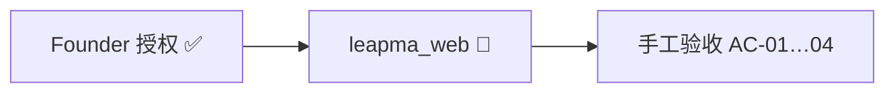

---
title: LeapMa 项目仪表盘
type: project
status: active
owner: ""
created: 2026-07-20
updated: 2026-07-21
tags:
  - project
  - dashboard
  - leapma
---

# Project Dashboard — 项目总览

最后更新：`2026-07-21`

---

## 1. 项目当前阶段

| 项 | 值 |
|----|-----|
| **阶段** | **Phase 5 — Vertical Slice 进行中（SPEC-GL-001）** |
| **SDD** | Spec ✅ → Arch ✅ → **Code 🔄** → Test ⏳ |

---

## 2. 当前目标

1. 跑通 / 验收 `apps/leapma_web` First Growth Experience  
2. Continuous Validation 并行  
3. **不自动 commit**（Founder 手动）  

---

## 3. 已完成

| 项 | 入口 |
|----|------|
| Spec / Arch / ADR-0001/0002 | Approved / Accepted |
| ADR-0003 | Flask SSR **Accepted** |
| 垂直切片代码 | [`apps/leapma_web`](../../apps/leapma_web/README.md) |

---

## 4. 进行中

| 事项 | 状态 |
|------|------|
| SPEC-GL-001 垂直切片 | **实现已落地；待本地验收 / Founder commit** |

---

## 5. 下一步

| 顺序 | 行动 |
|------|------|
| 1 | 按 app README 启动并用 Mock 走通 AC |
| 2 |（可选）接 MySQL + openai_compatible |
| 3 | Founder 手动 commit |

---

## 6. Review

- [x] Founder 显式授权编码  
- [ ] 手工验收通过  
- [ ] **不要由 Agent commit**  
