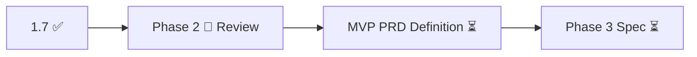

---
title: LeapMa 项目仪表盘
type: project
status: active
owner: ""
created: 2026-07-20
updated: 2026-07-21
tags:
  - project
  - dashboard
  - leapma
---

# Project Dashboard — 项目总览

> **AI 与人类的默认入口。** 会话开始先读本页，再按需下钻。

最后更新：`2026-07-21`  
本地 Git 根：`LeapMa/ai-engineer-os/` → [GitHub](https://github.com/LeapMaCoder/ai-engineer-os)

---

## 1. 项目当前阶段

| 项 | 值 |
|----|-----|
| **阶段** | **Phase 2 — MVP Definition Review**（首轮方向已通过；修订后 **待 Founder Review**） |
| **下一阶段** | **MVP PRD Definition** |
| **SDD 位置** | Vision ✅ → Research 🔄（Continuous Validation）→ Product 🔄 → Spec ❌ → Code ❌ |

---

## 2. 当前目标

1. Founder **二次 Review** 本轮修订（原则 9 / 成长环 / Monetization Signal / 非阻塞调研）  
2. Review 通过后进入 **MVP PRD Definition**  
3. User Research **持续验证**（与 PRD 并行，**不阻塞**）  
4. 禁止：代码 / DB / API / 技术选型 / UI  

---

## 3. 已完成事项

| 项 | 入口 |
|----|------|
| Phase 0–1.7 体系与治理 | [[Project_Map]] |
| Phase 2 MVP 包（首轮方向通过） | [[MVP/README]] |
| 本轮修订：Growth Before Monetization、目标驱动闭环、Monetization Signal、Continuous Validation | 见下 |

---

## 4. 进行中事项

| 事项 | 状态 |
|------|------|
| Founder Review（修订版 Phase 2） | **等待中** |
| Continuous Validation 访谈 | 可并行，非门禁 |
| MVP PRD Definition | **下一阶段**（Review 后开始） |

---

## 5. 下一步计划

| 顺序 | 行动 |
|------|------|
| 1 | Founder Review 本轮修订 |
| 2 | 启动 **MVP PRD Definition** |
| 3 | 持续访谈喂假设台账（不阻塞 PRD） |
| 4 | PRD 批准后再进 Spec（仍无代码） |

---

## 6. 核心假设（摘要）

H1–H8：多为 Unvalidated（持续验证中）  
M1 免费闭环留存、M2 付费来自天花板：Hypothesis  
原则 9：Growth Before Monetization（修订稿）

---

## 7. 当前风险

| 风险 | 备注 |
|------|------|
| R4/R1 AI→沦为聊天 | 仍为最高优先级 Hypothesis |
| 违反 Growth Before Monetization | 用锁功能假转化 |
| 把访谈重新当成开发阻塞 | 已明确禁止 |

---

## 8. 文档地图

| 主题 | 文档 |
|------|------|
| MVP | [[MVP/README]] |
| 原则 9 | [[Product_Principles]] |
| 成长环 | [[Core_Growth_Loop]] |
| 指标 | [[Success_Metrics]] |
| 索引 | [[docs/INDEX]] |

---

## 9. Review 状态

- [ ] 本轮修订 Founder Review 通过  
- [ ] 通过后改 MVP 文档 status → 可进入 PRD  
- [ ] **按要求：暂不 commit**  
