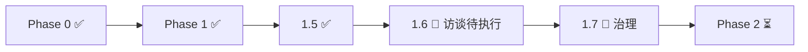

---
title: LeapMa 项目仪表盘
type: project
status: active
owner: ""
created: 2026-07-20
updated: 2026-07-20
tags:
  - project
  - dashboard
  - leapma
---

# Project Dashboard — 项目总览

> **AI 与人类的默认入口。** 会话开始先读本页，再按需下钻。  
> 重要文档变更后必须同步本页（见 `.cursor/rules/global/document-navigation-rule.mdc`）。

最后更新：`2026-07-21`  
本地 Git 根目录：`LeapMa/ai-engineer-os/` → [GitHub](https://github.com/LeapMaCoder/ai-engineer-os)  
文档编号：`00_Project` → `01_Vision` → … → `11_Operations`（已消除双 `00_`）

---

## 1. 项目当前阶段

| 项 | 值 |
|----|-----|
| **阶段** | **Phase 1.7 — Project Governance ✅**；主航道 **Phase 1.6 访谈待执行** |
| **主航道** | 用户发现（访谈）+ 状态治理已就绪 |
| **SDD 位置** | Vision ✅ → Research 🔄 → Product 🔄 → Spec ❌ → Arch ❌ → Code ❌ |

---

## 2. 当前目标

1. 让项目状态对 AI / 人类**始终可见**（Dashboard / Map / State / Questions）
2. 支撑创始人完成 **10 场用户访谈**，验证假设并选定首发 ICP
3. **禁止**功能设计、页面、技术方案、业务编码

---

## 3. 已完成事项

| 阶段 | 完成内容 | 入口 |
|------|----------|------|
| Phase 0 | Monorepo、SDD 文档体系、模板、Cursor Rules、AI 角色与流程 | [[docs/README]] |
| Phase 1 | 愿景 / 原则 / 北极星 | [[LeapMa_Vision]] |
| Phase 1.5 | 用户 / 竞品留存 / 市场桌面调研 | [[02_Research/README]] |
| Phase 1.6 | 访谈体系 + ICP 决策框架（**访谈未执行**） | [[Interview_Plan]] |
| Phase 1.7 | 项目导航与状态治理 | [[Project_Map]] |

---

## 4. 进行中事项

| 事项 | 负责人类型 | 状态 | 文档 |
|------|------------|------|------|
| 10 场创始人用户访谈 | Founder | 未开始执行 | [[Founder_Interview_Guide]] |
| 假设台账滚动更新 | 产品 / 研究 | 待访谈喂数据 | [[Hypothesis_Validation]] |
| 首发 ICP 打分决策 | 产品 | 待访谈后 | [[ICP_Decision_Framework]] |
| 治理文档保持同步 | AI + 人类 | 进行中 | 本页 / [[docs/INDEX]] |

---

## 5. 下一步计划

| 顺序 | 行动 | 完成定义 |
|------|------|----------|
| 1 | 执行访谈 I-001…I-010 | 10 份 [[Interview_Template]] |
| 2 | 更新 H1–H8 状态 | [[Hypothesis_Validation]] 非全 Unvalidated |
| 3 | ICP 加权打分 + 决策记录 | [[ICP_Decision_Framework]] |
| 4 | 进入问题级 PRD（仍非 Spec/代码） | `docs/03_Product/` |

详见 [[Roadmap]]。

---

## 6. 核心假设（摘要）

| ID | 摘要 | 状态 |
|----|------|------|
| H1 | 瓶颈主要不是缺内容 | Unvalidated |
| H2 | 坚持失败 ≈ 日程 + 反馈缺失 | Unvalidated（P0） |
| H3 | 能力不可见 → 囤课焦虑 | Unvalidated（P0） |
| H4 | 更愿为反馈/效率付费 | Unvalidated（P0） |
| H5 | AI 反馈可用但怕幻觉 | Unvalidated |
| H6 | 动态路径 > 固定课表 | Unvalidated |
| H7 | 游戏化可能反噬进阶者 | Unvalidated |
| H8 | 职场补技能更优首发 ICP | Unvalidated（P0） |

全文：[[Hypothesis_Validation]] · [[Problem_Hypothesis]]

---

## 7. 当前风险

| 风险 | 级别 | 缓解 |
|------|------|------|
| 未访谈就把 H8 当已定 ICP | 高 | 框架强制访谈后打分 |
| Hypothesis 被误读为 Confirmed | 高 | 证据标注纪律 |
| AI 开发导致文档漂移、状态不可见 | 高 | Dashboard / 导航规则 |
| 过早进入功能/技术 | 高 | SDD + Cursor Rules |
| AI 幻觉伤害未来信任（产品层） | 中 | 原则 6；访谈验证 H5 |

更多：[[Open_Questions]] · [[Current_State]]

---

## 8. 文档地图（速览）

| 想了解… | 去读 |
|---------|------|
| 项目现在怎样 | **本页** · [[Current_State]] |
| 目录与文档关系 | [[Project_Map]] · [[docs/INDEX]] |
| 阶段路线 | [[Roadmap]] |
| 未决问题 | [[Open_Questions]] |
| 为什么做 | [[LeapMa_Vision]] |
| 调研证据 | [[02_Research/README]] |
| 怎么开发 | [[Development_Workflow]] |

完整索引：[[docs/INDEX]]

---

## 9. 维护清单（每次重要变更）

- [ ] 更新本 Dashboard（阶段 / 进行中 / 下一步 / 风险）
- [ ] 更新 [[Project_Map]]（若增减目录或关键文档）
- [ ] 更新 [[docs/INDEX]]
- [ ] 必要时更新 [[Current_State]] / [[Open_Questions]] / [[Roadmap]]
- [ ] 根 [[README]] 阶段摘要与本页一致
