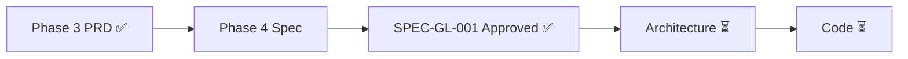

---
title: LeapMa 项目仪表盘
type: project
status: active
owner: ""
created: 2026-07-20
updated: 2026-07-21
tags:
  - project
  - dashboard
  - leapma
---

# Project Dashboard — 项目总览

最后更新：`2026-07-21`

---

## 1. 项目当前阶段

| 项 | 值 |
|----|-----|
| **阶段** | **Phase 4 — SPEC-GL-001 Approved** |
| **Phase 3** | ✅ MVP PRD Complete（commit `946235b`） |
| **SDD** | Vision ✅ → Product/PRD ✅ → **SPEC-GL-001 Approved ✅** → Arch ⏳ → Code ❌ |

---

## 2. 当前目标

1. **下一步：Architecture**（最小 Arch 笔记 / 必要 ADR）  
2. Continuous Validation 并行（ICP 仍 Hypothesis）  
3. **仍禁止业务代码**，直至 Architecture 门禁通过（垂直切片再小也须先有最小 Arch）  
4. **本任务不 commit**；建议 Founder 将 Foundation + SPEC-GL-001 一并 commit  

---

## 3. 已完成

| 项 | 入口 |
|----|------|
| Phase 3 PRD | commit `946235b` · [[PRD/README]] |
| Spec 基建 | [[04_Specifications/README]] · Template / Index / Status |
| SPEC-GL-001 | [[features/SPEC-GL-001_First_Growth_Experience]]（**Approved**；OQ 已定稿） |

---

## 4. 进行中

| 事项 | 状态 |
|------|------|
| Architecture（Phase 5 入口） | **未开始** |
| Founder commit（建议） | **等待中**（Execution 不执行） |

---

## 5. 下一步

| 顺序 | 行动 |
|------|------|
| 1 |（建议）Founder commit Spec Foundation + SPEC-GL-001 Approved |
| 2 | 写最小 Architecture / ADR |
| 3 | 再实现 First Growth Experience；仍禁无 Arch 编码 |

---

## 6. 产品真源速查

| 真源 | 文档 |
|------|------|
| Primary Problem | [[MVP_Core_Problem]] |
| Growth Loop v1.0 | [[Core_Growth_Loop]] |
| D-039 | 验证闭环非功能完整 |
| Spec 状态机 | [[Spec_Status]] |
| Feature 索引 | [[Feature_Index]] |
| First Growth Experience | [[features/SPEC-GL-001_First_Growth_Experience]] **Approved** |

---

## 7. Review

- [x] SPEC-GL-001 OQ 定稿 → Approved  
- [ ] **按要求：不要 commit**（建议 Founder 自行 commit）  
