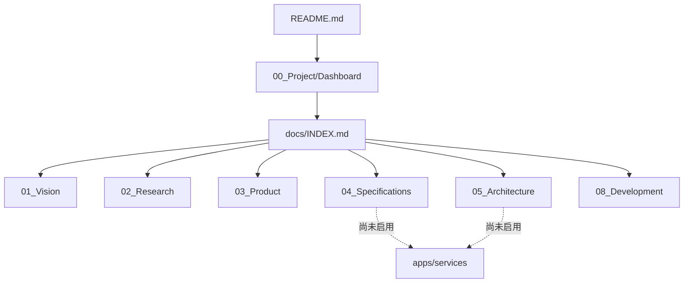
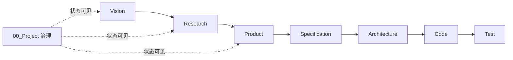
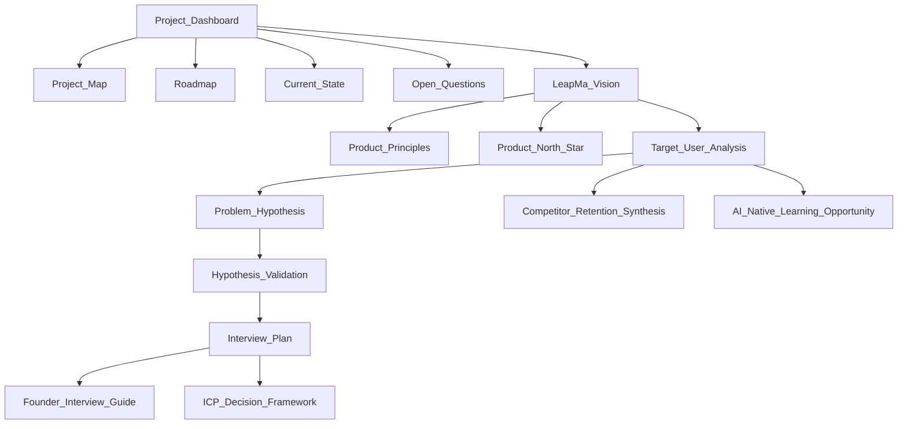

---
title: 项目地图
type: project
status: active
owner: ""
created: 2026-07-20
updated: 2026-07-20
tags:
  - project
  - map
  - leapma
---

# Project Map — 项目地图

描述仓库目录与文档关系。重要结构变更后须与 [[Project_Dashboard]]、[[docs/INDEX]] 同步。

## 1. 仓库顶层

产品名：**LeapMa**  
Git 仓库目录名 / GitHub：`ai-engineer-os`（本地位于 `LeapMa/ai-engineer-os/`）

```text
ai-engineer-os/           # Git 仓库根（与 GitHub 同名）
├── docs/                 # Source of Truth
├── apps/                 # 应用（空）
├── services/             # 服务（空）
├── packages/             # 共享库（空）
├── infrastructure/       # 基础设施（空）
├── tests/                # 跨切面测试（空）
├── scripts/              # 脚本（空）
├── .cursor/              # AI Rules
├── .github/              # GitHub（占位）
├── README.md             # 人类入口
├── CHANGELOG.md
└── .env.example
```



## 2. docs 权威链路



## 3. docs 目录职责

| 目录 | 职责 | 当前状态 |
|------|------|----------|
| `00_Project/` | 导航、阶段、状态、未决问题、决策日志 | **活跃** |
| `01_Vision/` | 使命愿景原则北极星 | 活跃 |
| `02_Research/` | 用户/竞品/市场/访谈 | 活跃（持续验证） |
| `03_Product/` | MVP 定稿 / PRD Complete | ✅ |
| `04_Specifications/` | Spec 体系；SPEC-GL-001 **Approved** | ✅ |
| `05_Architecture/` | SPEC-GL-001 最小架构 **Approved** | ✅ |
| `06_ADR/` | ADR-0001/0002/0003 **Accepted** | ✅ |
| `apps/leapma_web/` | 垂直切片实现 | **Phase 5 🔄** |
| `07_Sprint/` | Sprint | 空 |
| `08_Development/` | 流程与 AI 角色 | 活跃 |
| `09_Testing/` | 测试策略 | 空 |
| `10_Release/` | 发布 | 空 |
| `11_Operations/` | 运维 | 空 |
| `templates/` | 通用 SDD 模板 | 活跃（Spec 执行模板以 04 为准） |
| `Archive/` | 归档 | 空 |

## 4. 关键文档关系（当前）



## 5. Research 子树

```text
02_Research/
├── User/                 # 桌面用户分析
├── User_Interview/       # 创始人访谈体系
├── Competitors/          # 留存视角竞品
└── Market/               # 市场机会假设
```

## 6. Cursor Rules 地图

```text
.cursor/rules/
├── global/     # SDD + 文档导航同步
├── product/
├── architecture/
├── backend/
├── frontend/
├── ai/
├── testing/
└── review/
```

## 7. 维护规则

新增/移动/废止**重要文档**时：

1. 更新本 Map（若影响结构或关系）
2. 更新 [[Project_Dashboard]]
3. 更新 [[docs/INDEX]]
