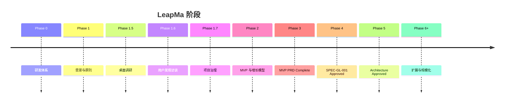

---
title: 产品路线图
type: project
status: active
owner: ""
created: 2026-07-20
updated: 2026-07-21
tags:
  - project
  - roadmap
  - leapma
---

# Roadmap — 阶段路线图

> 路线图描述**阶段目标**，不是功能 backlog。  
> 未完成上游门禁前，禁止跳入编码。

---

## Phase 0 — 项目初始化与研发体系 ✅

**目标：** AI Native SDD 地基

**完成标志：**

- Monorepo 骨架与目录 README
- docs 体系与模板
- Cursor Rules / AI 角色 / 开发流程
- Git 初始化

**状态：** 完成

---

## Phase 1 — Product Foundation ✅

**目标：** 产品战略真源

**完成标志：**

- [[LeapMa_Vision]]
- [[Product_Principles]]
- [[Product_North_Star]]

**状态：** 完成

---

## Phase 1.5 — Research Validation ✅（桌面）

**目标：** 验证产品假设（桌面层）

**完成标志：**

- 用户分析 / 问题假设
- 竞品留存分析
- AI Native 市场机会文档
- 结论标注 Confirmed / Hypothesis / Unknown

**状态：** 桌面部分完成；**一手验证未完成**（转入 1.6）

---

## Phase 1.6 — Founder User Discovery 🔄

**目标：** 确定 MVP 首发人群

**完成标志：**

- 访谈体系就绪 ✅
- **10 场访谈执行** ⏳
- Hypothesis 台账更新 ⏳
- ICP 决策记录 ⏳

**状态：** 体系完成，执行中/待执行

---

## Phase 1.7 — Project Governance ✅

**目标：** 项目状态对 AI/人类可见

**状态：** ✅ 完成

---

## Phase 2 — MVP & Growth Model Definition ✅

**目标：** 定义第一个 MVP，并同时考虑免费留存与付费转化

**完成标志：**

- `docs/03_Product/MVP/` 文档包
- Freemium 价值差异（非残缺锁功能）
- 成功指标与风险
- Founder Review 通过

**状态：** ✅ 定稿（commit `cca5bd0`）

---

## Phase 3 — MVP PRD Definition ✅

**目标：** 以 Problem First 定义第一个 MVP 要解决的核心用户问题

**完成标志：**

- Primary Problem 定稿
- Must User Stories = 4；Must AC = 4
- Hard No 确认
- D-039：MVP validates growth loop, not feature completeness
- Founder Final Review 方向批准

**状态：** ✅ **MVP PRD Complete**（commit `946235b`）

**禁止（仍有效）：** 代码 / 技术架构抢跑 / 数据库 / UI

**下一阶段：** Phase 4 Specification Foundation

---

## Phase 4 — Specification Foundation + SPEC-GL-001 ✅

**目标：** Spec 体系就绪；整环第一刀 **SPEC-GL-001** Approved

**完成标志：**

- `docs/04_Specifications/` 模板 / 索引 / 状态机
- SPEC-GL-001 正文 Approved（OQ 定稿；整环不八拆）
- AC / AI Behavior 未削弱；Hard No / D-031 / D-033 / D-039 保持

**状态：** ✅ **SPEC-GL-001 Approved**（见 [[features/SPEC-GL-001_First_Growth_Experience]]）  
建议 Founder 将 Foundation + Spec **一并 commit**（Execution 不执行）

**禁止（仍有效至 Arch）：** 无 Architecture 的业务代码 / UI / DB / API；按 GL 拆 8 个大 Spec

**其后：** Phase 5 Architecture（最小 Arch / 必要 ADR）→ 再实现

---

## Phase 5 — Architecture & First Vertical Slice 🔄

**目标：** SPEC-GL-001 最小架构 + ADR Accepted；授权后实现垂直切片

**架构门禁：** ✅ [[SPEC-GL-001_Architecture]] **Approved** · ADR-0001/0002 **Accepted**

**当前：** 门禁已过；垂直切片 `apps/leapma_web` **已落地**（待手工验收 / Founder commit）

**禁止：** K8s/微服务；PHP 主栈；Hard No 域

**其后：** 验收 AC → commit → 迭代真实 LLM / MySQL 生产配置

---

## Phase 6+ — Expand & Operate ⏳

**方向（非承诺）：** 图谱深化、护栏内游戏化、多端、运维、NSM 迭代

**状态：** 未开始

---

## 阶段门禁总览

| 从 | 到 | 门禁 |
|----|-----|------|
| Phase 3 | Phase 4 | PRD Complete |
| Phase 4 | SPEC-GL-001 Approved | OQ 定稿 + Founder 批准 |
| SPEC Approved | Architecture Approved | Arch + ADR Accepted |
| Arch Approved | 垂直切片实现 | **Founder 显式授权编码** |

详见 [[Development_Workflow]]。
