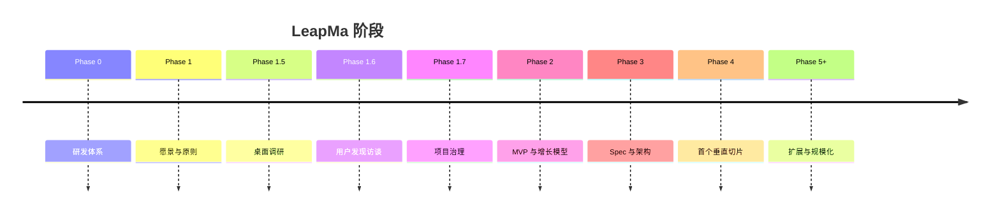

---
title: 产品路线图
type: project
status: active
owner: ""
created: 2026-07-20
updated: 2026-07-21
tags:
  - project
  - roadmap
  - leapma
---

# Roadmap — 阶段路线图

> 路线图描述**阶段目标**，不是功能 backlog。  
> 未完成上游门禁前，禁止跳入编码。

---

## Phase 0 — 项目初始化与研发体系 ✅

**目标：** AI Native SDD 地基

**完成标志：**

- Monorepo 骨架与目录 README
- docs 体系与模板
- Cursor Rules / AI 角色 / 开发流程
- Git 初始化

**状态：** 完成

---

## Phase 1 — Product Foundation ✅

**目标：** 产品战略真源

**完成标志：**

- [[LeapMa_Vision]]
- [[Product_Principles]]
- [[Product_North_Star]]

**状态：** 完成

---

## Phase 1.5 — Research Validation ✅（桌面）

**目标：** 验证产品假设（桌面层）

**完成标志：**

- 用户分析 / 问题假设
- 竞品留存分析
- AI Native 市场机会文档
- 结论标注 Confirmed / Hypothesis / Unknown

**状态：** 桌面部分完成；**一手验证未完成**（转入 1.6）

---

## Phase 1.6 — Founder User Discovery 🔄

**目标：** 确定 MVP 首发人群

**完成标志：**

- 访谈体系就绪 ✅
- **10 场访谈执行** ⏳
- Hypothesis 台账更新 ⏳
- ICP 决策记录 ⏳

**状态：** 体系完成，执行中/待执行

---

## Phase 1.7 — Project Governance ✅

**目标：** 项目状态对 AI/人类可见

**状态：** ✅ 完成

---

## Phase 2 — MVP & Growth Model Definition 🔄

**目标：** 定义第一个 MVP，并同时考虑免费留存与付费转化

**完成标志：**

- `docs/03_Product/MVP/` 文档包
- Freemium 价值差异（非残缺锁功能）
- 成功指标与风险
- Founder Review 通过

**状态：** 📝 首轮方向通过；修订稿（目标驱动环 / Growth Before Monetization / Monetization Signal / Continuous Validation）**等待 Founder Review**；按要求暂不 commit  

**下一阶段：** MVP PRD Definition  

**进入下一阶段前：** 本轮 Review 通过即可起草 PRD；User Research **并行持续验证**，不作为阻塞门禁

---

## Phase 3 — Specification & Architecture ⏳

**目标：** 在已定 ICP + 问题级 PRD 之后，形成可测试规格与系统设计

**进入条件：**

- MVP Review 通过（或修订后通过）
- 首发 ICP 已决策（推荐）
- 至少一份问题级 PRD 已批准
- 核心假设 P0 非全部 Unvalidated

**产出（方向）：**

- `04_Specifications/` 核心 Spec
- `05_Architecture/` 系统架构
- `06_ADR/` 必要决策

**禁止提前：** 无 Spec/Arch 的业务编码

**状态：** 未开始

---

## Phase 4 — First Vertical Slice ⏳

**目标：** 首个可验证的垂直切片实现（具体范围以 Spec 为准）

**进入条件：** Phase 3 门禁通过

**产出（方向）：**

- `apps/` / `services/` 最小实现
- 映射 Spec 的测试
- 发布说明（若对用户可见）

**状态：** 未开始

---

## Phase 5+ — Expand & Operate ⏳

**方向（非承诺）：**

- 能力图谱与路径深化
- 游戏化在护栏内扩展
- 多端 / 运维成熟度
- 数据驱动迭代 NSM（WEGS）

**状态：** 未开始

---

## 阶段门禁总览

| 从 | 到 | 门禁 |
|----|-----|------|
| 1.6 | ICP | 访谈证据 + 框架打分 |
| Phase 2 | PRD / Phase 3 | Founder Review MVP +（建议）ICP |
| PRD | Phase 3 Spec | PRD 批准 |
| Phase 3 | Phase 4 | Spec + Arch（+ADR） |
| Phase 4 | Release | Review + Test 映射 Spec |

详见 [[Development_Workflow]]。
