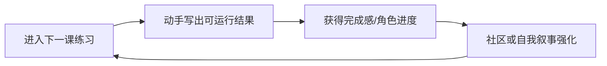

# 竞品调研 — Boot.dev（留存视角）

> 重点：用户为什么留下，以及 Retention Loop。  
> **不**做功能清单罗列。

## 证据说明

公开产品定位与社区口碑可观察部分标 **Confirmed**；动机推断标 **Hypothesis**；无数据处标 **Unknown**。

## 1. 产品一句话（定位层）

面向想真正「动手学后端」的学习者，强调练习与项目感，而非纯看课。  
证据：**Confirmed**（公开定位可复核）

## 2. 用户为什么留下？

| 可能原因 | 说明 | 级别 |
|----------|------|------|
| 动手即时性 | 「写起来」比「看完」更能产生进展感 | **Hypothesis** |
| 身份认同 | 「我在成为后端工程师」叙事清晰 | **Hypothesis** |
| 社区同伴 | Discord 等社区降低孤独感 | **Hypothesis**（社区存在可观察，贡献度 **Unknown**） |
| 路径足够窄 | 少选择焦虑，跟着练即可 | **Hypothesis** |
| 趣味人设/语气 | 降低枯燥感 | **Hypothesis** |

**Confirmed：** 存在强调 hands-on / 后端学习的差异化叙事。  
**Unknown：** 真实留存率、付费续订率、主要流失原因。

## 3. Retention Loop（推断）

| 环节 | 作用 | 级别 |
|------|------|------|
| 触发 | 「继续下一课」足够明确 | **Hypothesis** |
| 行动 | 编码练习（高努力、高反馈） | **Hypothesis** |
| 奖励 | 进度 + 我能写后端的身份感 | **Hypothesis** |
| 投入 | 已完成章节沉没成本 | **Hypothesis** |
| 再触发 | 路径未完成的开放环 | **Hypothesis** |

## 4. 留存飞轮的脆弱点

| 风险 | 说明 | 级别 |
|------|------|------|
| 难度陡增 | 卡住无人辅导 → 断裂 | **Hypothesis** |
| 时间不足 | 练习成本高，职场人难维持 | **Hypothesis** |
| 目标偏移 | 用户其实要的是面试题而非后端基础 | **Hypothesis** |

## 5. 对 LeapMa 的启示（非抄功能）

| 启示 | 级别 |
|------|------|
| 「动手后的可见结果」是强留存燃料 | **Hypothesis** |
| 窄而清晰的身份目标可降低流失 | **Hypothesis** |
| 高努力练习若缺辅导，断裂风险大 → AI 导师可能补位 | **Hypothesis** |
| 不可假设 Boot.dev 用户自动迁徙到 LeapMa | **Unknown** |

## 6. 链接

- 综评：[[Competitor_Retention_Synthesis]]
- 愿景：[[LeapMa_Vision]]
