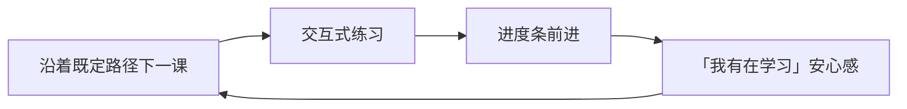

# 竞品调研 — Codecademy（留存视角）

> 重点：用户为什么留下，以及 Retention Loop。  
> **不**做功能清单罗列。

## 1. 产品一句话（定位层）

结构化编程课程 + 浏览器内练习，降低「从零开始写代码」的启动门槛。  
证据：**Confirmed**（公开产品形态可观察）

## 2. 用户为什么留下？

| 可能原因 | 说明 | 级别 |
|----------|------|------|
| 路径清晰 | Career Path / 课程路径减少选择成本 | **Confirmed**（路径产品公开存在） |
| 低环境摩擦 | 浏览器内编码，少折腾本地环境 | **Confirmed**（核心体验可观察） |
| 进度条与证书感 | 完成章节带来进展可视化 | **Hypothesis** |
| Pro 内容与实践项目 | 付费层延长使用 | **Hypothesis** |
| 「我在系统学习」安心感 | 对抗信息过载焦虑 | **Hypothesis** |

## 3. Retention Loop（推断）

| 环节 | 作用 | 级别 |
|------|------|------|
| 触发 | 未完成路径、邮件提醒、自我计划 | **Hypothesis** |
| 行动 | 看说明 + 填空式/引导式练习 | **Confirmed**（交互课形态） |
| 奖励 | 进度、徽章、证书叙事 | **Hypothesis** |
| 投入 | 订阅费 + 已学章节 | **Hypothesis** |
| 再触发 | 路径剩余 | **Hypothesis** |

## 4. 留存飞轮的脆弱点

| 风险 | 说明 | 级别 |
|------|------|------|
| 完成率陷阱 | 进度≠会做真实项目 | **Hypothesis**（常见批评） |
| 订阅疲劳 | 感觉「课很多但用不上」后取消 | **Hypothesis** |
| 引导过强 | 离开平台后独立能力不足 | **Hypothesis** |
| 同质化 | 与其他网课平台可替换 | **Hypothesis** |

## 5. 对 LeapMa 的启示（非抄功能）

| 启示 | 级别 |
|------|------|
| 清晰路径能降低启动焦虑 | **Hypothesis** |
| 仅有路径+进度条，长期会被「无真实能力」反噬 | **Hypothesis** |
| LeapMa 应用「能力可见」替代「课程进度幻觉」 | **Hypothesis**（对齐原则） |
| 低环境摩擦值得学习，但属体验原则，非本阶段方案 | **Hypothesis** |

## 6. 链接

- [[Competitor_Retention_Synthesis]]
- [[Product_Principles]]
