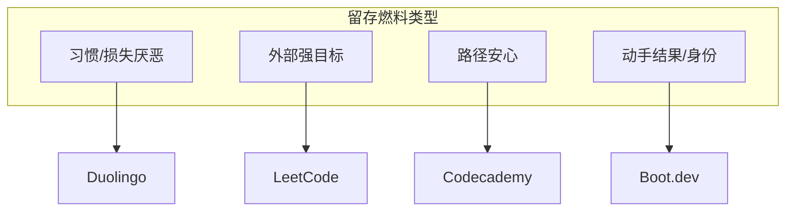
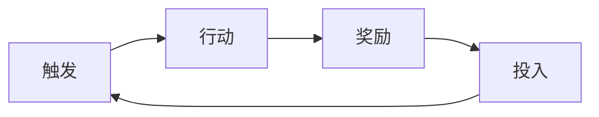

# 调研 — 竞品留存综评

综合：[[Boot_dev]] · [[Duolingo]] · [[LeetCode]] · [[Codecademy]]

## 1. 核心问题

用户为什么留下？各产品的 Retention Loop 燃料分别是什么？  
LeapMa 应从哪里借力、避开哪里？

## 2. 留存燃料对比

| 产品 | 主燃料（推断） | 反馈速度 | 外部目标依赖 | 空转风险 | 级别 |
|------|----------------|----------|--------------|----------|------|
| Duolingo | 习惯 + 损失厌恶 | 极快 | 低 | 高 | **Hypothesis**（机制 **Confirmed**） |
| LeetCode | 面试外部目标 + 判题反馈 | 快 | 高 | 中（刷量） | **Hypothesis** |
| Codecademy | 路径安心 + 进度可视化 | 中 | 中 | 高（进度幻觉） | **Hypothesis** |
| Boot.dev | 动手结果 + 身份叙事 | 中-快 | 中 | 中 | **Hypothesis** |

## 3. Retention Loop 模式抽象

对 LeapMa 的抽象要求（仍非功能设计）：

| 环 | 竞品启示 | LeapMa 方向性含义 | 级别 |
|----|----------|-------------------|------|
| 触发 | 提醒/目标日期/断签 | 需要可持续触发，但不能骚扰 | **Hypothesis** |
| 行动 | 必须够短或够有回报 | 编程学习摩擦天然更高 | **Hypothesis** |
| 奖励 | XP vs AC vs 进度 vs 跑通 | 应奖励「有效成长」而非空转 | **Hypothesis** |
| 投入 | 连胜/题量/订阅/章节 | 投入应变成能力资产更难丢弃 | **Hypothesis** |

## 4. 跨竞品 Confirmed 少、Hypothesis 多

### 较接近 Confirmed 的观察

- 短反馈循环普遍存在于高粘性练习产品（Duolingo 会话、LeetCode 判题）。**Confirmed**
- 结构化路径能降低选择成本（Codecademy 等）。**Confirmed**（形态存在）
- 求职/面试是编程学习的强外部引擎。**Confirmed**（文化可观察）

### 仍是 Hypothesis

- 哪一种燃料最适合 LeapMa 目标用户
- 游戏化迁移到编程是否净正向
- 用户离开各竞品的 Top 原因排序

### Unknown

- 各竞品真实留存曲线与付费续订数据
- 中国市场用户重叠与可迁徙比例

## 5. 对 LeapMa 的综合含义

| 含义 | 级别 |
|------|------|
| 只做内容平台，留存大概率弱于「习惯引擎」或「外部目标引擎」 | **Hypothesis** |
| 只做题海，容易脉冲留存，难做持续成长叙事 | **Hypothesis** |
| 理想位置：习惯触发 × 有效练习反馈 × 能力可见（抗空转） | **Hypothesis** |
| 该位置是否成立，取决于用户研究，不取决于本综评 | **Unknown** |

## 6. 决策影响

- 支撑 Vision 差异化叙事，但**不能**当作已验证 PMF
- 下一步必须用人访谈验证「燃料偏好」
- 禁止据此直接进入功能设计

## 7. 链接

- [[Boot_dev]] [[Duolingo]] [[LeetCode]] [[Codecademy]]
- [[Problem_Hypothesis]]
- [[AI_Native_Learning_Opportunity]]
