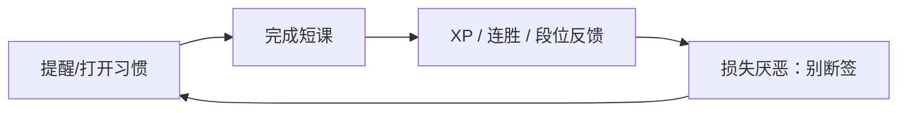

# 竞品调研 — Duolingo（留存视角）

> 重点：用户为什么留下，以及 Retention Loop。  
> **不**做功能清单罗列。  
> 注：Duolingo 主战场是语言学习；对 LeapMa 是「习惯引擎」参照，不是编程品类对标。

## 1. 产品一句话（定位层）

把学习拆成极短会话，用游戏化习惯机制驱动高频回访。  
证据：**Confirmed**（公开产品形态与增长叙事高度可见）

## 2. 用户为什么留下？

| 可能原因 | 说明 | 级别 |
|----------|------|------|
| 启动成本极低 | 几分钟就能完成一次「今日任务」 | **Confirmed**（短课形态可观察） |
| 连胜（Streak）损失厌恶 | 怕断签成为强回流理由 | **Confirmed**（连胜机制公开且被广泛讨论） |
| 排行榜/联赛社会比较 | 竞争刺激回访 | **Confirmed**（机制公开存在） |
| 通知与提醒系统 | 主动把用户拉回 | **Confirmed**（产品行为可观察） |
| 真正语言能力提升 | 部分用户因效果留下 | **Hypothesis**（效果因人而异，**Unknown** 占比） |
| 习惯自动化 | 到点就打开，思考变少 | **Hypothesis** |

## 3. Retention Loop（观察+推断）

| 环节 | 作用 | 级别 |
|------|------|------|
| 触发 | 通知、桌面图标习惯、断签恐惧 | **Confirmed** / **Hypothesis**（心理机制） |
| 行动 | 低摩擦短课 | **Confirmed** |
| 奖励 | XP、连胜、宝石、联赛名次 | **Confirmed**（符号存在） |
| 投入 | 长连胜本身成为资产 | **Hypothesis** |
| 再触发 | 明日继续以保护资产 | **Hypothesis** |

## 4. 留存飞轮的脆弱点 / 争议

| 风险 | 说明 | 级别 |
|------|------|------|
| 空转打卡 | 回访≠能力提升 | **Hypothesis**（常见批评，量化 **Unknown**） |
| 提醒疲劳 | 过度打扰导致卸载 | **Hypothesis** |
| 能力幻觉 | 用户以为会了但不会用 | **Hypothesis** |

## 5. 对 LeapMa 的启示（非抄功能）

| 启示 | 级别 |
|------|------|
| 低启动成本是坚持前提 | **Hypothesis** |
| 损失厌恶可提升回访，但必须绑定「有效练习」护栏 | **Hypothesis**（对齐 [[Product_Principles]]） |
| 纯连胜优化可能伤害能力结果与信任 | **Hypothesis** |
| 编程学习单次认知成本高于语言短课，不可直接复制同一摩擦模型 | **Hypothesis** |

## 6. 链接

- [[Competitor_Retention_Synthesis]]
- [[Product_North_Star]]
- [[Product_Principles]]
