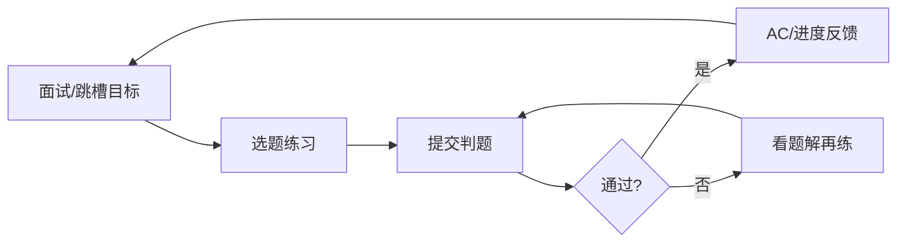

# 竞品调研 — LeetCode（留存视角）

> 重点：用户为什么留下，以及 Retention Loop。  
> **不**做功能清单罗列。

## 1. 产品一句话（定位层）

以算法题练习与评测为核心，深度绑定「技术面试/能力证明」外部目标。  
证据：**Confirmed**（公开定位与使用文化可观察）

## 2. 用户为什么留下？

| 可能原因 | 说明 | 级别 |
|----------|------|------|
| 外部强目标 | 找工作/跳槽/面试是强燃料 | **Confirmed**（求职刷题文化可观察） |
| 即时对错反馈 | 提交即判，反馈循环快 | **Confirmed**（在线评测可观察） |
| 进度可计数 | AC 数、连续打卡、题单完成 | **Confirmed**（可见计数器） |
| 公司/题单导向 | 「刷完这些更有希望过面试」 | **Hypothesis** |
| 竞赛与比较 | Contest 排名带来成就 | **Hypothesis** |
| 社群题解 | 卡住可找思路 | **Hypothesis** |

**关键洞察：** LeetCode 的留存大量来自**平台外目标**（面试），不只来自产品内游戏化。  
级别：**Hypothesis**（机制合理；贡献度拆分 **Unknown**）

## 3. Retention Loop（推断）

| 环节 | 作用 | 级别 |
|------|------|------|
| 触发 | 面试日期、焦虑、每日计划 | **Hypothesis** |
| 行动 | 做题-提交 | **Confirmed** |
| 奖励 | AC、积分、排名、焦虑缓解 | **Hypothesis** |
| 投入 | 已刷题量与会员 | **Hypothesis** |
| 再触发 | 题单未完成 + 外部截止日期 | **Hypothesis** |

## 4. 留存飞轮的脆弱点

| 风险 | 说明 | 级别 |
|------|------|------|
| 目标达成即流失 | 拿到 offer 后用量下降 | **Hypothesis** |
| 挫败退出 | 连续不会做 → 自我否定 | **Hypothesis** |
| 为刷而刷 | 通过数↑，工程能力迁移不足 | **Hypothesis** |
| 付费点与留存不完全同构 | Premium 价值感知因人而异 | **Unknown** |

## 5. 对 LeapMa 的启示（非抄功能）

| 启示 | 级别 |
|------|------|
| 强外部目标可驱动留存，但会造成脉冲式使用 | **Hypothesis** |
| 快速对错反馈是练习产品的基础设施级体验 | **Confirmed**（评测反馈模式有效可观察） |
| LeapMa 若只有「成长」内目标、缺外部锚点，留存更难 | **Hypothesis** |
| 需避免变成「另一道题海」而丢失能力图谱差异 | **Hypothesis** |

## 6. 链接

- [[Competitor_Retention_Synthesis]]
- [[Problem_Hypothesis]]
