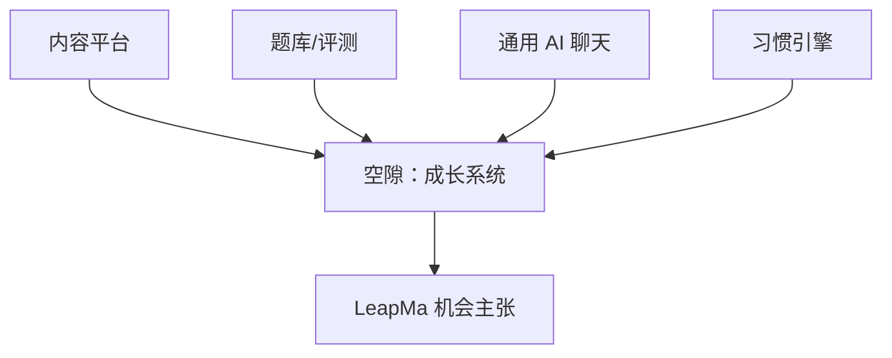
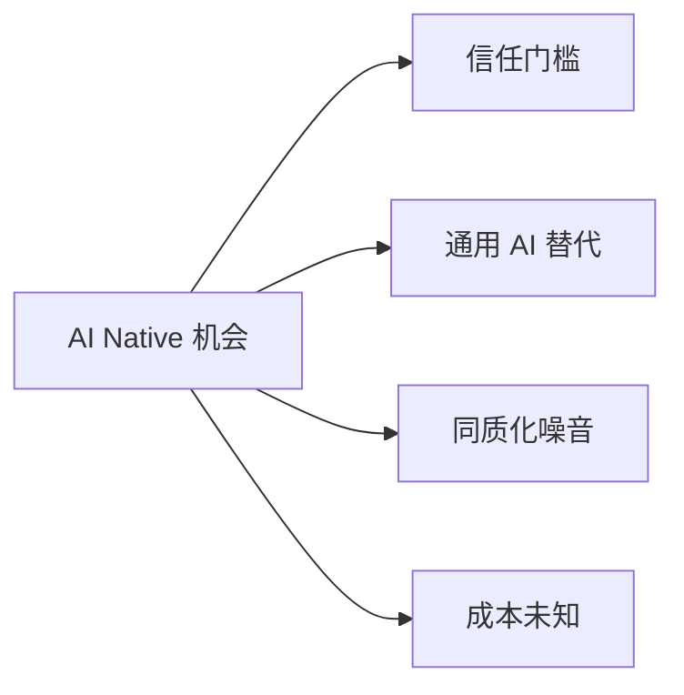

# 调研 — AI Native 学习产品机会

## 1. 问题

「AI Native 程序员成长产品」是否存在真实市场机会？机会来自哪里？陷阱是什么？

## 2. 方法

- 桌面研究：公开趋势、竞品形态、愿景假设对照
- 无市场规模一手数据采购、无用户实验
- 因此：**不得把本文件当作财务预测**

## 3. 关键术语

**AI Native 学习产品**（本文件工作定义）：

不是「在旧课程站加一个聊天框」，而是学习闭环（路径、练习、反馈、评估、坚持）从设计期就以 AI 能力为前提。

级别：定义本身为 **Hypothesis**（工作定义，待产品验证）

## 4. 机会主张（分层标注）

### O1 — 个性化辅导供给长期不足

| 项 | 内容 |
|----|------|
| 主张 | 真人一对一编程辅导贵且不可扩展；大众长期处于「缺反馈」 |
| 级别 | **Hypothesis**（价格与供给约束合理；缺口量化 **Unknown**） |

### O2 — 生成式 AI 降低「即时讲解/纠错」边际成本

| 项 | 内容 |
|----|------|
| 主张 | 模型使规模化反馈首次近似可行 |
| 级别 | **Confirmed**（能力存在可观察）+ 教育场景可靠性 **Unknown** |

### O3 — 用户已开始把 AI 聊天当「临时导师」

| 项 | 内容 |
|----|------|
| 主张 | 通用 AI 工具正在截走部分学习辅导需求 |
| 级别 | **Hypothesis**（使用趋势可观察；编程学习占比 **Unknown**） |

### O4 — 通用 AI 不是完整成长系统

| 项 | 内容 |
|----|------|
| 主张 | 聊天无长期路径、无能力账本、无抗空转的成长度量 → 留出产品空间 |
| 级别 | **Hypothesis** |

### O5 — 课程平台与题库平台之间存在定位空隙

| 项 | 内容 |
|----|------|
| 主张 | 「能力成长操作系统」尚未被单一巨头锁死 |
| 级别 | **Hypothesis**（见愿景与竞品综评） |

## 5. 市场结构观察（谨慎）

| 观察 | 级别 |
|------|------|
| 在线编程学习与技能提升是长期存在的需求 | **Confirmed**（品类存在） |
| AI 功能正在被大量教育产品以插件形式加入 | **Confirmed**（可观察） |
| 「AI Native 重构闭环」的成功案例仍少，叙事多于结果 | **Hypothesis** |
| 可服务的 TAM/SAM/SOM 数字 | **Unknown**（未建模） |
| 中国 vs 全球需求差异 | **Unknown** |

## 6. 机会质量评估（是否值得做）

| 维度 | 判断 | 级别 |
|------|------|------|
| 问题真实性 | 反馈缺失/坚持困难很可能真实 | **Hypothesis** |
| 方案时机 | AI 使反馈规模化首次可行 | **Hypothesis** |
| 差异化空间 | 相对「AI 插件课」与「纯聊天」有叙事空间 | **Hypothesis** |
| 竞争强度 | 大厂/题库/课平台均可快速加 AI | **Confirmed**（能力上可加） |
| 护城河早期 | 可能很弱，靠体验闭环与数据飞轮（未验证） | **Hypothesis** |
| 变现 | 订阅/导师加值可能成立 | **Hypothesis**；价格 **Unknown** |

## 7. 主要风险（未验证）

| 风险 | 说明 | 级别 |
|------|------|------|
| R1 幻觉摧毁信任 | 一次严重误导可导致卸载与口碑崩溃 | **Hypothesis** |
| R2 通用 AI 免费替代 | 用户觉得 ChatGPT 够用 | **Hypothesis** |
| R3 AI 贴牌课同质化 | 市场噪音大，获客贵 | **Hypothesis** |
| R4 留存抄 Duolingo 失败 | 编程会话成本更高 | **Hypothesis** |
| R5 监管/学术诚信 | AI 辅导与作弊边界 | **Unknown** |
| R6 成本结构 | 推理成本侵蚀毛利 | **Unknown** |

## 8. 与 Vision / 竞品的对齐

| Vision 主张 | 市场含义 | 级别 |
|-------------|----------|------|
| AI 导师 | 对应 O2/O3/O4 | **Hypothesis** |
| 动态路径 | 对应「通用聊天缺路径」空隙 | **Hypothesis** |
| 知识图谱/能力可见 | 对应进度幻觉问题 | **Hypothesis** |
| 游戏化 | 需防空转；市场证明习惯有效但不证明能力有效 | **Hypothesis** |

详见：[[Competitor_Retention_Synthesis]]、[[Problem_Hypothesis]]

## 9. 阶段性结论（诚实版）

| 结论 | 级别 |
|------|------|
| 存在值得探索的 AI Native 学习产品机会 | **Hypothesis** |
| 已证明 LeapMa 会赢 | **否 — Unknown/未证明** |
| 应立即大规模投入功能开发 | **否**（违反 SDD；证据不足） |
| 下一步最高杠杆是用户验证而非做功能 | **Hypothesis**（研究策略建议） |

## 10. 建议的验证问题（仍属 Research）

1. 用户是否已用通用 AI 学编程？满意点/失败点？  
2. 愿为「带路径的 AI 导师」付多少？相对纯聊天贵在哪？  
3. 最不能容忍的 AI 错误类型是什么？  
4. 首发人群是谁时，机会最尖锐？

以上全部当前为 **Unknown**。

## 11. 链接

- [[LeapMa_Vision]]
- [[Competitor_Retention_Synthesis]]
- [[Target_User_Analysis]]
- [[Problem_Hypothesis]]
