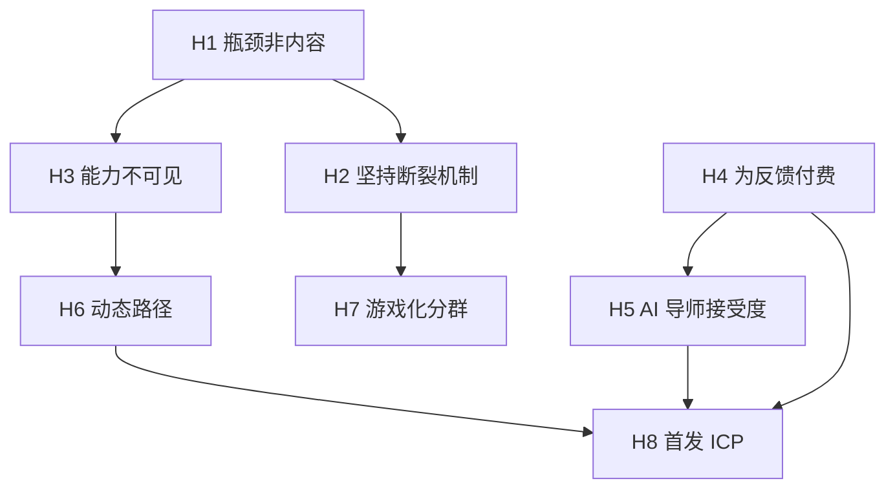
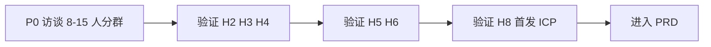

# 调研 — 问题假设

把 LeapMa 愿景中的「用户问题」拆成可证伪假设。  
**当前无一假设达到 Confirmed（缺一手用户证据）。**

## 证据标注

- **Confirmed**：已验证  
- **Hypothesis**：假设  
- **Unknown**：未知  

## 1. 核心问题陈述（待验证）

> 程序员在学习新技术/提升能力时，并非主要缺内容，而是缺「下一步练什么 + 及时反馈 + 可坚持机制 + 能力可见」。  
> 证据级别：**Hypothesis**

## 2. 假设清单

### H1 — 内容过载不是唯一瓶颈

| 项 | 内容 |
|----|------|
| 假设 | 用户停止成长，更多是因为路径混乱与反馈缺失，而非找不到教程 |
| 级别 | **Hypothesis** |
| 如何验证 | 访谈：上次放弃学习的直接原因编码 |
| 若为假 | LeapMa 可能仍需强内容策略，差异化弱化 |

### H2 — 坚持失败的主因是反馈与日程，而非懒惰

| 项 | 内容 |
|----|------|
| 假设 | 中断主要由外部日程 + 缺少小反馈循环导致 |
| 级别 | **Hypothesis** |
| 如何验证 | 让用户画「上次连续学习 2 周后如何断掉」时间线 |
| 若为假 | 游戏化/提醒可能无效，需另找动机模型 |

### H3 — 能力不可见造成焦虑性囤课

| 项 | 内容 |
|----|------|
| 假设 | 用户用囤课缓解焦虑，因说不清自己会什么 |
| 级别 | **Hypothesis** |
| 如何验证 | 问「你现在能向别人证明你会什么？」的回答质量 |
| 若为假 | 知识图谱心智可能不是强卖点 |

### H4 — 用户愿意为「反馈与效率」付费，胜过为「更多课」付费

| 项 | 内容 |
|----|------|
| 假设 | 同预算下，用户更愿为个性化反馈/省时间付费 |
| 级别 | **Hypothesis** |
| 如何验证 | 价格敏感度访谈 + 对比报价卡片（不做真实支付也可先测意愿） |
| 若为假 | 商业模式需重回内容订阅逻辑 |

### H5 — AI 导师可替代部分真人导师，但仍需边界信任

| 项 | 内容 |
|----|------|
| 假设 | 用户接受 AI 做练习反馈；但对关键正确性要求高，幻觉会致命 |
| 级别 | **Hypothesis**（AI 学习工具使用上升为可观察趋势，LeapMa 场景接受度仍未知） |
| 相关 | 「接受度」细节：**Unknown** |
| 如何验证 | 概念测试：展示反馈样例，测信任与付费意愿 |
| 若为假 | AI 导师叙事需降级为辅助，而非核心 |

### H6 — 动态路径的价值高于固定课表

| 项 | 内容 |
|----|------|
| 假设 | 用户更想要「根据我的表现调整」而非统一课表 |
| 级别 | **Hypothesis** |
| 如何验证 | 二选一概念偏好 + 解释原因 |
| 若为假 | 固定优质路径可能更简单有效 |

### H7 — 游戏化对进阶用户可能反噬

| 项 | 内容 |
|----|------|
| 假设 | 进阶用户反感幼稚打卡；学生/初学者接受度更高 |
| 级别 | **Hypothesis** |
| 如何验证 | 分群概念测试 |
| 若为假 | 可统一强度游戏化 |

### H8 — 职场补技能者是更优首发 ICP

| 项 | 内容 |
|----|------|
| 假设 | 相对大学生与进阶者，职场补技能者在「付费×痛点×可服务」上更平衡 |
| 级别 | **Hypothesis** |
| 如何验证 | 三群访谈对照 + 付费意愿 |
| 若为假 | 重排首发人群 |

## 3. 假设关系图

## 4. 必须回答的五个问题（汇总）

| 问题 | 当前结论 | 级别 |
|------|----------|------|
| 用户是谁？ | 三类候选见 [[Target_User_Analysis]]；首发未定 | **Unknown**（首发）/ **Hypothesis**（分群） |
| 当前学习方式？ | 文档/教程/题库/网课/AI 问答等混合 | **Confirmed**（方式存在）+ **Unknown**（LeapMa 人群占比） |
| 痛点？ | 路径、反馈、坚持、可见性 | **Hypothesis** |
| 为什么无法坚持？ | 日程冲击 + 反馈缺失 + 目标过远 | **Hypothesis** |
| 是否存在付费可能？ | 可能存在，尤其效率/反馈导向 | **Hypothesis**；价格带 **Unknown** |

## 5. 验证优先级（建议）

未完成 P0–P3 前，**不应**进入功能设计。

## 6. 风险

- 用竞品成功反向证明用户痛点（归因谬误）
- 把愿景文案重复写成「研究发现」
- 样本全是身边程序员朋友 → 选择偏差

## 7. 链接

- [[Target_User_Analysis]]
- [[User_Persona_Template]]
- [[LeapMa_Vision]]
- [[Product_North_Star]]
