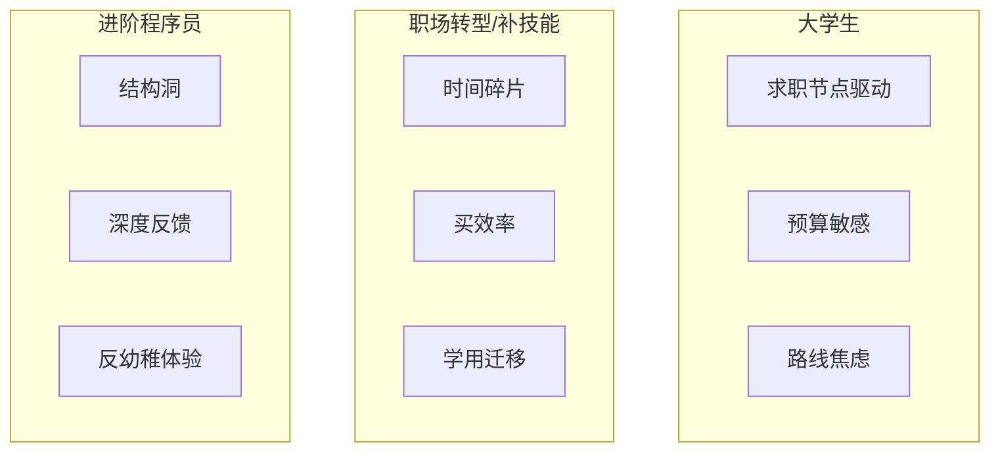

# 调研 — 目标用户分析

## 证据标注约定

| 标记 | 含义 |
|------|------|
| **Confirmed** | 有公开事实、行业常识或可复核来源支撑 |
| **Hypothesis** | 基于逻辑/竞品类比的合理推断，待一手验证 |
| **Unknown** | 缺少证据，不可当决策真相 |

> 本文件 **尚未** 基于 LeapMa 自有用户访谈。多数用户动机与付费结论为 Hypothesis / Unknown。

## 1. 调研问题

- 三类目标用户分别是谁？
- 他们当前如何学习？
- 核心痛点是什么？
- 为什么难以坚持？
- 是否存在付费可能？

支撑决策：谁应成为 Phase 1 后首个切入人群。

## 2. 方法

- 来源：愿景文档、公开竞品定位、行业常见学习行为观察
- 访谈 / 实验：无（**Unknown** 主因）
- 时间盒：Phase 1.5 桌面研究

---

## 3. 用户群 A：大学生

### 3.1 用户是谁？

| 维度 | 描述 | 证据级别 |
|------|------|----------|
| 身份 | 在校 CS / 软工 / 转专业想进技术岗的学生 | **Hypothesis**（与愿景一致，未抽样验证） |
| 目标 | 找实习/工作、过课设、建立可展示能力 | **Hypothesis** |
| 时间 | 学期内可用时间波动大（考试周骤降） | **Confirmed**（学业节律为普遍事实） |
| 预算 | 通常敏感，但可为「求职相关」付费 | **Hypothesis** |

### 3.2 当前学习方式？

| 方式 | 观察 | 证据级别 |
|------|------|----------|
| 学校课程 + 作业 | 主路径，但常与就业技能错位 | **Hypothesis** |
| B 站 / YouTube / 博客 | 碎片化补课 | **Confirmed**（程序员学习内容消费的普遍形态） |
| 题库（如 LeetCode） | 临近求职时高强度刷题 | **Confirmed**（求职季刷题文化可观察） |
| 网课平台 | 囤课、跟课，完成率不稳定 | **Hypothesis** |
| 同学/学长带 | 质量依赖人际网络 | **Hypothesis** |

### 3.3 痛点？

| 痛点 | 说明 | 证据级别 |
|------|------|----------|
| 不知道学什么够用 | 路线互相冲突 | **Hypothesis** |
| 课设与就业技能脱节 | 学校进度 ≠ 岗位要求 | **Hypothesis** |
| 缺少个性化反馈 | 大班/自学难以及时纠错 | **Hypothesis** |
| 焦虑驱动学习 | 学很多但能力不可见 | **Hypothesis** |

### 3.4 为什么无法坚持？

| 原因 | 说明 | 证据级别 |
|------|------|----------|
| 外部日程冲击 | 考试、课程项目打断连续学习 | **Confirmed**（学业日历客观存在） |
| 目标过远 | 「找工作」太远，日常缺少小反馈 | **Hypothesis** |
| 路线重置 | 换教程等于从零开始的心理成本 | **Hypothesis** |
| 社交对比焦虑 | 看到别人进度后放弃或乱跳 | **Hypothesis** |

### 3.5 付费可能？

| 判断 | 证据级别 |
|------|----------|
| 存在付费可能，尤其靠近实习/校招节点 | **Hypothesis** |
| 价格敏感，更可能买「结果感强」的短期服务 | **Hypothesis** |
| 学生客单价上限与续费意愿 | **Unknown**（需访谈/实验） |

---

## 4. 用户群 B：职场转型者 / 职场补技能者

> 含：转行学编程者，以及在职想学新语言/新技术的职场人。

### 4.1 用户是谁？

| 维度 | 描述 | 证据级别 |
|------|------|----------|
| 身份 | 有全职工作，用碎片时间学习新技术栈/语言 | **Hypothesis** |
| 目标 | 转岗、升职、接新项目、降低被淘汰焦虑 | **Hypothesis** |
| 时间 | 工作日夜间/周末；可持续时长短 | **Confirmed**（在职学习时间约束为普遍事实） |
| 预算 | 通常高于学生，愿为效率付费 | **Hypothesis** |

### 4.2 当前学习方式？

| 方式 | 观察 | 证据级别 |
|------|------|----------|
| 官方文档 + 教程 | 工作驱动的「用到再学」 | **Confirmed**（工程师常见模式） |
| 短视频/专栏 | 通勤碎片输入 | **Hypothesis** |
| 公司内部分享 / Mentor | 质量不均 | **Hypothesis** |
| 系统性网课 | 买课后常搁置 | **Hypothesis** |
| AI 聊天工具即学即问 | 快速增长的替代导师行为 | **Hypothesis**（趋势可观察，LeapMa 用户占比 Unknown） |

### 4.3 痛点？

| 痛点 | 说明 | 证据级别 |
|------|------|----------|
| 时间碎片化 | 难以维持深度练习 | **Confirmed**（时间约束） |
| ROI 不清晰 | 不知投入是否转化为工作能力 | **Hypothesis** |
| 学用脱节 | 教程示例 ≠ 工作代码语境 | **Hypothesis** |
| 中断后难回炉 | 两周不学就不敢重开 | **Hypothesis** |

### 4.4 为什么无法坚持？

| 原因 | 说明 | 证据级别 |
|------|------|----------|
| 工作优先级永远更高 | 加班/突发需求打断 | **Confirmed** |
| 疲劳决策 | 下班后认知资源不足 | **Hypothesis** |
| 缺少即时工作回报 | 学了不能马上用在项目上就流失 | **Hypothesis** |
| 完美主义起步 | 想系统学完再动手，迟迟不开练 | **Hypothesis** |

### 4.5 付费可能？

| 判断 | 证据级别 |
|------|----------|
| 付费意愿可能高于学生（买时间、买反馈） | **Hypothesis** |
| 订阅制可接受，若每周都感到进展 | **Hypothesis** |
| 可承受价格带、年付 vs 月付偏好 | **Unknown** |

---

## 5. 用户群 C：程序员进阶用户

### 5.1 用户是谁？

| 维度 | 描述 | 证据级别 |
|------|------|----------|
| 身份 | 已有工作经验，想补体系、升高级/架构向、或跨领域加深 | **Hypothesis** |
| 目标 | 能力结构完整、可迁移、可讲述 | **Hypothesis** |
| 时间 | 有一定自主权，但更挑剔 ROI | **Hypothesis** |
| 预算 | 可能为高质量导师/社群/深度内容付费 | **Hypothesis** |

### 5.2 当前学习方式？

| 方式 | 观察 | 证据级别 |
|------|------|----------|
| 生产事故/项目驱动学习 | 最强动机来源 | **Confirmed**（工程师成长常见路径） |
| 书籍 / 源码 / 论文 | 深度路径 | **Hypothesis** |
| 技术会议 / 博客 / Newsletter | 保持视野 | **Confirmed**（公开内容生态存在） |
| 题库/面试系统 | 跳槽期脉冲式使用 | **Confirmed** |
| 传统入门课 | 往往「太浅」而离开 | **Hypothesis** |

### 5.3 痛点？

| 痛点 | 说明 | 证据级别 |
|------|------|----------|
| 不知道自己的结构洞 | 会做业务但体系有盲区 | **Hypothesis** |
| 内容太入门 | 现有学习产品同质且浅 | **Hypothesis** |
| 反馈人难找 | 高级问题缺少合适导师 | **Hypothesis** |
| 学习与绩效难挂钩 | 公司不奖励「系统学习」 | **Hypothesis** |

### 5.4 为什么无法坚持？

| 原因 | 说明 | 证据级别 |
|------|------|----------|
| 工作已能「混过去」 | 缺少外部紧迫感 | **Hypothesis** |
| 深度内容成本高 | 投入大、反馈慢 | **Hypothesis** |
| 产品体验infantilizing | 被当新手对待而流失 | **Hypothesis** |

### 5.5 付费可能？

| 判断 | 证据级别 |
|------|----------|
| 愿为「省时间的高质量反馈」付费 | **Hypothesis** |
| 对游戏化幼稚感敏感，可能反向伤害付费 | **Hypothesis** |
| 客单价与续费周期 | **Unknown** |

---

## 6. 三类用户对比

| 维度 | 大学生 | 职场转型/补技能 | 进阶程序员 | 证据级别 |
|------|--------|-----------------|------------|----------|
| 核心焦虑 | 就业与路线 | 时间与 ROI | 能力天花板 | **Hypothesis** |
| 坚持断裂点 | 学业冲击 | 加班与疲劳 | 缺少紧迫感 | **Hypothesis** |
| 付费触发 | 求职季 | 转岗/项目压力 | 高质量导师感 | **Hypothesis** |
| 对游戏化接受度 | 较高 | 中等 | 两极 | **Hypothesis** |
| LeapMa 切入难度 | 获客或易、留存未知 | 价值匹配可能最高 | 内容深度门槛高 | **Hypothesis** |

## 7. 初步建议（非拍板）

| 建议 | 证据级别 |
|------|----------|
| 不宜同时把三类用户当同等首发焦点 | **Hypothesis** |
| 「职场补技能 / 轻转型」可能最契合「有限时间 + 愿为反馈付费」 | **Hypothesis** |
| 大学生可作为增长池，但付费与坚持需单独验证 | **Hypothesis** |
| 进阶用户适合后期深度场景，过早服务易内容塌陷 | **Hypothesis** |
| 最终首发人群：**Unknown**，需访谈与小范围验证 | **Unknown** |

## 8. 风险与偏见

- 桌面研究易把「我们相信的痛点」写成事实 → 已尽量标 Hypothesis
- 未区分中国/海外用户差异 → **Unknown**
- 未做付费实验 → 付费结论不可当 Confirmed

## 9. 决策影响

- 对产品：约束首发人群选择，避免愿景用户群被当成已验证 ICP
- 对 Spec：暂无（禁止功能设计）
- 对架构：无

## 10. 链接

- Vision：[[LeapMa_Vision]]
- 原则：[[Product_Principles]]
- 问题假设：[[Problem_Hypothesis]]
- 画像模板：[[User_Persona_Template]]
