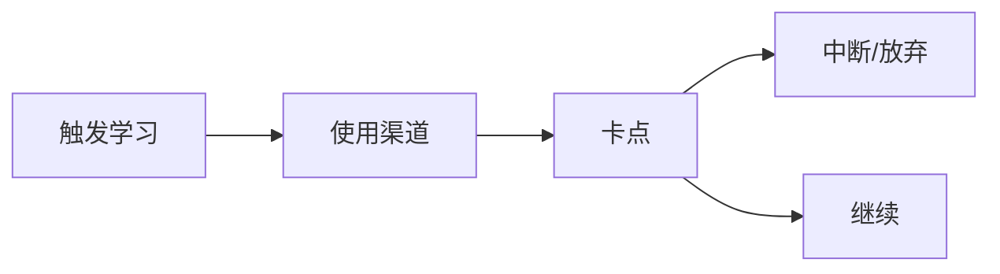

# 用户画像模板

用于把访谈/观察沉淀为可对比的 Persona。  
**本文件是模板，不是已验证画像。** 填写后的每条结论须标注证据级别。

## 使用规则

1. 一个 Persona 对应一类可行动用户群，不要合成「全能用户」。
2. 没有一手证据的字段标 **Unknown** 或删除，禁止编造细节装真实。
3. Persona 服务决策（做谁的痛、不做什么），不是小说人设。

## 证据级别（字段级）

在每个关键字段后标注：`Confirmed` / `Hypothesis` / `Unknown`

---

## Persona 卡片

```yaml
persona_id: P-XXX
name: ""              # 代号，非真实姓名
segment: ""           # 大学生 | 职场转型/补技能 | 进阶程序员 | 其他
status: draft         # draft | validated
last_updated: YYYY-MM-DD
evidence_base: ""     # 访谈数 / 问卷数 / 仅桌面研究
```

### 1. 一句话

> 谁，在什么情境下，想达成什么。（证据：）

### 2. 基本情境

| 字段 | 内容 | 证据 |
|------|------|------|
| 身份背景 | | |
| 当前角色/阶段 | | |
| 可用学习时间 | | |
| 预算敏感度 | | |
| 主要设备/场景 | | |

### 3. 目标与成功样子

| 类型 | 描述 | 证据 |
|------|------|------|
| 长期目标 | | |
| 近 30 天目标 | | |
| 自认的「成功」 | | |

### 4. 当前学习方式

| 方式 | 频率 | 满意度 | 证据 |
|------|------|--------|------|
| | | | |



### 5. 痛点（按强度排序）

| 排序 | 痛点 | 是否亲口提及 | 证据 |
|------|------|--------------|------|
| 1 | | | |
| 2 | | | |
| 3 | | | |

### 6. 为什么无法坚持

| 断裂触发 | 描述 | 证据 |
|----------|------|------|
| | | |

### 7. 现有替代方案

用户现在用什么凑合？（工具/人/自制方法）

| 替代 | 喜欢什么 | 讨厌什么 | 证据 |
|------|----------|----------|------|
| | | | |

### 8. 付费可能

| 问题 | 回答 | 证据 |
|------|------|------|
| 是否为学习付过费 | | |
| 为了什么付 | | |
| 价格心理锚点 | | |
| 订阅 vs 一次性 | | |
| 不付费的原因 | | |

### 9. 对 LeapMa 价值主张的反应（验证用）

向用户陈述愿景价值（AI 导师 / 动态路径 / 图谱 / 游戏化）后记录：

| 主张 | 反应（兴奋/中立/反感） | 原话摘要 | 证据 |
|------|------------------------|----------|------|
| AI 导师反馈 | | | |
| 动态路径 | | | |
| 能力可见（图谱心智） | | | |
| 游戏化坚持 | | | |

### 10. 非目标提醒

该 Persona **不是**谁：

-

### 11. 决策含义

- 应优先满足：
- 明确不做：
- 仍 Unknown：

### 12. 来源附件

- 访谈笔记链接：
- 问卷：
- 日期：
