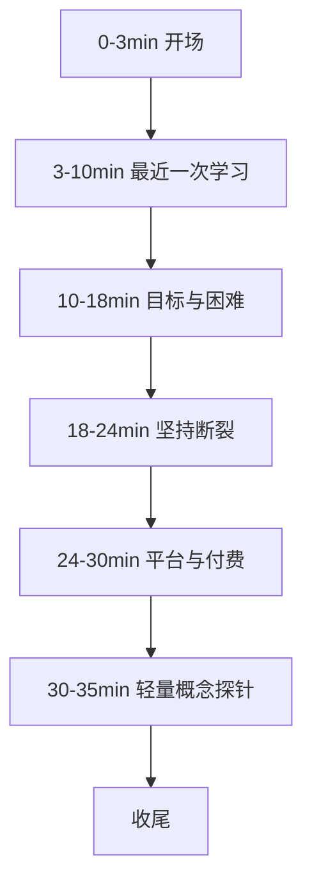

# 创始人访谈指南（10 场）

帮助创始人完成 10 次发现型访谈。  
目标是听懂真实行为，不是说服对方喜欢 LeapMa。

## 0. 开场 60 秒

可用话术：

> 我想了解你平时怎么学编程/新技术，不是推销产品。没有标准答案。你怎么做的就怎么说。大约 30–40 分钟。我可以记笔记，内容会脱敏。可以吗？

禁止：一上来介绍 LeapMa 愿景、演示构想、问「你需不需要这种产品」。

---

## 1. 绝对避免的问题

| 不要问 | 为什么有害 |
|--------|------------|
| 你喜欢这个产品吗？ | 诱导礼貌认同 |
| 如果有 AI 导师你会用吗？ | 假想未来，答案偏「会」 |
| 你觉得知识图谱重要吗？ | 行话 + 诱导 |
| 你愿不愿意付费给我们？ | 社交压力下的假意愿 |
| 我们这样做是不是很棒？ | 寻求认可 |

## 2. 应该问的问题类型

| 要问 | 例子 |
|------|------|
| 最近一次具体事件 | 你最近一次学习编程是什么时候？ |
| 过程细节 | 那天你打开的第一个东西是什么？ |
| 卡点 | 哪一步开始不想继续了？ |
| 过去行为 | 你为学习付过费吗？上次因为什么付？ |
| 对比 | 后来为什么不用 XX 了？ |

---

## 3. 推荐流程（35 分钟）

### 3.1 最近一次学习（从这里开始）

1. **你最近一次学习编程 / 新技术是什么时候？**
2. 那次是想解决什么问题，还是在跟一门课/一条路线？
3. 你实际做了哪些步骤？（逼出时间线）
4. 中间卡过吗？卡在哪？你怎么处理的？
5. 那次最后停在什么结果？有没有「完成」的感觉？

### 3.2 目标与困难

6. 你现在最想达成的学习目标是什么？有没有截止日期？
7. **这一年里，学习上最大的困难是什么？**
8. 如果只能改一件事让学习变容易，你希望改什么？（听原话，不塞选项）

### 3.3 坚持断裂

9. 有没有一段你连续学得比较勤的时间？大概多久？
10. **后来是怎么断掉的？** 发生了什么事？
11. 断掉之后有没有想重启？重启时卡在哪？
12. （若对方说「我懒」）**当时具体是哪一天开始没打开的？那天前后还发生了什么？**

### 3.4 平台与付费（事实）

13. 你用过哪些学习网站/App/书/社群？
14. 哪个用得最久？为什么留下？
15. 哪个弃用了？弃用前最后一次打开时发生了什么？
16. **近两年为学习付过费吗？**
17. （若有）付的是什么？当时想买到什么结果？买到了吗？
18. （若无/取消）不付或取消的原因是什么？

### 3.5 轻量概念探针（不提品牌）

> 仅在前面故事充分后再问；各 1–2 分钟。

19. **路径：** 有人喜欢按固定课表往下学；有人希望「我卡住了就根据我的情况告诉我下一步」。你过去更常遇到哪种？更想要哪种？为什么？
20. **反馈：** 你卡住时最想立刻得到什么帮助？你试过问人 / 搜 / 问 AI 吗？体验怎么样？
21. **AI：** 有没有用 AI 学过编程？哪次有帮助？哪次让你不信任？
22. **坚持手段：** 你用过打卡、连胜、排行榜吗？它对你是帮助还是压力？有没有因此卸载过什么 App？
23. **能力可见：** 如果现在要向朋友证明「你会 XX」，你能拿出什么？说得清吗？

### 3.6 收尾

24. 关于「为什么学不下去 / 怎样才学得动」，还有什么我该问但没问到的？
25. 还有没有同类朋友愿意匿名聊聊？（转介）

---

## 4. 追问工具箱（Mom Test 风格）

对方说「我需要系统一点」→ 追问：

- 上次你因为不系统，具体损失了什么？
- 你为此做过什么尝试？

对方说「我会付费的」→ 追问：

- 你上次类似付费是什么时候？
- 那次付完后有没有续费/取消？

对方说「AI 很好用」→ 追问：

- 举一次具体对话：你问了什么，它回了什么，你接着做了什么？
- 有没有一次它害你浪费时间？

## 5. 现场纪律

| 规则 | 说明 |
|------|------|
| 80/20 | 对方说 ≥80% |
| 不教学 | 不纠正对方技术问题（除非对方求助且极短） |
| 不答辩 | 不解释「我们将来会如何解决」 |
| 记原话 | 金句进模板；结论回家再标 Hypothesis |
| 单人主访 | 避免两个人轮番说服感 |

## 6. 每场结束后（15 分钟内）

1. 用 [[Interview_Template]] 补全  
2. 填写「假设信号」支持/反对  
3. 每 2–3 场更新 [[Hypothesis_Validation]]  
4. 不要当天就定 ICP；等满样本再用框架打分  

## 7. 10 场检查清单

- [ ] I-001
- [ ] I-002
- [ ] I-003
- [ ] I-004
- [ ] I-005 ← 中期 ICP 初评
- [ ] I-006
- [ ] I-007
- [ ] I-008
- [ ] I-009
- [ ] I-010 ← 终评 + 首发建议

## 8. 链接

- [[Interview_Plan]]
- [[Interview_Template]]
- [[Hypothesis_Validation]]
- [[ICP_Decision_Framework]]
