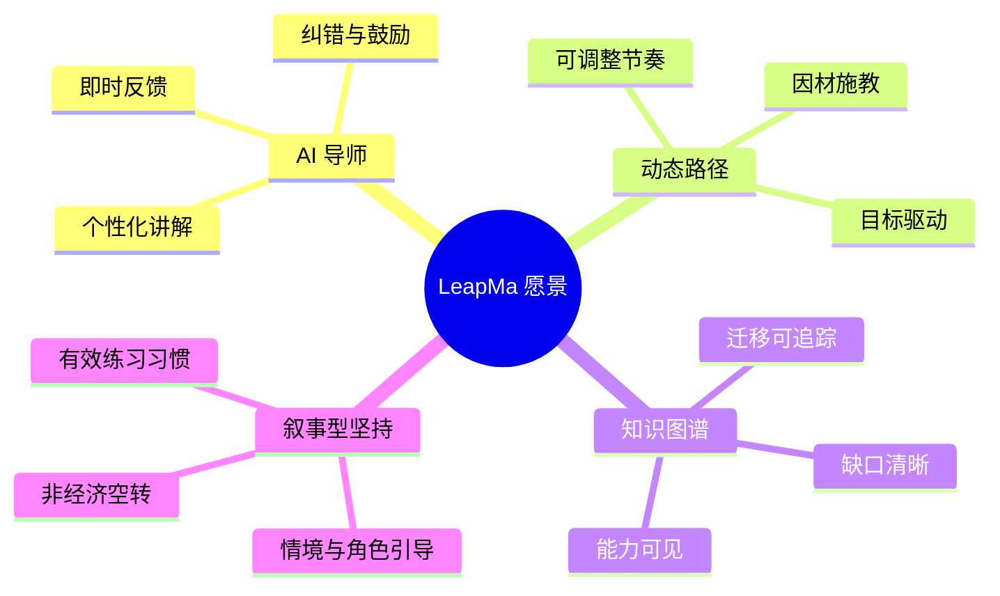
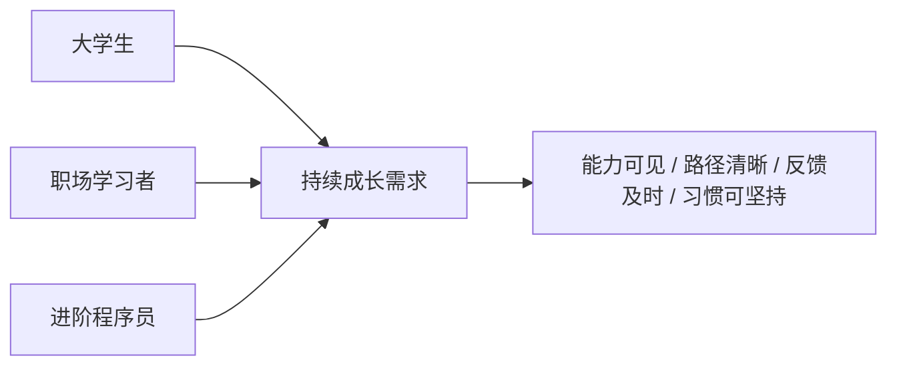
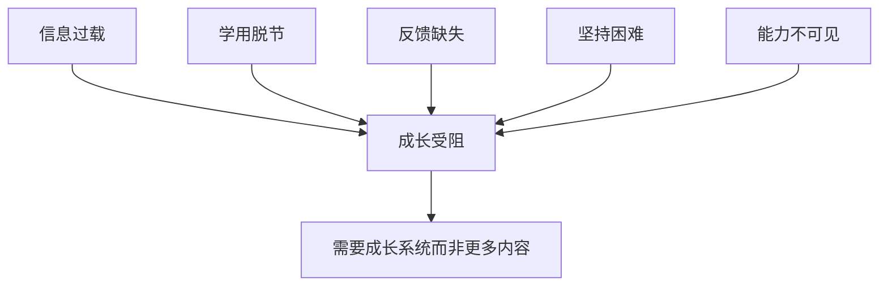
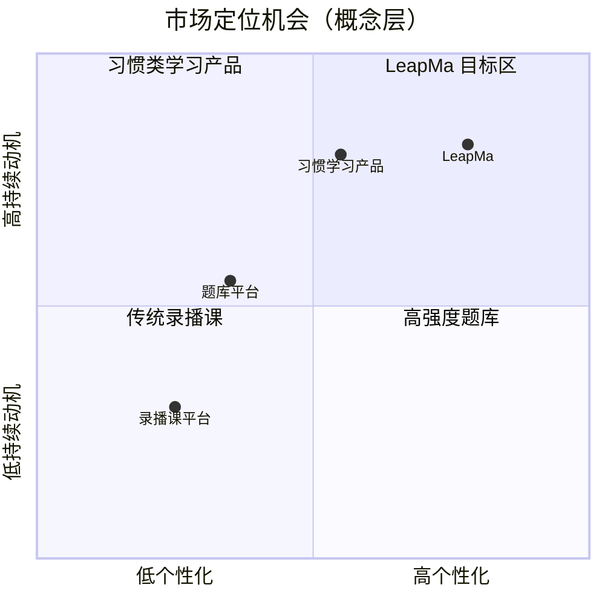
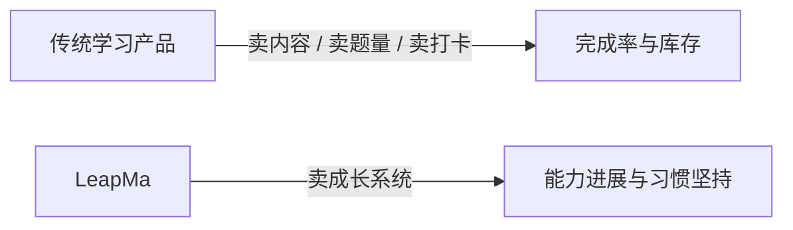
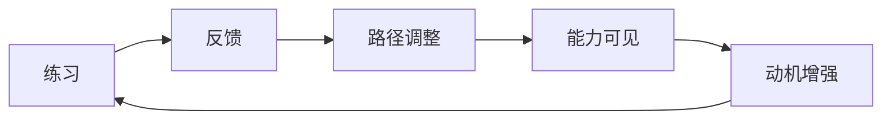

# 愿景 — LeapMa

> **一句话北极星：** 让每一位程序员都能在 AI 导师陪伴下，沿着清晰的能力图谱持续成长，而不是在课程与题海里反复迷路。

## 1. 产品使命

帮助程序员建立**可持续的能力成长系统**：知道自己缺什么、下一步练什么、如何被纠正、如何坚持下去。

LeapMa 存在的意义，不是「卖更多课」，而是让学习行为变成可度量、可反馈、可长期坚持的成长习惯。

## 2. 产品愿景

在未来，程序员的成长不再依赖：

- 碎片化的教程收藏
- 跟不上的录播课进度
- 只会刷题却不会迁移的题库
- 缺少反馈的自学孤岛

而是拥有一个 **AI Native 成长伙伴**：

LeapMa 要成为程序员成长领域中，把「学、练、评、坚持」闭环做得最好的平台。

## 3. 核心用户

| 用户群 | 典型画像 | 核心诉求 |
|--------|----------|----------|
| 大学生 | 在校 CS / 转专业学生 | 建立可就业的基础能力与学习方法 |
| 职场学习者 | 想学新语言 / 新技术的在职人员 | 用有限时间高效补齐目标能力 |
| 进阶程序员 | 有经验但想系统提升的工程师 | 补结构洞、形成可迁移能力体系 |

### 用户关系（愿景层）

## 4. 用户痛点

### 4.1 不知道学什么

信息过载，路线互相冲突；收藏很多，体系很少。

### 4.2 学了但不会用

看懂教程 ≠ 能独立解决问题；缺少针对个人薄弱点的练习与讲解。

### 4.3 缺少高质量反馈

自学时没有「老师」指出卡点；社区回答延迟且质量不稳定。

### 4.4 难以坚持

动力靠意志力，中断后难以回到轨道；进度不可见，挫败感高。

### 4.5 能力不可见

学了很久却说不清自己会什么、缺什么；面试与工作表现之间缺少中间层证据。

## 5. 产品价值

LeapMa 提供的不是「更多课程」，而是一套成长系统价值：

| 价值 | 对用户意味着什么 |
|------|------------------|
| 方向感 | 始终知道下一步最值得练什么 |
| 反馈感 | 练习被看见、错误被纠正、进步被确认 |
| 结构感 | 能力以图谱形式可见，而非散点记忆 |
| 坚持感 | 用**叙事型坚持**（情境 / 固定 NPC 引导有效练习）把学习变成可持续习惯；**不是**联赛/XP 商店/排行 |
| 迁移感 | 学到的是可迁移能力，而不只是单课进度条 |

**叙事型坚持 vs 复杂游戏（D-056）：**

| 允许 | 禁止 |
|------|------|
| 固定 NPC、困境→心智模型、任务/关卡隐喻 | 联赛、XP 商店、排行榜、好感度养成、视觉小说长分叉 |

**价值主张（愿景表述）：**

> 用 AI 导师 + 动态路径 + 知识图谱 + **叙事型坚持**，把程序员学习从「囤课」变成「持续变强」。

## 6. 市场机会

### 6.1 为什么是现在

- 程序员终身学习已成为常态，但高质量个性化辅导昂贵且不可扩展
- AI 使「一对一导师体验」首次具备规模化可能
- 用户已习惯短周期反馈与习惯类产品（游戏化学习心智成熟）
- 传统课程平台增长见顶，用户更在意结果与坚持，而非内容库存

### 6.2 机会窗口

在「内容平台」与「题库平台」之间，存在尚未被很好占据的位置：**能力成长操作系统**。

> 上图为战略定位示意，不代表具体竞品坐标测量。

## 7. 与竞品差异

竞品参考：Boot.dev、Duolingo、Codecademy、LeetCode、DataCamp、Mimo。

| 参考对象 | 它们擅长 | LeapMa 差异化方向 |
|----------|----------|-------------------|
| 课程平台（如 Codecademy / DataCamp） | 结构化内容与引导式练习 | 不只交付内容，而是动态路径 + 能力图谱驱动成长 |
| 题库平台（如 LeetCode） | 海量练习与评测 | 不只刷题，而是把练习挂到能力图谱与个人缺口上 |
| 习惯产品（如 Duolingo） | 坚持与游戏化经济 | 用**叙事型坚持**服务程序员真实能力；禁止空转积分/排行替代能力证据（D-056） |
| 实践导向课程（如 Boot.dev） | 动手与项目感 | 强化 AI 导师反馈与个性化路径，降低自学孤独感 |
| 移动轻学习（如 Mimo） | 低门槛进入 | 服务从入门到进阶的持续成长，而不是停留在轻量体验 |

### 差异一句话

LeapMa = **AI 导师体验** × **动态学习路径** × **知识图谱** × **叙事型坚持**  
而不是其中单一要素的加强版。

## 8. 长期目标

### 8.1 12 个月（方向性）

- 验证核心价值主张：用户认为 LeapMa 帮助他们「更清楚下一步」且「更能坚持」
- 形成可复述的产品叙事与原则共识（见 `Product_Principles.md`）
- 建立可观测的北极星指标基线（见 `Product_North_Star.md`）

### 8.2 24–36 个月（方向性）

- 成为目标用户心中「程序员持续成长」的首选伙伴之一
- 用户能稳定描述自己的能力位置与成长轨迹
- 形成可扩展的成长飞轮：练习 → 反馈 → 路径调整 → 能力可见 → 更强动机

### 8.3 愿景层成功信号（非功能清单）

| 长期结果 | 成功信号（方向性） |
|----------|-------------------|
| 用户持续回来 | 习惯型回访，而非囤课型沉默 |
| 能力变得可见 | 用户能说明自己会什么 / 缺什么 |
| 学习更有效 | 同等时间下，目标能力进展更快 |
| 口碑来自成长 | 推荐理由是「我变强了」，不是「课很多」 |

## 9. 非目标（愿景层）

- 不做「课程超市」：不以内容 SKU 堆砌为护城河
- 不做纯社交社区优先：社区可增强，但不替代成长闭环
- 不做企业培训管理系统优先：先服务个人成长者
- 不做与程序员成长无关的泛教育扩张
- 本阶段不做功能设计、技术方案与实现

## 10. 未决问题

- 首个垂直切入点应优先服务哪类用户？（大学生 / 职场补语言 / 进阶程序员）
- 「能力可见」在用户心智中的最小可信表达是什么？（待 Research / Product 细化，仍非功能设计）
- 免费与付费价值边界如何定义才不破坏成长闭环？

## 11. 下游链接

- 产品原则：[[Product_Principles]]
- 北极星指标：[[Product_North_Star]]
- 由本愿景派生的产品文档：（待 PRD）
- 支撑本愿景的调研：
  - [[Target_User_Analysis]]
  - [[Problem_Hypothesis]]
  - [[Competitor_Retention_Synthesis]]
  - [[AI_Native_Learning_Opportunity]]
