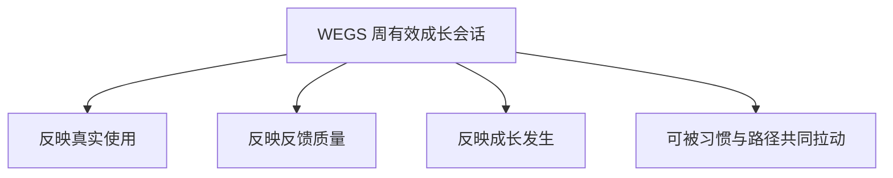
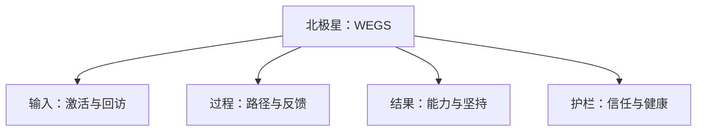
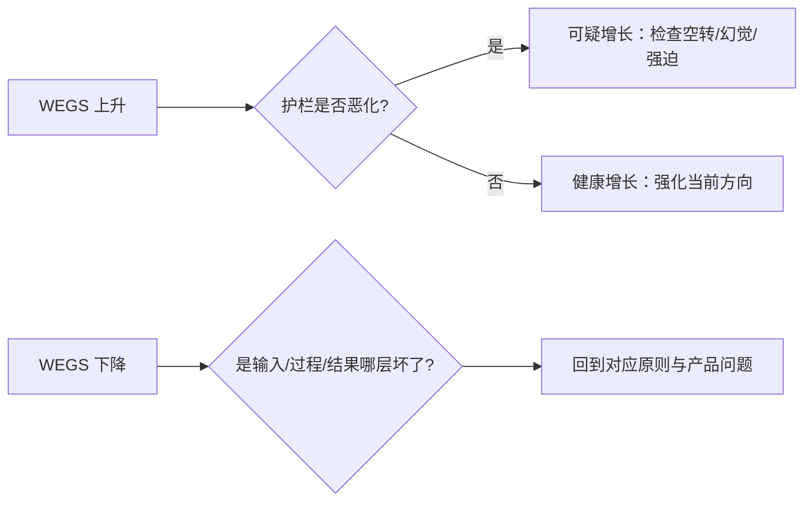

# 产品北极星

本文定义 LeapMa 的**长期核心指标**，用于对齐「我们是否在变强产品，而不是在变忙」。

上游依据：[[LeapMa_Vision]]、[[Product_Principles]]

> 本文件只定义指标含义与层级，不定义埋点方案、数据仓库或技术实现。

## 1. 北极星指标（North Star Metric）

### NSM

**周活跃成长者完成的「有效成长会话」数**  
（Weekly Effective Growth Sessions，简称 **WEGS**）

### 定义（产品语义）

一次 **有效成长会话** 同时满足：

1. 用户进行了面向能力目标的练习或导师辅导互动  
2. 产生了可感知反馈（纠错、讲解、下一步建议等）  
3. 会话结束时，用户的成长状态相对会话前有可记录进展（哪怕很小）

> 「可记录进展」在愿景层指：能力位置、路径位置或掌握信心的可见变化；不在此规定数据结构。

### 为什么是它

| 备选指标 | 未选为 NSM 的原因 |
|----------|-------------------|
| 注册用户数 | 只反映获客，不反映成长 |
| 课程完成率 | 易变成内容消费指标 |
| 题解数量 | 易变成刷量，未必关联能力结构 |
| 连胜天数 | 重要，但是支撑指标；单独优化会空转打卡 |
| 收入 | 重要，但是结果指标；过早当 NSM 会扭曲体验 |

## 2. 指标层级

### 2.1 输入指标（能不能进来并回来）

| 指标 | 产品含义 |
|------|----------|
| 新用户首次有效会话率 | 新用户是否快速体验到成长闭环 |
| 次周回访率 | 用户是否愿意回来继续成长 |
| 激活到首次反馈时长（方向性） | 用户多快获得第一次有价值反馈 |

### 2.2 过程指标（闭环是否转得动）

| 指标 | 产品含义 |
|------|----------|
| 有效会话中含导师反馈的比例 | 反馈是否真正发生 |
| 路径调整后的继续学习率 | 动态路径是否被用户接受 |
| 从「卡住」到「继续」的恢复率 | 挫败是否被系统接住 |

### 2.3 结果指标（是否真的变强 / 更坚持）

| 指标 | 产品含义 |
|------|----------|
| 能力进展感知得分（调研/自评，方向性） | 用户是否觉得自己更清楚、更强 |
| 连续 4 周保持有效会话的用户占比 | 习惯是否形成 |
| 目标达成声明率（方向性） | 用户是否认为接近自己设定的学习目标 |

### 2.4 护栏指标（防止优化歪了）

| 护栏 | 为什么需要 |
|------|------------|
| 空转打卡比（低价值会话占比） | 防止游戏化劫持 NSM |
| 导师不信任/无帮助反馈率 | 防止 AI 幻觉伤害信任 |
| 过早流失率（首次会话后即离开） | 防止激活体验失败被增长数字掩盖 |
| 抱怨「不知道下一步」的比例 | 防止路径价值空洞 |

## 3. 指标与原则的对齐

| 原则 | 主要对应指标 |
|------|--------------|
| 成长优先于内容库存 | WEGS、能力进展感知 |
| 反馈优先于单向讲授 | 含反馈会话比例、无帮助反馈率 |
| 个性化路径优先 | 路径调整后继续学习率 |
| 能力可见优先 | 能力进展感知、「不知道下一步」比例 |
| 坚持服务真实能力 | 4 周有效会话占比、空转打卡比 |
| 诚实 AI 导师 | 不信任/无帮助反馈率 |
| Growth Before Monetization | 免费可完成有效会话；付费墙相关护栏 |
| No Questionnaire Wall | 过早流失、「不知道下一步」、激活路径无问卷阻塞 |

## 4. 解读方式（决策用法）

**禁止的优化方式（愿景层）：**

- 为抬升 WEGS 而降低「有效」标准
- 用纯打卡会话充数
- 用打断学习的骚扰通知换回访

## 5. 阶段预期（方向性，非 KPI 合同）

| 阶段 | 指标焦点 |
|------|----------|
| Phase 1 产品地基 | 定义清楚 NSM 与护栏；尚未追求数值目标 |
| 后续 Product / Research | 明确「有效成长会话」的可观察定义与用户语义验证 |
| 有真实用户后 | 建立基线，再设阶段性目标 |

## 6. 非目标

- 不在此文件规定埋点、看板或技术架构
- 不把收入、融资指标写入 NSM
- 不把单一功能的点击率提升当作成功

## 7. 未决问题

- 「有效成长会话」的最小用户可感知标准如何用调研验证？
- 能力进展在早期应用何种「轻量可见」表达才可信？（仍属产品语义，非功能设计）
- 不同用户群（大学生 / 职场 / 进阶）是否需要分段解读 NSM？

## 相关文档

- [[LeapMa_Vision]]
- [[Product_Principles]]
