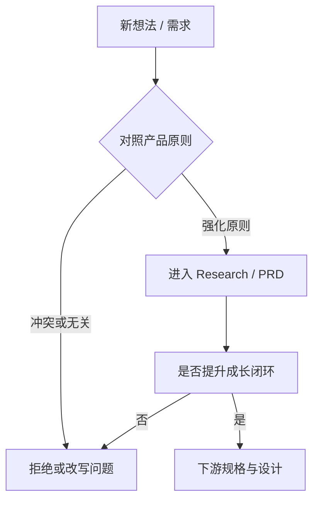
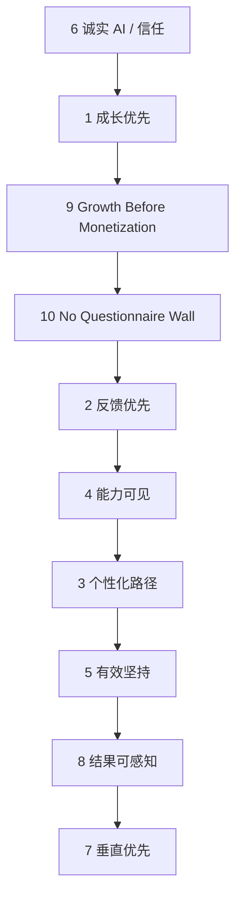

# 产品原则

本文定义：**未来所有产品决策必须遵守的原则**。

原则用于裁决「做不做、怎么取舍」，不是功能清单，也不涉及技术实现。

上游依据：[[LeapMa_Vision]]

## 如何使用本原则

每次产品决策（含 PRD、范围裁剪、体验取舍）至少回答：

1. 这条决策强化了哪条原则？
2. 是否违反任何一条原则？
3. 若冲突，牺牲的是什么、保留的是什么？（需显式记录）

---

## 原则 1：成长优先于内容库存

**陈述：** 我们优化的是用户能力进展与坚持，而不是课程数量、时长或目录丰富度。

**决策含义：**

- 宁做一个能闭环的成长路径，不做十个互不连接的内容包
- 「再加一门课」若不能提升能力可见或路径清晰，默认拒绝

**反例：** 为充实货架而批量上架与用户缺口无关的内容。

---

## 原则 2：反馈优先于单向讲授

**陈述：** 没有反馈的学习，对 LeapMa 不算完成交付。

**决策含义：**

- 优先保证练习被看见、错误被指出、进步被确认
- AI 导师的价值在于高质量反馈，而非更多讲解文案

**反例：** 只增加讲解视频/长文，却不提升纠错与指导质量。

---

## 原则 3：个性化路径优先于统一课表

**陈述：** 默认假设每位用户的起点、目标与节奏不同。

**决策含义：**

- 路径应可因目标与表现调整
- 统一课表可以作为起点，但不能成为唯一形态

**反例：** 强迫所有用户按同一进度解锁，无视个体差异。

---

## 原则 4：能力可见优先于进度条幻觉

**陈述：** 用户应逐渐看清「我会什么 / 缺什么」，而不仅是「我看完了百分之几」。

**决策含义：**

- 进度表达应尽量关联能力结构（知识图谱心智），而非纯消费进度
- 避免用虚假完成感替代真实掌握

**反例：** 用观看完成率充当能力证明。

---

## 原则 5：坚持机制服务真实能力，而非空转打卡

**陈述：** 游戏化用于维持有效练习，不鼓励无效刷分。

**决策含义：**

- 奖励应绑定有意义的学习行为（练习、纠错后的再练、能力进展）
- 反对纯打卡、纯连胜却与能力无关的设计倾向

**反例：** 用极易获得的积分制造上瘾，却不提升能力。

---

## 原则 6：诚实的 AI 导师，不做万能幻觉

**陈述：** AI 导师必须在边界内帮助用户；不确定时应坦诚，并引导有效下一步。

**决策含义：**

- 宁可承认不会，也不编造「权威答案」
- 导师体验服从学习效果与信任，服从短期「答得很快很满」

**反例：** 为了显得智能而给出无法验证或误导性指导。

---

## 原则 7：深度垂直优先于泛教育扩张

**陈述：** 先把程序员成长闭环做深，再考虑边界扩张。

**决策含义：**

- 新领域进入必须证明能复用成长系统，而非只是换皮内容
- 个人成长者优先于企业培训管理系统

**反例：** 尚未验证核心闭环就扩张到无关品类。

---

## 原则 8：结果可感知优先于功能可演示

**陈述：** 用户应在短周期内感知「我变清楚了 / 我有进展了」，而不是只看到功能清单很全。

**决策含义：**

- 版本取舍优先选择能增强感知进展的能力
- Demo 好看但用户无感的方案降级

**反例：** 堆叠表面功能，核心痛点（方向、反馈、坚持）未改善。

---

## 原则 9：Growth Before Monetization（成长先于变现）

**英文名：** Growth Before Monetization  
**状态：** ✅ 正式生效（Phase 2 Founder Review 定稿）

**陈述：**

产品首先帮助用户产生**真实成长**，再通过**增强价值**实现商业化。

免费用户不是被限制的用户，而是**未来价值用户**。

商业化不应该破坏用户成长闭环，而应该增强成长效率、深度和个性化。

**决策含义：**

- 先证明成长闭环成立，再优化变现强度
- 免费层必须能跑通 [[Core_Growth_Loop]] v1.0 全环节
- 禁止用砍断关键成长体验的方式制造付费焦虑
- 商业化做在效率 / 深度 / 个性化等增强上，而非「能不能成长」
- 短期转化率不得压过真实成长与长期信任

**反例：** 用户尚未感到任何成长，就被付费墙挡住反馈与下一步。

**来源：** Phase 2 Founder Review 定稿；详见 [[Free_vs_Paid_Strategy]] · [[Decision_Log]]

---

## 原则 10：No Questionnaire Wall（禁止问卷墙）

**英文名：** No Questionnaire Wall  
**状态：** ✅ 正式生效（Founder / Strategic 定稿；D-041）

**陈述：**

没人喜欢填问卷。LeapMa **禁止**用多题问卷或测评墙换取「个性化」的幻觉。

**价值在前，画像在后。** 先让用户进入可感知的成长（下一步、短练习、可信反馈），再在必要处以轻量方式理解用户。

**推断优先于盘问：** 优先用对话与行为推断；提问仅作兜底，且须可跳过。提问**不得**阻塞「下一步 / 短练习 / 可信反馈」。

本原则与原则 9（Growth Before Monetization）、[[Core_Growth_Loop]]、以及首体验去问卷化决策（[[Decision_Log|D-040]]）一致。

**决策含义：**

- 禁止用多题问卷 / 强制测评墙作为进入成长环的门槛
- 价值交付（可陈述的下一步、短练习、可信反馈）优先于完整用户画像
- 个性化应主要来自对话推断与行为信号，而非表单堆叠
- 任何提问默认可选、可跳过；极度模糊时最多轻量建议，仍不得挡环
- 违反本原则的功能提案：**默认拒绝**，或改写为可选 / 推断式，不得强制

**反例：** 开场 10 题测评才能解锁练习；「完善画像」弹窗挡住下一步；用强制问卷假装个性化。

**落地对照：** SPEC-GL-001 业务规则 BR-011…BR-013；体验修订 D-040。

**来源：** Founder / Strategic 定稿；[[Decision_Log]] D-041

---

## 原则冲突时的裁决顺序

当原则冲突时，按以下优先级裁决（高 → 低）：

说明：信任与真实成长高于增长花活；**成长先于变现**；**禁止用问卷墙挡成长环**；垂直聚焦高于版图扩张。个性化不得靠强制问卷实现。

## 原则不会回答的问题

- 具体功能怎么做
- 技术如何实现
- 某一 Sprint 排期

上述问题分别由 Product / Specification / Architecture / Sprint 文档回答。

## 相关文档

- [[LeapMa_Vision]]
- [[Product_North_Star]]
- [[Free_vs_Paid_Strategy]]
- [[Core_Growth_Loop]]
- [[Decision_Log]]
- [[features/SPEC-GL-001_First_Growth_Experience]]
- [[MVP_Vision]]
