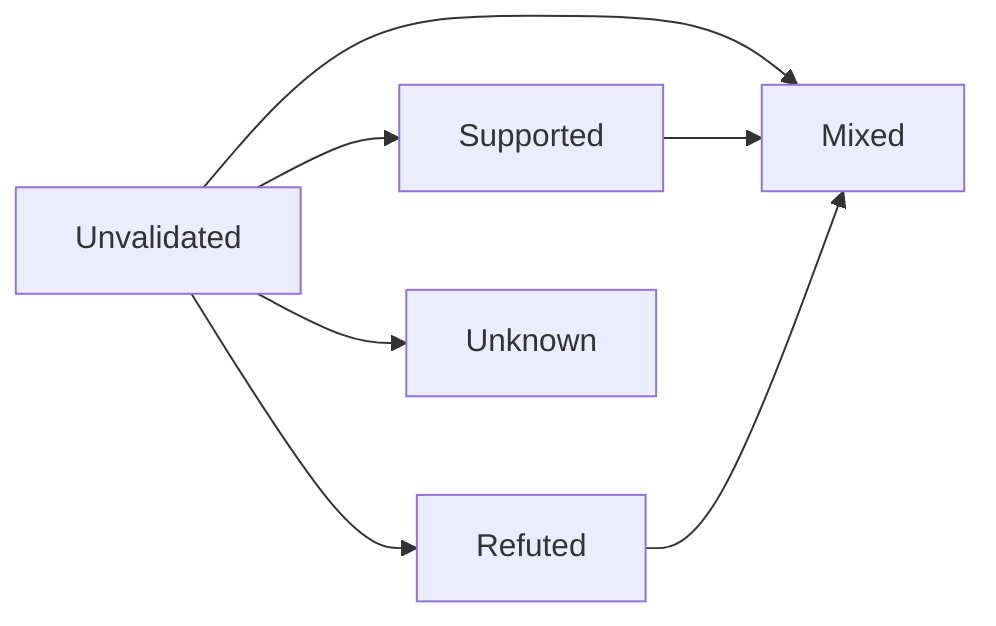

# 假设验证台账

维护 H1–H8 的验证状态。  
每场访谈后更新「证据」；状态变更需写明依据。

## 状态枚举

| 状态 | 含义 |
|------|------|
| **Unvalidated** | 未验证（默认） |
| **Supported** | 被多条独立证据倾向支持（仍非最终真理） |
| **Refuted** | 被证据倾向证伪 |
| **Mixed** | 证据冲突，需分群解释 |
| **Unknown** | 信息不足，无法判断 |

证据级别仍可标：Confirmed / Hypothesis / Unknown（单条证据质量）。

---

## H1 — 内容过载不是唯一瓶颈

| 字段 | 内容 |
|------|------|
| **描述** | 用户停止成长，更多因路径混乱与反馈缺失，而非找不到教程 |
| **当前状态** | Unvalidated |
| **证据** | 暂无一手访谈；桌面研究见 [[Problem_Hypothesis]] |
| **验证方式** | 访谈编码「上次放弃」的直接原因；统计「缺内容」占比 |
| **结果** | 待 10 场访谈后填写 |

---

## H2 — 坚持失败的主因是反馈与日程，而非懒惰

| 字段 | 内容 |
|------|------|
| **描述** | 中断主要由外部日程 + 缺少小反馈循环导致 |
| **当前状态** | Unvalidated |
| **证据** | 无 |
| **验证方式** | 坚持断裂时间线；区分外部事件 vs 自我归因「懒」 |
| **结果** | 待填写 |

---

## H3 — 能力不可见造成焦虑性囤课

| 字段 | 内容 |
|------|------|
| **描述** | 用户因说不清自己会什么而囤课/焦虑跳转 |
| **当前状态** | Unvalidated |
| **证据** | 无 |
| **验证方式** | 「如何证明你会什么」回答质量；囤课行为自述 |
| **结果** | 待填写 |

---

## H4 — 更愿为反馈与效率付费，胜过更多课

| 字段 | 内容 |
|------|------|
| **描述** | 同预算下，用户更愿为个性化反馈/省时间付费 |
| **当前状态** | Unvalidated |
| **证据** | 无；付费价格带 Unknown |
| **验证方式** | 真实付费历史 + 若重新付费会买什么；避免假想「你会买吗」 |
| **结果** | 待填写 |

---

## H5 — AI 可做部分导师反馈，但信任边界严格

| 字段 | 内容 |
|------|------|
| **描述** | 用户接受 AI 练习反馈；关键正确性要求高，幻觉伤害信任 |
| **当前状态** | Unvalidated |
| **证据** | 通用 AI 使用趋势可观察（非 LeapMa 场景 Confirmed） |
| **验证方式** | 询问已有 AI 学习经历；何种错误不可接受 |
| **结果** | 待填写 |

---

## H6 — 动态路径价值高于固定课表

| 字段 | 内容 |
|------|------|
| **描述** | 用户更想按表现调整下一步，而非统一课表 |
| **当前状态** | Unvalidated |
| **证据** | 无 |
| **验证方式** | 情境二选一 + 追问原因；记录反例（喜欢固定的人） |
| **结果** | 待填写 |

---

## H7 — 游戏化对进阶用户可能反噬

| 字段 | 内容 |
|------|------|
| **描述** | 进阶用户反感幼稚打卡；学生/初学者接受度更高 |
| **当前状态** | Unvalidated |
| **证据** | 无 |
| **验证方式** | 分群询问连胜/打卡感受与是否因此卸载过产品 |
| **结果** | 待填写 |

---

## H8 — 职场补技能者是更优首发 ICP

| 字段 | 内容 |
|------|------|
| **描述** | 相对大学生与进阶者，职场补技能在痛点×付费×可服务上更平衡 |
| **当前状态** | Unvalidated |
| **证据** | 仅有 [[Target_User_Analysis]] 桌面推断 |
| **验证方式** | 三群对照 + [[ICP_Decision_Framework]] 打分 |
| **结果** | 待填写；ICP 可随证据修订，**不阻塞** MVP PRD 起草 |

---

## 汇总看板

| ID | 状态 | 最近更新 | 备注 |
|----|------|----------|------|
| H1 | Unvalidated | 2026-07-20 | |
| H2 | Unvalidated | 2026-07-20 | P0 |
| H3 | Unvalidated | 2026-07-20 | P0 |
| H4 | Unvalidated | 2026-07-20 | P0 |
| H5 | Unvalidated | 2026-07-20 | P1 |
| H6 | Unvalidated | 2026-07-20 | P1 |
| H7 | Unvalidated | 2026-07-20 | P2 |
| H8 | Unvalidated | 2026-07-20 | P0 决策假设 |

## 变更日志

| 日期 | 变更 | 作者 |
|------|------|------|
| 2026-07-20 | 建账，全部 Unvalidated | |
