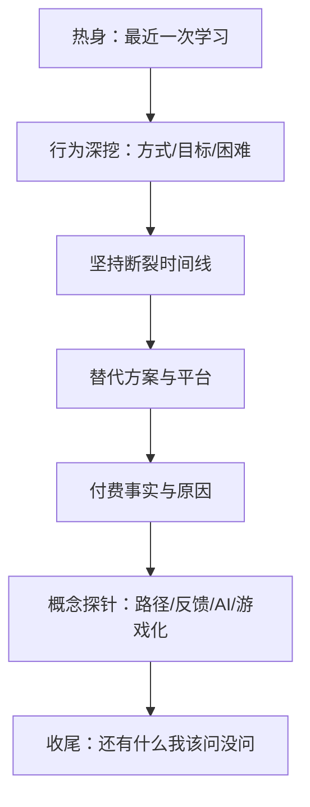

# 访谈计划 — Continuous Validation

## 0. 定位（Founder Review）

User Research = **Continuous Validation（持续验证）**  
**不是** MVP 开发 / PRD 推进的 **Development Blocker（开发阻塞）**。

| 可以并行 | 不必等待「凑满 10 场」才开始 |
|----------|------------------------------|
| MVP PRD Definition | 用当前 Hypothesis 起草，标注证据级别 |
| 假设滚动更新 | 每有新访谈就更新台账 |
| ICP 打分 | 证据增强后修订，允许先验启动 |

10 场仍是**推荐样本深度**，用于提高置信度，而非门禁闸门。

## 1. 访谈目标

在持续进行的创始人访谈中（建议累计约 10 次作为阶段里程碑）：

1. 验证/证伪核心问题假设（H1–H7）
2. 为三类候选人群打分，支撑 ICP（H8）— **可修订，非一次性锁死**
3. 收集真实行为故事，而非对 LeapMa 的偏好表态

**本阶段不产出功能清单、页面或技术方案。**

## 2. 需要验证的假设

优先顺序（与证据缺口对齐）：

| 优先级 | ID | 假设摘要 | 本轮必须回答？ |
|--------|-----|----------|----------------|
| P0 | H2 | 坚持失败主因是日程+反馈缺失 | 是 |
| P0 | H3 | 能力不可见 → 焦虑囤课 | 是 |
| P0 | H4 | 更愿为反馈/效率付费 | 是 |
| P1 | H1 | 瓶颈主要不是缺内容 | 是 |
| P1 | H5 | 接受 AI 反馈但怕幻觉 | 是（概念层，不演示产品） |
| P1 | H6 | 偏好动态路径胜于固定课表 | 是 |
| P2 | H7 | 游戏化对进阶者可能反噬 | 尽量分群覆盖 |
| P0 | H8 | 职场补技能更优首发 ICP | 是（对照三群） |

状态台账：[[Hypothesis_Validation]]

## 3. 样本设计（10 人）

### 3.1 分群配额（建议）

| 人群 | 人数 | 目的 |
|------|------|------|
| 大学生 | 3 | 对照求职驱动与预算 |
| 职场补技能 / 轻转型 | 4 | 验证 H8 主候选 |
| 进阶程序员 | 3 | 验证深度需求与游戏化反感 |

> 人数可 ±1，但三类都至少 2 人，否则 ICP 对照无效。

### 3.2 用户筛选条件

**通用准入（必须）：**

- 近 **90 天**内有过程序相关自学（任何形式）
- 能用 30–45 分钟中文沟通
- 同意匿名记录笔记（可录音需另行同意）

**分群准入：**

| 人群 | 必须满足 | 排除 |
|------|----------|------|
| 大学生 | 在读；目标含实习/校招/转专业入门 | 纯完成课设、无课外自学 |
| 职场补技能 | 全职工作；近半年学过新语言/框架/方向 | 工作完全不碰代码且无转行意图 |
| 进阶程序员 | ≥2 年相关经验；主动做体系化提升 | 仅面试刷题、无长期学习意图也可进样，但需标注 |

**排除（全局）：**

- LeapMa 团队成员/亲属
- 以向你销售课程/代理为目的的受访者
- 从未自学、只有学校被动听课者（除非明确在转型准备期）

### 3.3 招募渠道（建议，非功能）

熟人转介、校友群、技术社区私信、前同事；每渠道注明来源以免偏差。

## 4. 访谈问题设计（结构）

完整话术见 [[Founder_Interview_Guide]]。结构如下：

### 4.1 问题原则

| 做 | 不做 |
|----|------|
| 问最近一次具体事件 | 问「你喜欢 LeapMa 吗」 |
| 问做了什么、花了多久、卡在哪 | 问「你需不需要 AI 导师」 |
| 让对方讲故事 | 念愿景让对方表态 |
| 沉默等待 | 替对方总结成你的假设 |

### 4.2 与假设的映射（摘要）

| 问题主题 | 主要映射 |
|----------|----------|
| 最近一次学习过程 | H1 |
| 最大困难 / 卡住 | H1 H3 |
| 坚持失败时间线 | H2 |
| 「如何证明你会什么」 | H3 |
| 付费历史与原因 | H4 |
| AI 使用经历与不信任点 | H5 |
| 固定课表 vs 按表现调整（二选一故事） | H6 |
| 打卡/连胜感受 | H7 |
| 时间/预算/紧迫感 | H8 |

## 5. 执行节奏

| 项 | 建议 |
|----|------|
| 单次时长 | 30–45 分钟 |
| 记录 | 当场用 [[Interview_Template]]；结束后 15 分钟内补全 |
| 假设更新 | 每 2–3 场更新一次 [[Hypothesis_Validation]] |
| ICP 打分 | 第 5 场后初评；第 10 场后定稿讨论 |
| 停止条件 | 出现高度重复且三群对照清晰；或假设已被强证伪需改方向 |

## 6. 产出物（本阶段结束时应有）

- [ ] 10 份访谈记录（可脱敏）
- [ ] 更新后的 Hypothesis_Validation
- [ ] 填过分数的 ICP_Decision_Framework
- [ ] 一页纸：推荐首发人群 + 仍 Unknown 的风险

## 7. 非目标

- 不卖产品、不招募内测名单作为主目标
- 不做可用性测试（无产品）
- 不把「对方客气说好」当成验证

## 8. 链接

- [[Founder_Interview_Guide]]
- [[Interview_Template]]
- [[Hypothesis_Validation]]
- [[ICP_Decision_Framework]]
- [[Target_User_Analysis]]
