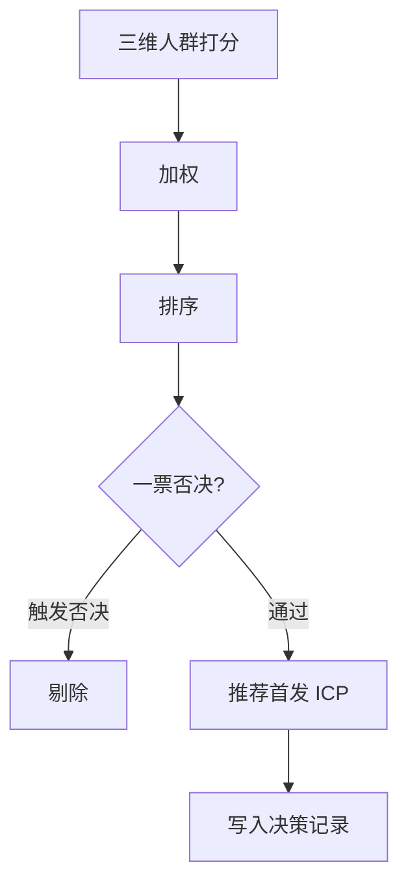

# ICP Decision Framework — 首发用户选择方法

本文提供**选择 LeapMa 第一个 MVP 服务人群**的方法。  
在访谈证据进入 [[Hypothesis_Validation]] 之前，任何「已定 ICP」都只是 **Hypothesis**，且**可随持续验证修订**。

ICP 打分**不阻塞** MVP PRD Definition（Continuous Validation）。

**禁止：** 用本框架直接导出功能列表、页面或技术方案。

## 1. 候选人群

与愿景一致的三候选：

| ID | 人群 |
|----|------|
| A | 大学生 |
| B | 职场补技能 / 轻转型 |
| C | 程序员进阶用户 |

## 2. 评价维度

对每个人群按 1–5 打分（5 最好）。**必须写证据来源**；无证据则分值旁标 `?` 且不得假装精确。

| 维度 | 含义 | 高分长相 | 低分长相 |
|------|------|----------|----------|
| 痛点强度 | 问题是否高频、急迫、痛 | 主动寻找出路，愿改行为 | 偶尔抱怨，可忍受 |
| 用户规模 | 可触达的相关人数量级 | 足够支撑早期学习样本 | 过窄难验证 |
| 付费可能 | 是否有真实付费行为/能力 | 已为学习付过费且愿再付 | 只想免费 or 无预算 |
| 获取成本 | 早期接触该人群的难度 | 创始人能两周内约到访谈/试用 | 难找、长周期、贵 |
| 产品匹配度 | 与愿景四要素是否同向 | 强需求反馈/路径/可见/坚持 | 只需题库或纯内容 |
| 留存潜力 | 是否可能形成重复使用 | 有持续目标与可周更的习惯位 | 脉冲式（如仅面试季） |

> 「用户规模」「获取成本」在访谈前多为 **Unknown/Hypothesis**，打分宜保守。

## 3. 打分表（空白，访谈后填）

分数：1–5；证据：访谈 ID / 桌面研究 / 未知

### 3.1 人群 A — 大学生

| 维度 | 分数 | 证据 | 备注 |
|------|------|------|------|
| 痛点强度 | | | |
| 用户规模 | | | |
| 付费可能 | | | |
| 获取成本 | | | |
| 产品匹配度 | | | |
| 留存潜力 | | | |
| **小计** | | | |

### 3.2 人群 B — 职场补技能 / 轻转型

| 维度 | 分数 | 证据 | 备注 |
|------|------|------|------|
| 痛点强度 | | | |
| 用户规模 | | | |
| 付费可能 | | | |
| 获取成本 | | | |
| 产品匹配度 | | | |
| 留存潜力 | | | |
| **小计** | | | |

### 3.3 人群 C — 进阶程序员

| 维度 | 分数 | 证据 | 备注 |
|------|------|------|------|
| 痛点强度 | | | |
| 用户规模 | | | |
| 付费可能 | | | |
| 获取成本 | | | |
| 产品匹配度 | | | |
| 留存潜力 | | | |
| **小计** | | | |

## 4. 权重（默认）

可根据策略调整，调整必须写理由。

| 维度 | 默认权重 | 理由 |
|------|----------|------|
| 痛点强度 | 20% | 无痛不做 |
| 付费可能 | 20% | MVP 需可学习的商业信号 |
| 产品匹配度 | 20% | 避免选错题 |
| 留存潜力 | 15% | 对齐 NSM（有效成长会话） |
| 获取成本 | 15% | 创始人阶段可执行性 |
| 用户规模 | 10% | 早期够用即可，不必最大盘 |

**加权分** = Σ(分数 × 权重)



## 5. 一票否决（硬门槛）

任一成立 → 该人群**不得**作为首发 ICP（仍可后续服务）：

1. 痛点强度访谈后仍 ≤2，且无紧急外部目标  
2. 付费可能上，样本中几乎无人有学习付费史，且明确拒绝为反馈付费  
3. 产品匹配度上，核心诉求明显是「只要题库/只要找工作内推」等，与成长系统冲突  
4. 获取成本上，4 周内无法稳定接触到连续用户  

否决记录：

| 人群 | 是否否决 | 条款 | 证据 |
|------|----------|------|------|
| A | | | |
| B | | | |
| C | | | |

## 6. 访谈前的「先验假设」（非正式打分）

> 仅作对照，**不能**代替访谈后分数。来源：[[Target_User_Analysis]]，级别均为 **Hypothesis**。

| 维度 | A 大学生 | B 职场补技能 | C 进阶 | 级别 |
|------|----------|--------------|--------|------|
| 痛点强度 | 中高 | 高 | 中 | Hypothesis |
| 用户规模 | 大 | 中大 | 中 | Hypothesis |
| 付费可能 | 中低（节点高） | 中高 | 中高但挑剔 | Hypothesis |
| 获取成本 | 低 | 中 | 中高 | Hypothesis |
| 产品匹配度 | 中高 | 高 | 中（深度门槛） | Hypothesis |
| 留存潜力 | 中（学期波动） | 中高 | 中（缺紧迫感） | Hypothesis |
| **先验倾向** | 增长池 | **主候选** | 后期深度 | Hypothesis = H8 |

## 7. 决策输出模板

访谈结束后复制填写：

```markdown
## ICP 决策记录 — YYYY-MM-DD

- 加权分：A=_ B=_ C=_
- 否决：_
- 推荐首发 ICP：_
- 明确不做首发：_
- 支撑假设状态：H8 = _
- 仍 Unknown：_
- 决策人：_
- 反对意见：_
```

## 8. 与下游的边界

| 本框架产出 | 不产出 |
|------------|--------|
| 首发服务谁 | 功能列表 |
| 为什么是他们 | 页面信息架构 |
| 风险与 Unknown | 技术选型 |

首发 ICP 确定后，下一阶段才是问题级 PRD（仍非 Spec/代码）。

## 9. 链接

- [[Interview_Plan]]
- [[Hypothesis_Validation]]
- [[Target_User_Analysis]]
- [[LeapMa_Vision]]
- [[Product_Principles]]
