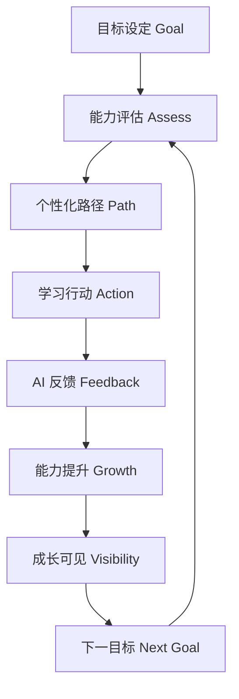

# Core Growth Loop — 用户成长循环

> 回答：**用户为什么会回来？**  
> Founder Review 调整：**目标驱动**是程序员成长的重要动力。  
> 证据：机制为 **Hypothesis**；目标驱动在程序员学习中常见为 **Hypothesis**（待持续验证）。

## 1. 核心闭环（目标驱动）



文本链：

```text
目标设定
  → 能力评估
  → 个性化路径
  → 学习行动
  → AI 反馈
  → 能力提升
  → 成长可见
  → 下一目标
```

| 环节 | 产品语义（非实现） | 失败时用户感受 | 级别 |
|------|-------------------|----------------|------|
| 目标设定 | 我为何学、学到什么算成功 | 「漫无目的刷」 | **Hypothesis** |
| 能力评估 | 相对目标，我现在在哪 | 「盲目跟课」 | **Hypothesis** |
| 个性化路径 | 基于缺口的下一步序列 | 「又回到统一课表」 | **Hypothesis** |
| 学习行动 | 短练习 / 提问 / 改错再练 | 「太重，今天算了」 | **Hypothesis** |
| AI 反馈 | 纠错、讲解、坦诚边界 | 「废话/幻觉」→ 信任崩 | **Hypothesis** |
| 能力提升 | 真实微小进展 | 「忙了白忙」 | **Hypothesis** |
| 成长可见 | 进展/缺口相对目标可感知 | 「不知道有没有变强」 | **Hypothesis** |
| 下一目标 | 达成后升阶或调整目标 | 「做完就空」→ 流失 | **Hypothesis** |

**强调：** 程序员常被外部/内在目标拉动（转岗、项目、面试、体系补洞）。闭环以目标开、以下一目标续，而不是纯提醒打卡。级别：**Hypothesis**

## 2. 为什么用户会回来（留存燃料）


| 燃料 | 说明 | 空转风险 | 级别 |
|------|------|----------|------|
| 目标开放环 | 「我还没达到声明的目标」 | 目标过大 → 放弃 | **Hypothesis** |
| 路径下一步 | 个性化开放任务 | 下一步过难 → 回避 | **Hypothesis** |
| 反馈可依赖 | 回来为了被纠正/讲清 | 幻觉 → 永久离开 | **Hypothesis** |
| 进展相对目标可见 | 中断有「能力资产」 | 假进度条 | **Hypothesis** |

**MVP 优先依赖：** 目标清晰 + 评估后的路径下一步 + 可信反馈 + 可见进展。级别：**Hypothesis**

## 3. 与竞品燃料的对照（借力不抄功能）

| 参照 | 燃料 | LeapMa 借鉴 | 级别 |
|------|------|-------------|------|
| LeetCode | 外部目标 + 快判 | 目标驱动 + 快反馈 | **Hypothesis** |
| Boot.dev | 动手结果 + 身份目标 | 行动须有结果；目标可叙事 | **Hypothesis** |
| Codecademy | 路径安心 | 路径须接在评估之后 | **Hypothesis** |
| Duolingo | 习惯 | 低启动；须服务目标而非空转 | **Hypothesis** |

## 4. 闭环健康检查

1. 这一步是否让用户更接近**自设目标**？  
2. 是否可能制造空转（打卡无成长）？  
3. 是否把用户推去「只把 AI 当聊天」而跳出环？  
4. 免费层是否仍包含从目标到下一目标的完整环？（原则 9）

## 5. 免费层必须包含整环

原则 9（Growth Before Monetization）：免费用户跑通目标驱动闭环，付费增强强度/深度。  
详见 [[Product_Principles]] · [[Free_vs_Paid_Strategy]]

## 相关文档

- [[MVP_Vision]] · [[MVP_User_Journey]] · [[MVP_Scope]] · [[Product_North_Star]]
