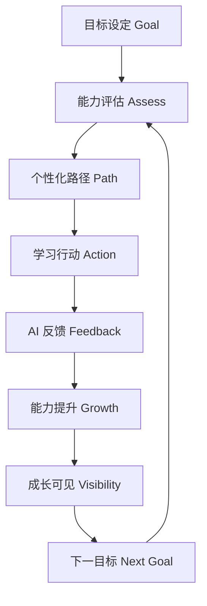

# Core Growth Loop v1.0 — LeapMa MVP 产品真源

> **状态：v1.0 正式生效**（Phase 2 Founder Review 定稿）  
> 本文是 LeapMa MVP 的**产品真源（Product Source of Truth）**之一。  
> 回答：用户为什么留下、为什么回来、功能如何对齐成长。

## 强制规则

**所有未来功能 / PRD 条目必须说明：服务本闭环的哪一个（或多个）环节。**  
无法映射到本环的功能，默认降级或拒绝（除非 Founder 显式例外并记入 [[Decision_Log]]）。

## 1. 闭环流程（v1.0）



```text
目标设定
  → 能力评估
  → 个性化路径
  → 学习行动
  → AI 反馈
  → 能力提升
  → 成长可见
  → 下一目标
```

| 环节 ID | 名称 | 产品语义（非实现） | 级别 |
|---------|------|-------------------|------|
| GL-1 | 目标设定 | 为何学、何为成功 | **Hypothesis**（机制已定稿；效果待验） |
| GL-2 | 能力评估 | 相对目标的当前位置 | **Hypothesis** |
| GL-3 | 个性化路径 | 基于缺口的下一步序列 | **Hypothesis** |
| GL-4 | 学习行动 | 短练习 / 提问 / 改错再练 | **Hypothesis** |
| GL-5 | AI 反馈 | 纠错、讲解、坦诚边界 | **Hypothesis** |
| GL-6 | 能力提升 | 真实微小进展 | **Hypothesis** |
| GL-7 | 成长可见 | 相对目标的进展/缺口可感知 | **Hypothesis** |
| GL-8 | 下一目标 | 升阶或调整目标，续环 | **Hypothesis** |

**强调：** 目标驱动是程序员成长的重要动力。闭环以目标开、以下一目标续。

## 2. 功能映射模板（必填）

新增功能时复制：

| 字段 | 填写 |
|------|------|
| 功能名称 | |
| 服务环节（GL-1…GL-8） | |
| 如何增强该环节 | |
| 是否破坏其他环节 | 否 / 是（说明） |
| 证据级别 | Hypothesis / Confirmed / Unknown |

## 3. 为什么用户会回来

| 燃料 | 对应环节 | 级别 |
|------|----------|------|
| 目标未完成 | GL-1 / GL-8 | **Hypothesis** |
| 路径上的下一步 | GL-3 | **Hypothesis** |
| 可信反馈 | GL-5 | **Hypothesis** |
| 相对目标的进展可见 | GL-7 | **Hypothesis** |

## 4. 免费层必须包含整环

对齐原则 9 Growth Before Monetization：免费用户跑通 GL-1…GL-8；付费增强效率、深度、个性化，不拆环。

## 5. 版本

| 版本 | 日期 | 说明 |
|------|------|------|
| v1.0 | 2026-07-21 | Phase 2 定稿，定为 MVP 产品真源 |

变更本环须 Founder 批准并更新 [[Decision_Log]]。

## 相关文档

- [[MVP_Vision]] · [[Free_vs_Paid_Strategy]] · [[MVP_Scope]] · [[Product_Principles]] · [[Decision_Log]]
