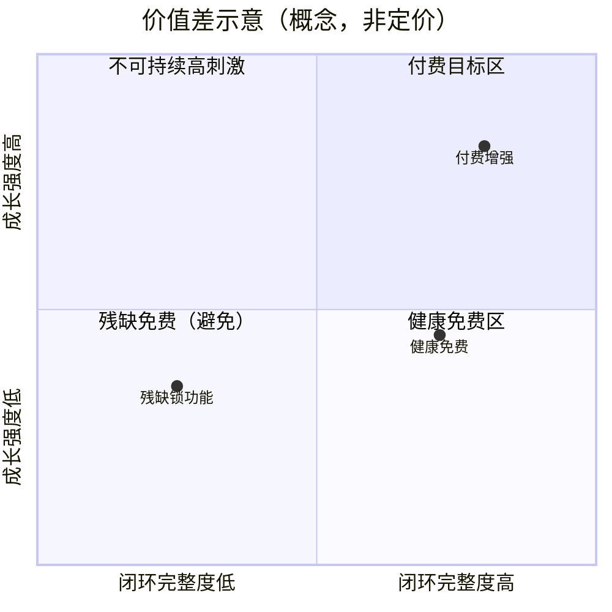

# Free vs Paid Strategy — Freemium 价值差异

> **不要简单锁功能。** 从价值差异分析：留下 vs 升级。  
> **禁止假设用户一定付费。** 转化是 **Hypothesis**，价格与比例均为 **Unknown**。

上游：[[MVP_Vision]] · [[Core_Growth_Loop]] · 原则 9 [[Product_Principles]]

## 1. 总原则

| 原则 | 含义 | 级别 |
|------|------|------|
| 免费先成才 | 免费层必须能形成习惯与有效成长会话 | **Hypothesis** |
| 付费买加速与深度 | 付费解决「更强问题」，不是修复残缺产品 | **Hypothesis** |
| 阻断体验 = 战略失误 | 过早切断反馈/下一步会伤害留存与口碑 | **Hypothesis** |
| 转化靠天花板 | 用户感到「免费已有用，但不够快/不够深」时升级 | **Hypothesis** |

---

## 2. Free 用户

### 2.1 提供什么价值？

| 价值 | 说明 | 级别 |
|------|------|------|
| 完整成长环 | 目标→评估→路径→行动→反馈→可见→下一目标 可跑通 | **Hypothesis** |
| 基础 AI 反馈 | 对练习/卡住给出可理解纠错与下一步 | **Hypothesis** |
| 轻量能力可见 | 知道「今天进展/主要缺口」 | **Hypothesis** |
| 有限但诚实的辅导 | 额度或深度有界，但不说谎充专家 | **Hypothesis** |

### 2.2 为什么留下？

- 第一次就感到「被反馈 + 有下一步」（Activation）  
- 回来成本低：短会话也能完成一圈  
- 进展可见，中断后敢重启  

级别：**Hypothesis**；真实比例 **Unknown**

### 2.3 如何形成习惯？

| 机制 | 说明 | 护栏 | 级别 |
|------|------|------|------|
| 每日/每周开放环 | 未完成的下一步自然召回 | 下一步须可完成 | **Hypothesis** |
| 有效会话奖励感 | 奖励绑成长，不绑空打卡 | 对齐原则 5 | **Hypothesis** |
| 信任累积 | 反馈有用 → 默认打开 LeapMa 而非纯聊天 | 幻觉为零容忍倾向 | **Hypothesis** |

### 2.4 Free 明确不该做的事

- 把关键反馈整段锁死，只留「试玩残片」  
- 用强骚扰兑换留存  
- 把免费用户当「转化炮灰」叙事  

级别：原则 9 Growth Before Monetization — **Accepted**（Phase 2 定稿）；商业压力下执行力 — **Unknown**

---

## 3. Paid 用户

### 3.1 为什么升级？（动机假设，非保证）

用户可能在以下「更强问题」时考虑付费：

| 更强问题 | 付费价值方向 | 级别 |
|----------|--------------|------|
| 卡住恢复太慢 | 更深诊断、多轮辅导、更细纠错 | **Hypothesis** |
| 路径不够贴合目标 | 更强个性化（目标/弱项/节奏） | **Hypothesis** |
| 能力可见太粗 | 更清晰的中期能力图景与里程碑 | **Hypothesis** |
| 时间极度稀缺 | 「同样时间更高有效进展」的效率感 | **Hypothesis** |
| 临近外部节点 | 冲刺期需要更高强度陪伴 | **Hypothesis** |

**不作为主叙事的升级理由：** 「不付费就几乎不能用」。  
级别：**Hypothesis**

### 3.2 付费价值是什么？（价值差摘要）

| 维度 | Free | Paid（方向） | 级别 |
|------|------|--------------|------|
| 闭环完整 | 完整 | 完整 | **Hypothesis** |
| 反馈深度 | 基础够用 | 更深、更稳、更多轮 | **Hypothesis** |
| 路径个性化 | 基础下一步 | 更强目标对齐与调整 | **Hypothesis** |
| 能力可见 | 轻量 | 更丰富的进展叙事 | **Hypothesis** |
| 强度/额度 | 有健康上限 | 提高上限 | **Hypothesis** |

具体权益清单、价格、包月/包年：**Unknown**（待访谈与实验；本阶段不定）

### 3.3 转化逻辑（必须能一句话说清）

> 免费让你养成有效成长；付费让你在同样习惯上**长得更快、卡得更少、看得更清**。

级别：**Hypothesis**  
验证方式：持续访谈 + Monetization Signal；早期看天花板动机而非强迫付费。

---

## 4. 反模式（禁止倾向）

| 反模式 | 为什么有害 | 级别 |
|--------|------------|------|
| Paywall 砍断反馈 | 破坏闭环与原则 9 | **Hypothesis** |
| 只有付费才有下一步 | 免费无法习惯 → 无人可转化 | **Hypothesis** |
| 用羞耻文案逼升级 | 伤害信任与品牌 | **Hypothesis** |
| 用空转游戏化刷 DAU 再卖会员 | 违反原则 5，转化虚高 | **Hypothesis** |

## 5. Founder Review

- [ ] 是否批准「健康免费 + 付费增强」而非「残缺免费」？  
- [ ] 付费「更强问题」列表是否要增删？  
- [ ] 是否接受价格与包装延后到访谈后？  

## 相关文档

- [[MVP_User_Journey]] · [[Success_Metrics]] · [[MVP_Risk_Assessment]]
