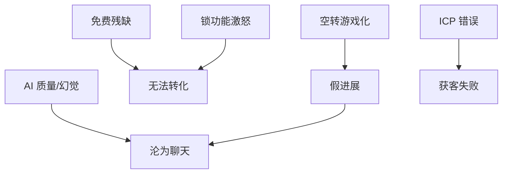

# MVP Risk Assessment — 最大风险

> 风险均为待验证；缓解是产品策略，非技术方案。

## 1. 风险清单

| ID | 风险 | 若发生 | 可能性* | 影响* | 级别 |
|----|------|--------|---------|-------|------|
| R1 | 用户只把 AI 当聊天工具，不进成长环 | 无留存、无差异化 | 高 | 致命 | **Hypothesis** |
| R2 | 游戏化/提醒无法提升真实坚持 | DAU 虚高，Learning 低 | 中 | 高 | **Hypothesis** |
| R3 | 免费用户无法自然转化 | 商业不可持续 | 中高 | 高 | **Unknown** 比例 |
| R4 | AI 反馈质量不足 / 幻觉 | 信任崩、卸载 | 高 | 致命 | **Hypothesis** |
| R5 | 免费过残或缺闭环 | 无人可留、口碑差 | 中（若违反原则 9） | 致命 | **Hypothesis** |
| R6 | 首发 ICP 选错（H8 为假） | 获客与叙事错位 | 中 | 高 | Unvalidated |
| R7 | 「成长可见」做成假进度条 | 短期留存、长期幻灭 | 中 | 高 | **Hypothesis** |
| R8 | 付费靠锁功能激怒用户 | 转化虚、品牌损 | 中（若选错 Freemium） | 高 | **Hypothesis** |

\*可能性/影响为创始人待评的主观栏，非数据。

## 2. 风险关系

## 3. 缓解策略（产品层）

| 风险 | 缓解 | 对应文档 |
|------|------|----------|
| R1 | Activation 强制走到反馈+下一步+可见；成功标准对比纯聊天 | [[MVP_Vision]] [[Success_Metrics]] |
| R2 | 奖励绑有效会话；护栏空转比 | 原则 5、NSM 护栏 |
| R3 | 先证明免费有用；转化看天花板动机 | [[Free_vs_Paid_Strategy]] |
| R4 | 诚实边界；无帮助反馈可标记；信任优先于「答得满」 | 原则 6、H5 |
| R5/R8 | 原则 9；禁止残缺免费 | [[Product_Principles]] |
| R6 | 持续验证 + ICP 可修订；**不**阻塞 MVP PRD | [[ICP_Decision_Framework]] · Continuous Validation |
| R7 | 可见性关联真实缺口/进展语义 | 原则 4 |

## 4. 最大风险（当前判断）

**第一致命风险：R4 + R1（反馈不可信 → 产品沦为可替换聊天）。**  
级别：**Hypothesis**

**第二致命风险：R5（为了变现拆掉免费闭环）。**  
级别：**Hypothesis**（流程上可控，若坚持原则 9）

**商业不确定性：R3（转化）— 允许未知，禁止用锁功能伪造确定性。**

## 5. Founder Review

- [ ] 是否同意 R4/R1 为最高优先级？  
- [ ] 是否有遗漏的致命风险？  
- [ ] 缓解是否足够「可执行且仍不碰代码」？  

## 相关文档

- [[MVP_Vision]] · [[Free_vs_Paid_Strategy]] · [[Open_Questions]]
