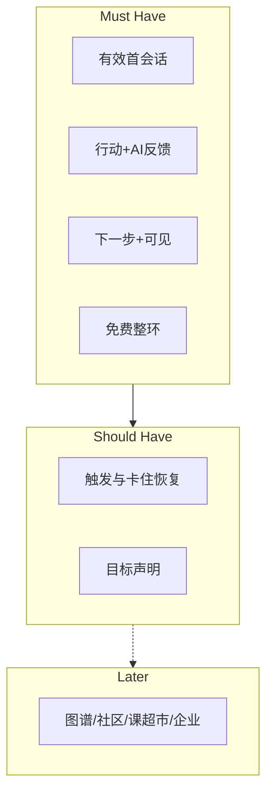

# MVP Scope — 第一版本范围

> 内容是**能力/体验块**，不是 UI/API/库表。  
> 每项含：用户问题 · 验证假设 · 影响指标。

首发人群暂定：职场补技能（H8）— **Hypothesis**，访谈可推翻。

## Must Have

| 能力块 | 对应用户问题 | 验证假设 | 影响指标 |
|--------|--------------|----------|----------|
| 首次目标驱动有效会话 | 第一次不知道为什么留下 | M1、目标驱动闭环 | Activation |
| 目标设定 + 轻量能力评估 | 盲目跟课、无方向 | 闭环 Goal/Assess | Activation、Learning |
| 个性化路径「下一步」 | 路径混乱 | H1、H6 | Retention、Activation |
| 短学习行动 | 启动成本过高 | H2 | WEGS、Retention |
| AI 反馈（纠错/讲解/坦诚边界） | 缺反馈、不信任 | H5 | Activation、Learning、护栏 |
| 成长可见 → 下一目标 | 能力不可见、做完就空 | H3 | Retention、Learning |
| 免费层跑通整环 | 免费被限制则无法习惯 | M1、原则 9 | Retention、Monetization Signal 基础 |
| 付费增强叙事清晰 | 不知为何升级 | M2、H4 | Monetization Signal |
## Should Have

| 能力块 | 对应用户问题 | 验证假设 | 影响指标 |
|--------|--------------|----------|----------|
| 卡住恢复增强（免费有基础，付费更深 — 仅定义差异） | 连续挫败离开 | H2、H5 | Retention、Conversion |
| 极轻习惯触发（非骚扰） | 想不起来回来 | 留存燃料 | Retention |
| 目标声明（学什么/为何学） | 无外部锚点易漂 | H8 场景 | Activation、Retention |
| 无帮助反馈标记/降级路径 | 幻觉与废话 | H5 | 护栏、信任 |

## Later

| 能力块 | 为何 Later | 关联 |
|--------|------------|------|
| 完整知识图谱可视化 | MVP 只需「轻量可见」 | 原则 4 的深化 |
| 重度游戏化/联赛 | 空转与进阶反噬风险（H7） | Non_Goals |
| 社区/论坛 | 非核心闭环 | Non_Goals |
| 完整课程超市 | 违反成长优先 | Non_Goals |
| 企业培训套件 | 垂直原则 | Non_Goals |
| 多语言全面内容 | 范围爆炸 | Non_Goals |
| 精细计费与多种套餐 | 价格 **Unknown**，先验证意愿 | Free_vs_Paid |

## 范围边界图

## Founder Review

- [ ] Must 是否过重或过轻？  
- [ ] 是否有被误放进 Must 的实现项？  
- [ ] Later 列表是否有创始人坚持 MVP 就要的项？  

## 相关文档

- [[Non_Goals]] · [[MVP_Vision]] · [[Success_Metrics]]
