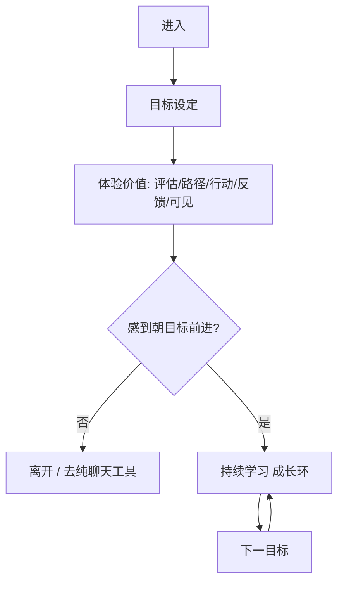
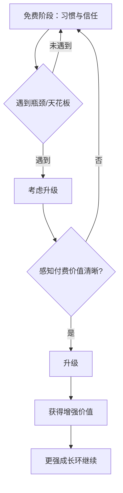

# MVP User Journey — 免费与付费旅程

> 问题层旅程，**非**页面线框。  
> 级别：旅程结构 **Hypothesis**；行为比例 **Unknown**。

## 1. 免费用户旅程

### 阶段说明

| 阶段 | 用户在做什么 | 产品应交付 | 级别 |
|------|--------------|------------|------|
| 进入 | 带着目标或焦虑到来 | 尽快澄清目标，少选择 | **Hypothesis** |
| 体验价值 | 评估 → 路径 → 行动 → 反馈 → 可见 | 完成首次目标驱动有效会话 | **Hypothesis** |
| 持续学习 | 朝下一目标重复成长环 | 目标开放环 + 可信反馈 | **Hypothesis** |

### 免费旅程成功标准

用户能回答：「我为什么还要用 LeapMa，而不是只开 ChatGPT？」  
期望答案方向：下一步 + 持续可见的成长，而不只是单次问答。级别：**Hypothesis**

---

## 2. 付费用户旅程

### 阶段说明

| 阶段 | 用户状态 | 产品应交付 | 级别 |
|------|----------|------------|------|
| 免费阶段 | 已形成有效会话习惯 | 完整闭环，建立信任 | **Hypothesis** |
| 遇到瓶颈 | 恢复慢 / 路径不够贴 / 时间更紧 / 目标临近 | 让天花板可被感知，而非羞辱 | **Hypothesis** |
| 升级 | 主动选择更强成长 | 价值差说清（深度/速度/可见） | **Hypothesis** |
| 增强价值 | 付费后应感到「卡更少/更清楚」 | 付费后 Learning / WEGS 应变好 | **Unknown** 证据 |

### 付费旅程纪律

- 瓶颈应是**成长瓶颈**，不是**人工残缺**  
- 升级理由应能在访谈里被用户用自己的话复述  

级别：**Hypothesis**

---

## 3. 两条旅程的对照

| | 免费 | 付费 |
|--|------|------|
| 核心问题 | 为什么回来？ | 为什么升级？ |
| 答案方向 | 反馈+下一步+可见 | 突破免费层天花板 |
| 失败模式 | 变成一次性 AI 聊天 | 因锁功能愤怒付费或永久离开 |

## 相关文档

- [[Free_vs_Paid_Strategy]] · [[Core_Growth_Loop]] · [[Success_Metrics]]
