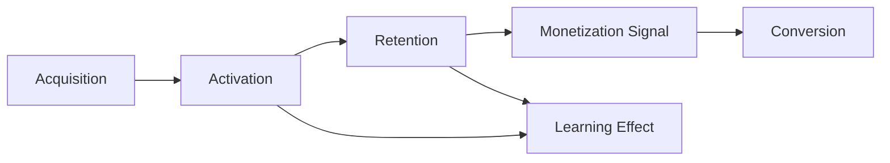

# Success Metrics — MVP 成功指标

> 定义**看什么**，不定义埋点/数仓/技术实现。  
> 对齐 NSM：[[Product_North_Star]]（WEGS）  
> 目标值多为 **Unknown**；方向为 **Hypothesis**。

## 总览

---

## Acquisition — 用户如何进入

| 指标（方向） | 含义 | 级别 |
|--------------|------|------|
| 合格访客→注册/开始率 | 目标人群进入意愿 | **Unknown** |
| 来源质量（假设 ICP 占比） | 是否摸到目标人群 | **Hypothesis**（H8） |

**非目标：** 纯广告量最大化。

---

## Activation — 第一次价值体验

对齐目标驱动闭环的首次穿越（至少：目标或意图 → 行动 → 反馈 → 可见下一步）。

| 指标（方向） | 含义 | 级别 |
|--------------|------|------|
| 首会话完成有效成长会话比例 | 是否真正 Aha | **Hypothesis** |
| 首会话→次日/三日再访 | 第一次是否值得回来 | **Hypothesis** |
| 「无帮助反馈」报告率 | 信任护栏 | **Hypothesis** |

---

## Retention — 为什么回来

| 指标（方向） | 含义 | 级别 |
|--------------|------|------|
| WEGS | 北极星 | 基线 **Unknown** |
| D7 / D30 有效会话用户占比 | 习惯 | **Unknown** |
| 空转会话占比（护栏） | 假活跃 | **Hypothesis** |
| 「无目标 / 不知下一步」占比（护栏） | 目标-路径失效 | **Hypothesis** |

回来 = 再次完成有效成长会话。级别：**Hypothesis**

---

## Monetization Signal — 货币化信号（早期）

> **早期不要求付费。**  
> 在真实 Conversion 之前，观察用户是否出现「愿意为更强成长付费」的信号。  
> 状态：**Hypothesis**

| 信号（方向） | 含义 | 级别 |
|--------------|------|------|
| 升级兴趣 | 主动询问会员/升级、点击了解付费价值（非强迫） | **Hypothesis** |
| 高级能力需求 | 表达需要更深诊断、更强路径、更高强度辅导 | **Hypothesis** |
| 价值感知 | 能用自己的话说清「免费已有用，若付费希望多得到什么」 | **Hypothesis** |

**纪律：**

- Monetization Signal ≠ 收入 KPI  
- 无信号时优先修成长闭环，而不是加硬 paywall  
- 有信号时再设计 Conversion 实验  

对齐原则 9：Growth Before Monetization。

---

## Conversion — 为什么付费

| 指标（方向） | 含义 | 级别 |
|--------------|------|------|
| 试用/升级率（有真实付费能力后） | 转化 | **Unknown** |
| 升级原因编码（天花板 vs 愤怒锁功能） | 验证 M2 | **Hypothesis** |
| 付费后 WEGS / Learning | 付费是否增强成长 | **Unknown** |

**纪律：** 不假设用户一定付费；免费已无价值时的「转化失败」算产品失败。

---

## Learning Effect — 是否真正成长

| 指标（方向） | 含义 | 级别 |
|--------------|------|------|
| 相对目标的自评进展 | 目标驱动是否生效 | **Hypothesis** |
| 「更清楚会/不会」 | 能力可见 | **Hypothesis** |
| 同类错误重复下降（概念） | 反馈生效 | **Unknown** |

---

## 指标与灵魂问题

| 灵魂问题 | 主看 |
|----------|------|
| 为什么留下？ | Activation |
| 为什么持续？ | Retention + 目标开放环 |
| 为什么可能付费？ | Monetization Signal → Conversion |

## Founder Review

- [ ] Monetization Signal 三类是否够用？  
- [ ] 是否确认早期不强制付费 KPI？  

## 相关文档

- [[Free_vs_Paid_Strategy]] · [[Product_North_Star]] · [[MVP_Risk_Assessment]]
