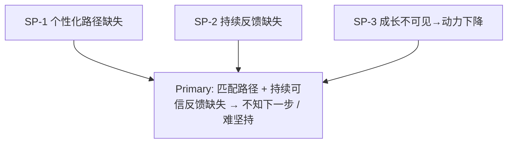

# MVP Core Problem — 核心问题（定稿表述）

> **Problem First。** 禁止 Spec / 代码 / UI。  
> Founder Final Review 方向已批准；按要求暂不 commit。

## 1. Primary Problem（唯一主问题）

> **用户在技术成长过程中，缺少与自身目标匹配的成长路径，以及持续可信的反馈机制，导致不知道下一步如何提升，并难以长期坚持。**

| 字段 | 内容 |
|------|------|
| 谁 | 想提升技术能力的学习者（MVP 主焦点假设：职场补技能） |
| 缺失一 | 与自身目标匹配的成长路径 |
| 缺失二 | 持续可信的反馈机制 |
| 结果 | 不知道下一步如何提升；难以长期坚持 |
| 证据 | **Hypothesis**（持续验证）；表述 **Accepted**（Founder） |

对应 Growth Loop 主战场：**GL-3（路径）+ GL-5（反馈）**；行动（GL-4）与可见/续环（GL-6…8）承接结果。

---

## 2. Supporting Problems（支撑问题）

| ID | 支撑问题 | 说明 | 对应 GL | 证据 |
|----|----------|------|---------|------|
| SP-1 | **个性化成长路径缺失** | 路径未贴合个人目标与缺口 | GL-3（辅 GL-1/2） | **Hypothesis** |
| SP-2 | **持续反馈缺失** | 缺少及时、可信、可延续的反馈 | GL-5（辅 GL-4） | **Hypothesis** |
| SP-3 | **成长不可见导致动力下降** | 进展说不清，难以坚持回来 | GL-6 / GL-7 / GL-8 | **Hypothesis** |

支撑问题服务于 Primary，不做独立大平台野心。

---

## 3. Not Solving Yet

见 [[MVP_Out_of_Scope]] Hard No：课程平台、社区、招聘、IDE、代码生成工具、复杂游戏系统等。

---

## 4. 层级总览

---

## 5. ICP 假设

| 人群 | 角色 | 证据 |
|------|------|------|
| 职场补技能 / 轻转型 | 主焦点（假设） | H8 **Hypothesis** |
| 大学生 | 非唯一定义焦点 | **Hypothesis** |
| 进阶程序员 | Not focus | **Hypothesis** |

---

## 6. 与 Must 故事对齐

| Primary / Supporting | Must Story |
|----------------------|------------|
| 匹配路径 / SP-1 | US-01 |
| 持续反馈 / SP-2 | US-02 |
| 成长可见与坚持 / SP-3 | US-03 |
| 原则 9 免费可验证整环 | US-04 |

## 相关文档

- [[User_Stories]] · [[Acceptance_Criteria]] · [[MVP_Out_of_Scope]] · [[Decision_Log]] D-039
