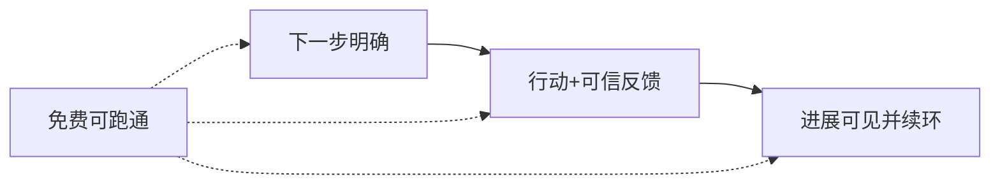

# Phase 3 PRD Quality Review Report

审查日期：2026-07-21  
范围：`docs/03_Product/PRD/`  
未进入 Spec / 代码。

---

## 1. 当前 MVP 是否聚焦？

**修订前：** 不够聚焦。P1–P5 近似并列，US/AC 各 10 条，像「把 Growth Loop 每一环都做成独立史诗」，有 Feature 铺开风险。

**修订后（本轮已改文档）：**

| 层级 | 定义 |
|------|------|
| **Primary** | 不知下一步该练什么 + 缺以及时可信反馈 |
| **Supporting** | 最低目标、轻量位置、进展可见/续环（最小必要） |
| **Not Solving Yet** | 课平台/社区/招聘/IDE/代码生成/复杂游戏等 |

**结论：** 修订后**可以聚焦**；是否最终通过取决于 Founder 是否认可该 Primary 表述。  
证据级别：问题本身仍为 **Hypothesis**。

---

## 2. 最大范围风险

| 风险 | 说明 | 级别 |
|------|------|------|
| **环上铺功能** | 把 GL-1…GL-8 各做成大系统 | 高（修订前已出现） |
| **课程平台化回潮** | 用「补内容」代替「下一步+反馈」 | 高 |
| **工具化漂移** | IDE / 代码生成抢主叙事 | 高 |
| **社交/游戏填留存** | 用社区或复杂游戏掩盖闭环未通 | 中高 |
| **AC 变成 UI 清单** | 验收变成页面有无 | 中（已改写为价值闭环） |

---

## 3. 建议删减内容

| 原内容 | 处理 |
|--------|------|
| US-01…US-10 全部 Must | **已收敛为 4 条 Must**；增强价值等 → Later |
| AC-01…AC-10 全部 Must | **已收敛为 4 条 Must AC** |
| P1–P5 同等主问题 | **已改为 1 Primary + 3 Supporting** |
| 独立深度评估/目标管理/付费说明 | Later / Not Solving Yet |

---

## 4. 推荐 MVP 核心闭环

```text
定向：相对目标得到「下一步」
    → 行动 + 可信 AI 反馈
    → 感到进展并知道为何再来
    （全程免费可跑通）
```

对应：

| 故事 | GL 主战场 |
|------|-----------|
| US-01 | GL-3（辅 GL-1/2 最小） |
| US-02 | GL-4 + GL-5 |
| US-03 | GL-6 + GL-7 + GL-8 |
| US-04 | 整环最小路径 + 原则 9 |



---

## 5. Founder 需拍板

1. Primary Problem 表述是否锁定？  
2. 核心 4 US / 4 AC 是否通过？  
3. Hard No（课平台/社区/招聘/IDE/代码生成/复杂游戏）是否通过？  
4. 通过后是否允许 commit Phase 3 修订？  

**按要求：本轮不 commit。**
