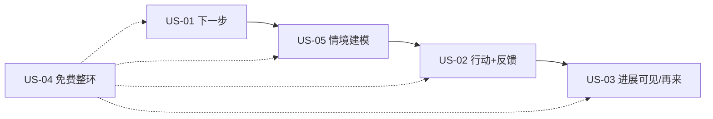

# User Stories — MVP 核心故事（收敛版）

> **MVP 核心 User Story = 5 条（Must）。** 其余进 Later。  
> 每条含：用户 · 场景 · 问题 · 期望结果 · GL · 成功指标。  
> 禁止 Feature / UI 语言。

对齐 Primary Problem：[[MVP_Core_Problem]]  
课内教学契约：[[features/SPEC-GL-002_NPC_Guided_Lesson]]（D-056）

**Must 确认：** User Stories = **5**（US-01…US-05）

---

## Must — 核心 5 条

### US-01 明确下一步

| 字段 | 内容 |
|------|------|
| 用户 | 职场补技能学习者（假设主焦点） |
| 场景 | 已有大致学习方向（如「补 Python / 补后端」），面对大量教程不知从何练起 |
| 问题 | **Primary / SP-1：** 缺少与自身目标匹配的成长路径，不知道下一步如何提升 |
| 期望结果 | 用户能说出「接下来我该做什么」，无需自己在内容海里猜优先级 |
| Growth Loop | **GL-1（最低必要）→ GL-2（最低必要）→ GL-3（主）** |
| 成功指标 | Activation；「不知下一步」护栏 |
| 证据 | **Hypothesis** |

---

### US-02 行动并获得可信反馈

| 字段 | 内容 |
|------|------|
| 用户 | 同上 |
| 场景 | 已有明确下一步，开始一次短学习行动（练习或目标向提问） |
| 问题 | **Primary / SP-2：** 缺少持续可信的反馈机制 |
| 期望结果 | 单次会话内完成行动，并得到可理解、诚实边界的反馈，知道如何改 |
| Growth Loop | **GL-4 + GL-5（主）** |
| 成功指标 | Activation；WEGS；Learning；无帮助反馈护栏 |
| 证据 | **Hypothesis**（H5） |

---

### US-03 感知进展并愿意再来

| 字段 | 内容 |
|------|------|
| 用户 | 同上 |
| 场景 | 完成至少一轮「下一步 → 行动 → 反馈」 |
| 问题 | **SP-3：** 成长不可见导致动力下降，难以长期坚持 |
| 期望结果 | 用户能指出相对目标的一点具体进展，并清楚为何还要回来（下一小步/下一目标） |
| Growth Loop | **GL-6 + GL-7 + GL-8** |
| 成功指标 | Retention；Learning Effect；WEGS |
| 证据 | **Hypothesis** |

---

### US-04 免费完成最小成长闭环

| 字段 | 内容 |
|------|------|
| 用户 | 尚未付费的学习者 |
| 场景 | 第一次完整走通「定向 → 行动反馈 → 感到进展」 |
| 问题 | 若免费被残缺阻断，主问题永远验证不了（原则 9） |
| 期望结果 | 不付费也能完成 US-01～US-03 的最小价值闭环；不出现「不付费就不能成长」 |
| Growth Loop | **GL-1…GL-8 最小路径** |
| 成功指标 | Retention；Monetization Signal 基础（非付费 KPI） |
| 证据 | 原则 9 **Confirmed**；效果 **Hypothesis** |

---

### US-05 情境引导建立心智模型再验收

| 字段 | 内容 |
|------|------|
| 用户 | 同上 |
| 场景 | 进入单课学习（含故事/正常概念呈现） |
| 问题 | 一上来裸做题或纯教材腔，难以建立可迁移心智模型，易误伤与放弃 |
| 期望结果 | 固定 NPC / 情境以困境引出概念与易错点，用户先建模再完成验收题；判定仍诚实可信（可与 US-02 同一次行动叠加） |
| Growth Loop | **GL-4 + GL-5（主）**（单课教学形态） |
| 成功指标 | Learning；Activation；回访意愿（Q-A8） |
| 证据 | **Hypothesis**（D-056）；细则 [[features/SPEC-GL-002_NPC_Guided_Lesson]] |
| 优先级 | Must |

---

## 核心闭环（推荐）

**推荐 MVP 价值闭环：**  
定向（下一步）→ **情境建模（先懂）** → 行动 + 可信反馈 → 进展可见并续环；且全程免费可跑通。

---

## Later — 移出本 MVP Must

| 原条目 | 为何 Later |
|--------|------------|
| 独立「深度目标工作坊」 | 超出 SP-1 最小必要 |
| 独立「完整能力评估体系」 | 超出 SP-2 最小必要 |
| 独立「下一目标管理系统」 | 并入 US-03 最小续环即可 |
| 增强价值 / WTP 说明（原 US-10） | 非主问题；有信号后再做 |
| 复杂个性化引擎 | 验证主问题后再加深 GL-3 |
| 跨课长剧情 / 好感度 | Hard No / D-056 禁止 |

可保留为后备故事 ID（不进入 Must 验收）：

### US-L01 理解增强价值（Later）

| 字段 | 内容 |
|------|------|
| 用户 | 已感到免费有用的学习者 |
| 场景 | 遇到强度/深度天花板 |
| 问题 | 想更快/更深，但尚不需要本 MVP 验证 |
| 期望结果 | 理解增强价值是什么（不强迫付费） |
| Growth Loop | 增强 GL-3/5/7 |
| 成功指标 | Monetization Signal；WTP Signal |
| 优先级 | Later |

---

## Founder Review

- [ ] 核心 5 条是否仍过多/过少？  
- [ ] US-05 与 US-02 边界是否清晰（建模 vs 判定）？  

## 相关文档

- [[MVP_Core_Problem]] · [[Acceptance_Criteria]] · [[features/SPEC-GL-002_NPC_Guided_Lesson]] · [[Phase3_PRD_Review_Report]]
