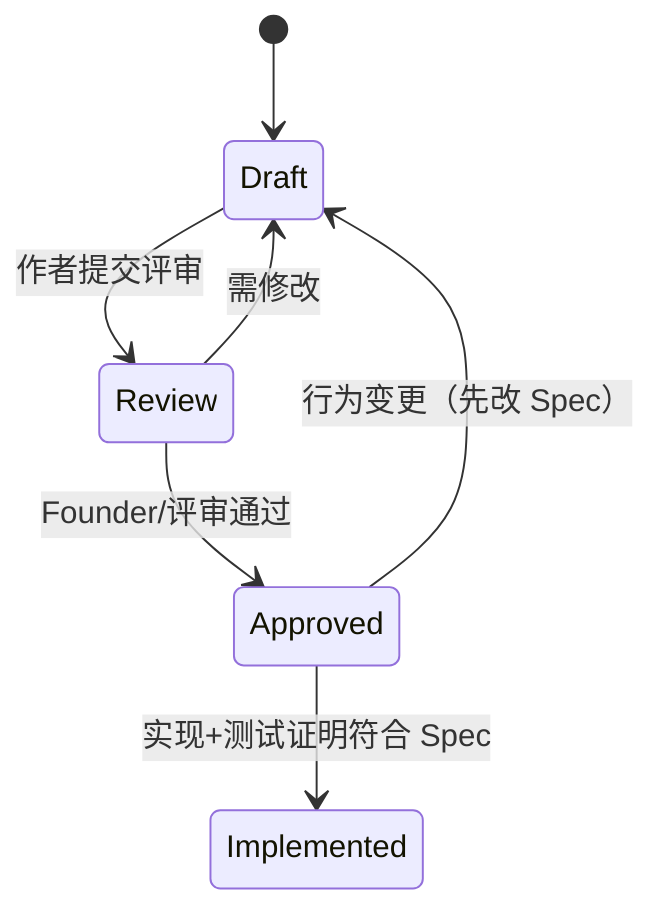

# Spec Status — 规格状态机

## 状态机



| 状态 | 含义 | 允许 |
|------|------|------|
| **Draft** | 撰写中 | 改文档 |
| **Review** | 待评审 | 评论；不实现 |
| **Approved** | 已批准契约 | 可进入 Architecture / 实现门禁讨论 |
| **Implemented** | 已有实现证明符合 Spec | 回归以 Spec 为准 |

**Planned**（仅用于 [[Feature_Index]]）：已预定题目，**尚无正文** — 不是状态机四态之一。

## 强制规则

1. **Approved 之前禁止实现**（无业务代码 / UI / API / DB 落地）。  
2. **改行为必须先改 Spec**，再改实现；禁止「代码先漂再补文档」。  
3. Review → Approved 须核对：PRD/US/AC 引用、GL 映射、Hard No、D-039、原则 9。  
4. Implemented 须有 Test Mapping 可追溯（可先手工）。  

## 与 SDD

```text
PRD Approved ──► Spec Draft → Review → Approved ──► Architecture/ADR ──► Code → Test
```

当前：**SPEC-GL-001 = Approved**（见 [[features/SPEC-GL-001_First_Growth_Experience]]）。  
实现前须 Architecture / 必要 ADR；禁止无 Arch 的业务编码。
