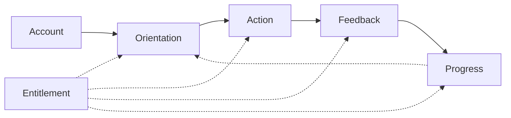
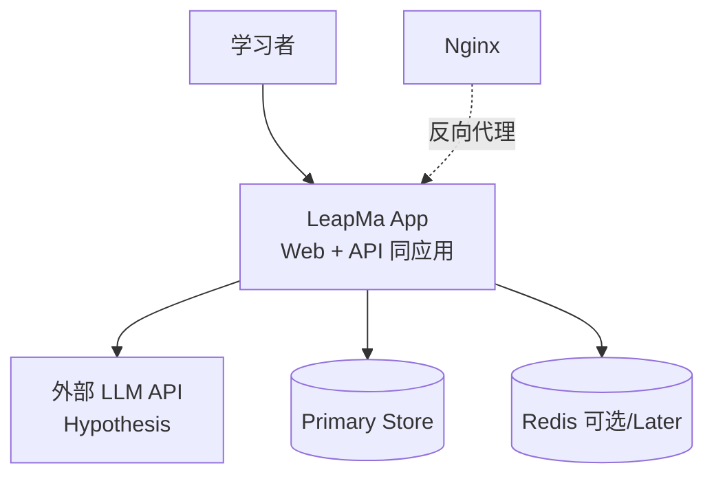
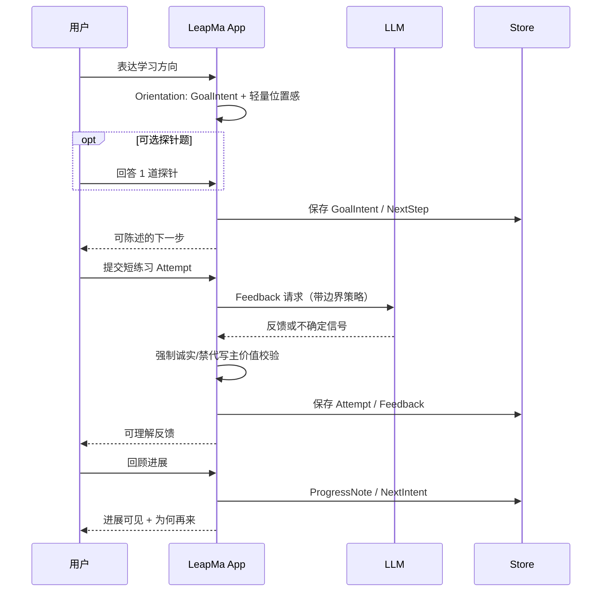

# Architecture — SPEC-GL-001 First Growth Experience

> **状态：Approved**（Founder 已拍板）  
> 可追溯 Spec：[[features/SPEC-GL-001_First_Growth_Experience]] **Approved**  
> 约束：D-031 / D-033 / D-039；Hard No 见 [[MVP_Out_of_Scope]]  
> 栈：ADR-0001 / ADR-0002 **Accepted**  
> **实现：** 仍须 Founder **显式授权**垂直切片代码；本文件不授权编码
## 1. 可追溯性

| Spec 要素 | 本架构如何承接 |
|-----------|----------------|
| User Flow 1–7 | 逻辑模块串联：定向 → 行动 → 反馈 → 进展/续环 |
| GL-1…8 最小路径 | 见 §3；单应用内模块，不拆 8 服务 |
| AC-01…04 / AI Behavior | 反馈管线强制诚实边界；免费能力集不可被付费墙切断 |
| D-039 | 只支撑验证闭环，不做平台完整架构 |

## 2. 目标与非目标

### 目标

- 为 First Growth Experience 提供**可实现边界**：模块、数据概念、AI/免费护栏
- 单人可维护；本地 Docker Compose 友好（Hypothesis：部署形态）
- 映射 SPEC-GL-001，使垂直切片有据可依

### 非目标（架构拒绝）

| Hard No / 非目标 | 架构态度 |
|------------------|----------|
| 课平台 / SKU 货架 | 不建 Catalog/CourseSKU 域 |
| 社区 / 论坛 | 不建 Feed/UGC/匹配服务 |
| 招聘 | 不建 Job/Resume 域 |
| IDE / 工程工作台 | 不建 Workspace/Debugger 容器 |
| 代码生成作主价值 | Feedback 管线禁止「代写整项目」主路径 |
| 复杂游戏 | 不建联赛/段位/连胜经济 |
| K8s / 微服务拆分 | 本阶段拒绝 |
| 因有 PHP 默认 PHP | 拒绝；选型见 ADR 利弊 |

## 3. SPEC / Growth Loop → 逻辑模块

**原则：** 逻辑边界，**不是**微服务。建议一个可部署的 **LeapMa App**（进程内模块或清晰包边界即可）。

| 模块 | 服务 GL | Spec User Flow | 职责（最小） |
|------|---------|----------------|--------------|
| **Account（最小）** | 横切 | — | 识别用户（可匿名会话起步 → 轻量账户）；**不**做复杂身份平台 |
| **Orientation（定向）** | GL-1, GL-2, GL-3 | 步骤 1–3 | GoalIntent 澄清；对话推断 + 可选 1 探针；产出 NextStep |
| **Action（行动）** | GL-4 | 步骤 4 | 短练习为主、提问为辅；记录 Attempt；单次会话可结束 |
| **Feedback（反馈）** | GL-5 | 步骤 5 | 调用 AI；落实允许/禁止/不确定；产出 Feedback |
| **Progress（进展/续环）** | GL-6, GL-7, GL-8 | 步骤 6–7 | ProgressNote（用户能指出进展）；NextIntent（为何再来） |
| **Entitlement（权益）** | 横切 US-04 | 全路径 | 声明「免费闭环能力集」；**禁止**对核心环设付费墙 |

## 4. 系统上下文（C4 容器级）

| 容器 | 职责 | 拥有数据 | 备注 |
|------|------|----------|------|
| **LeapMa App** | 定向/行动/反馈/进展/账户/权益；**简单 Web，服务端渲染优先** | 业务实体 | 单应用；非复杂 SPA；非纯 CLI 产品（AQ-001） |
| **外部 LLM** | 生成反馈/对话推断/探针辅助 | 无（请求内） | **不锁厂商**；必须可替换 Provider（AQ-002） |
| **Primary Store** | 持久化会话与成长实体 | 是 | ADR-0002 **Accepted**：MySQL |
| **Redis** | 会话/限流等 | 可选 | **Later**；首切片非必须 |
| **Nginx** | TLS/反代 | 无 | 环境已有；非业务逻辑 |

环境清单见 [[Development_Environment]]（环境 ≠ 强制栈）。

## 5. 关键流程（价值路径，非 UI）

**Entitlement 校验点：** Orientation / Action / Feedback / Progress 的**核心能力**对未付费用户一律放行（AC-04）。付费增强（若有）只能挂在非必需路径。

## 6. 数据概念（产品级实体，非 DDL）

| 实体 | 含义 | 主要模块 |
|------|------|----------|
| **UserRef** | 用户或匿名会话标识 | Account |
| **GoalIntent** | 一句话目标意图 / 成功定义 | Orientation |
| **PositionHint** | 轻量位置感（对话推断结果 ± 探针结果） | Orientation |
| **NextStep** | 可陈述、可执行的下一步学习行动 | Orientation → Action |
| **Exercise** | 短练习内容（主路径） | Action |
| **Attempt** | 用户一次提交/作答 | Action |
| **Feedback** | 对错/改进点或坦诚不确定 | Feedback |
| **ProgressNote** | 相对目标的 ≥1 点具体进展（用户可指出） | Progress |
| **NextIntent** | 再来方向（下一小步或下一目标意图） | Progress |
| **EntitlementProfile** | 免费闭环能力集 vs 增强能力（增强 Later） | Entitlement |

> **禁止**在本阶段把上述实体展开为完整 ER / 迁移脚本当「实现」。DDL 属实现任务。

## 7. AI 反馈边界如何落实（架构）

对齐 Spec AI-001…004；实现前须在 Feedback 模块固化策略（**Hypothesis**：具体中间件形态）。

| Spec 规则 | 架构落实 |
|-----------|----------|
| 允许：对错、改进点、目标相关讲解 | Feedback 主路径 prompt/策略只服务「改错再练」 |
| 禁止：伪造权威 | 输出须带置信/不确定通道；高不确定时走「坦诚」分支 |
| 禁止：代写整项目作主价值 | **拒绝策略**：检测「整项目代写」意图 → 降级为短练习引导（Hard No） |
| 不确定时坦诚 + 有效下一步 | Feedback schema 允许 `uncertain=true` + `next_hint`；禁止静默编造 |
| 禁止空夸奖/假等级代替进展 | Progress 模块不接受「无相对目标证据」的等级暴涨；ProgressNote 以用户可指出的具体点为准 |

**信任边界：** LLM 输出不可信；App 侧校验后再持久化/展示。  
**Provider：** 必须可替换（接口隔离）；不锁厂商（AQ-002）。

## 8. 免费闭环如何不可被付费墙切断

| 规则 | 架构含义 |
|------|----------|
| D-031 / AC-04 | `EntitlementProfile.free` **必须包含** Orientation+Action+Feedback+Progress 全能力 |
| 付费增强 | 仅可增加效率/深度/个性化（Later）；**不得**作为 AC-01…03 的前置锁 |
| 实现护栏 | 任何 `require_paid` 挂在核心环上 = 缺陷；评审/测试必查 |
| Monetization Signal | 可观察意愿；**不**要求支付网关才能跑环（本切片可不建支付） |

## 9. 横切（最小）

| 关注点 | 本切片态度 |
|--------|------------|
| 认证 | 最小：会话 ID → 可选注册；**Unknown** 最终方案 |
| 可观测 | 基础请求日志 + 反馈不确定率（Hypothesis） |
| 失败 | LLM 超时/失败 → 坦诚降级 + 可重试下一步；不伪造完成 |
| 隐私 | Prompt 少传无关 PII；存储最小化（Hypothesis） |

## 10. 技术方向（Accepted）

| 主题 | 决策 | 状态 |
|------|------|------|
| 运行时 | Python 单应用（Web + AI 编排）；**不锁**具体 Web 框架名 | ADR-0001 **Accepted** |
| UI 形态 | **简单 Web，服务端渲染优先**；非复杂 SPA；非纯 CLI 产品 | AQ-001 **Resolved** |
| 主存储 | MySQL Primary Store | ADR-0002 **Accepted** |
| Redis | 首切片非必须 | Deferred |
| LLM | **不锁厂商**；可替换 Provider；App 侧落实诚实/不确定/禁代写主价值 | AQ-002 **Resolved** |
| PHP / 微服务 / K8s | 不作主栈 / 本阶段拒绝 | Confirmed |

## 11. Architecture Questions

### Resolved

| ID | 定稿 | 状态 |
|----|------|------|
| AQ-001 | 简单 Web，**服务端渲染优先**；非复杂 SPA；非纯 CLI 产品形态 | **Resolved** |
| AQ-002 | 不锁 LLM 厂商；必须可替换 Provider；App 侧落实诚实/不确定/禁代写主价值 | **Resolved** |
| AQ-005 | ADR-0001 / ADR-0002 → **Accepted** | **Resolved** |

### 仍为 Hypothesis（不阻塞 Arch Accepted）

| ID | 问题 | 级别 |
|----|------|------|
| AQ-003 | 匿名会话保留多久、是否强制注册？ | Hypothesis |
| AQ-004 | 探针题内容来源：手写少量 vs LLM 生成？ | Hypothesis |
## 12. 实现护栏（Code 授权后）

**必须：**

- 可追溯到本架构模块与 SPEC-GL-001 AC
- Feedback 落实诚实/不确定/禁代写主价值
- 免费用户可跑通 GL-1…8 最小路径
- Docker Compose 本地可起最小依赖（若采用容器）

**禁止：**

- 无 Arch/ADR Review 的栈漂移
- 引入课平台/社区/招聘/IDE/代码生成主价值/复杂游戏
- 为「将来」拆微服务或上 K8s
- 用付费墙阻断核心环

## 变更记录

| 日期 | 变更 |
|------|------|
| 2026-07-21 | 初稿：SPEC-GL-001 最小架构；待 Founder Review |
| 2026-07-21 | Founder 拍板：Arch **Approved**；AQ-001/002/005 Resolved；ADR-0001/0002 Accepted |
