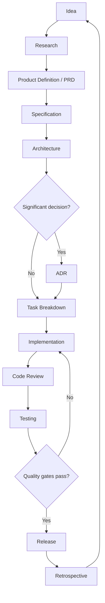

# Development Workflow

LeapMa uses **Specification Driven Development (SDD)**.

Source of Truth chain:

**Vision → Product → Specification → Architecture → Code → Test**

This document describes the full path from idea to release.

## End-to-end flow

## Phase details

### 1. Idea

- Capture the problem, not a solution lock-in.
- Owner: AI CEO / AI Product Manager (with human).
- Output: short problem statement linked to Vision.

### 2. Research

- Location: `docs/01_Research/`
- Template: `docs/templates/Research_Template.md`
- Goal: reduce uncertainty with evidence.
- Research alone does **not** authorize code.

### 3. Product Definition

- Location: `docs/02_Product/`
- Template: `docs/templates/PRD_Template.md`
- Must include users, goals, non-goals, success signals.
- Must cite Vision (and Research when used).

### 4. Specification

- Location: `docs/03_Specifications/`
- Template: `docs/templates/Specification_Template.md`
- Requirements must be testable (IDs + acceptance criteria).
- Ambiguity is fixed in Specs, not in code comments.

### 5. Architecture

- Location: `docs/04_Architecture/`
- Template: `docs/templates/Architecture_Template.md`
- Designs how Specs are realized across `apps/`, `services/`, `packages/`, `infrastructure/`.
- Significant choices → ADR in `docs/05_ADR/`.

### 6. Task Breakdown

- Location: `docs/06_Sprint/` (or linked tracker + Task template)
- Every task cites Spec IDs (and Architecture when relevant).
- No orphan implementation tasks.

### 7. Implementation

- Code lands in `apps/`, `services/`, `packages/`, or `infrastructure/` as designed.
- Follow Cursor rules for the relevant domain.
- If Spec/Architecture is wrong, **stop and update docs** before continuing.

### 8. Code Review

- Use `docs/templates/Review_Template.md` for non-trivial changes.
- AI Reviewer enforces merge gates in `.cursor/rules/review/`.
- Reject SDD violations even if the code “works”.

### 9. Testing

- Strategy in `docs/08_Testing/`; suites in `/tests` and near code.
- Tests assert Specs.
- Failures map back to Spec IDs or produce Spec defect reports.

### 10. Release

- Notes in `docs/09_Release/` via Release Note template.
- Update `CHANGELOG.md`.
- Rollout/rollback plan required for risky changes.

### 11. Retrospective

- Capture what to change in process/docs/rules.
- Feed improvements into Vision/Product/Workflow — not only “try harder”.

## Gate checklist (must pass)

| Gate | Fail condition |
|------|----------------|
| Product | No PRD / no user outcome |
| Spec | Untestable or missing acceptance criteria |
| Architecture | Design missing for non-trivial work |
| ADR | Significant irreversible choice undocumented |
| Review | Secrets, scope creep, doc drift |
| Test | Must-priority acceptance criteria unverified |

## Role ownership by phase

| Phase | Primary role | Supporting |
|-------|--------------|------------|
| Idea | AI CEO | Product |
| Research | Product | Architect |
| Product | AI Product Manager | CEO |
| Spec | Product + Architect | Engineers |
| Architecture | AI Architect | Backend / Frontend / AI Engineer |
| Implementation | Backend / Frontend / AI Engineer | Architect |
| Review | AI Reviewer | All authors |
| Testing | AI QA Engineer | Engineers |
| Release | CEO / Product + Engineers | QA / Ops |
| Retro | All | CEO |

## Working agreements

1. Prefer updating docs over clever code that hides undecided behavior.
2. Prefer small vertical slices that still honor the full gate chain.
3. Prefer ADRs over tribal knowledge.
4. Prefer refusing premature implementation over “temporary” hacks that become permanent.
