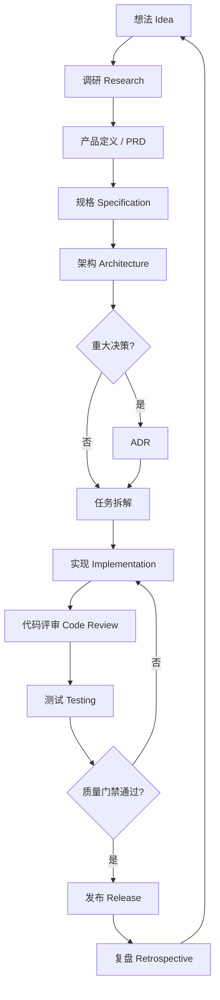
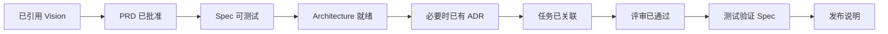

---
title: 开发流程
type: development
status: active
created: 2026-07-20
updated: 2026-07-20
tags:
  - development
  - workflow
  - sdd
  - leapma
---

# 开发流程

LeapMa 采用 **Specification Driven Development（SDD，规格驱动开发）**。

Source of Truth 链路：

**Vision → Product → Specification → Architecture → Code → Test**  
（愿景 → 产品 → 规格 → 架构 → 代码 → 测试）

本文描述从想法到发布的完整路径。

## 端到端流程

## 各阶段说明

### 1. 想法（Idea）

- 先抓住问题，不要锁死方案。
- 负责人：AI CEO / AI 产品经理（在人类监督下）。
- 产出：与 Vision 关联的简短问题陈述。

### 2. 调研（Research）

- 位置：`docs/02_Research/`
- 模板：`docs/templates/Research_Template.md`
- 目标：用证据降低不确定性。
- 仅有 Research **不**授权写代码。

### 3. 产品定义（Product Definition）

- 位置：`docs/03_Product/`
- 模板：`docs/templates/PRD_Template.md`
- 必须包含用户、目标、非目标、成功信号。
- 必须引用 Vision（使用了 Research 时一并引用）。

### 4. 规格（Specification）

- 位置：`docs/04_Specifications/`
- 模板：`docs/templates/Specification_Template.md`
- 需求必须可测试（ID + 验收标准）。
- 模糊在 Spec 中消除，不靠代码注释。

### 5. 架构（Architecture）

- 位置：`docs/05_Architecture/`
- 模板：`docs/templates/Architecture_Template.md`
- 描述 Spec 如何在 `apps/`、`services/`、`packages/`、`infrastructure/` 中落地。
- 重大选型 → `docs/06_ADR/` 写 ADR。

### 6. 任务拆解（Task Breakdown）

- 位置：`docs/07_Sprint/`（或外部追踪器 + Task 模板）
- 每个任务引用 Spec ID（必要时引用 Architecture）。
- 禁止无文档依据的孤儿实现任务。

### 7. 实现（Implementation）

- 代码按设计落入 `apps/`、`services/`、`packages/` 或 `infrastructure/`。
- 遵守对应域的 Cursor Rules。
- 若 Spec/Architecture 有误，**先停下来改文档**，再继续写代码。

### 8. 代码评审（Code Review）

- 非琐碎变更使用 `docs/templates/Review_Template.md`。
- AI 评审员执行 `.cursor/rules/review/` 中的合并门禁。
- 即使代码「能跑」，违反 SDD 也要拒绝。

### 9. 测试（Testing）

- 策略在 `docs/09_Testing/`；套件在 `/tests` 与代码旁。
- 测试断言 Spec。
- 失败映射回 Spec ID，或产出 Spec 缺陷报告。

### 10. 发布（Release）

- 说明放在 `docs/10_Release/`，使用 Release Note 模板。
- 更新 `CHANGELOG.md`。
- 高风险变更须有放量/回滚计划。

### 11. 复盘（Retrospective）

- 沉淀流程/文档/规则的改进点。
- 改进回流到 Vision/Product/Workflow，而不是只「下次更努力」。

## 门禁清单（必须通过）

| 门禁 | 失败条件 |
|------|----------|
| Product | 无 PRD / 无用户结果 |
| Spec | 不可测试或缺少验收标准 |
| Architecture | 非琐碎工作缺少设计 |
| ADR | 重大难回退选型未文档化 |
| Review | 密钥、范围蔓延、文档漂移 |
| Test | Must 级验收标准未验证 |

## 各阶段角色归属

| 阶段 | 主责 | 协作 |
|------|------|------|
| 想法 | AI CEO | 产品 |
| 调研 | 产品 | 架构 |
| 产品 | AI 产品经理 | CEO |
| Spec | 产品 + 架构 | 工程师 |
| Architecture | AI 架构师 | 后端 / 前端 / AI 工程师 |
| 实现 | 后端 / 前端 / AI 工程师 | 架构 |
| 评审 | AI 评审员 | 全体作者 |
| 测试 | AI QA 工程师 | 工程师 |
| 发布 | CEO / 产品 + 工程师 | QA / 运维 |
| 复盘 | 全体 | CEO |

## 工作约定

1. 宁可先改文档，也不要用聪明代码掩盖未决行为。
2. 宁可做仍遵守完整门禁链的小垂直切片。
3. 宁可写 ADR，也不靠口口相传。
4. 宁可拒绝过早实现，也不要让「临时方案」变永久。
