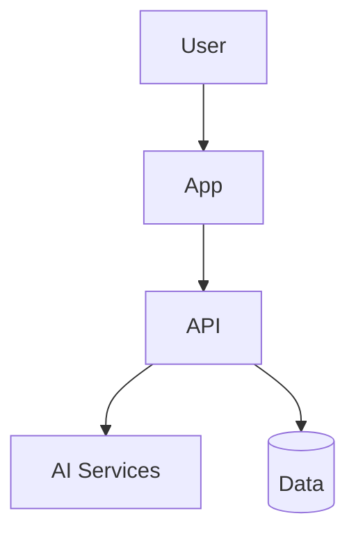
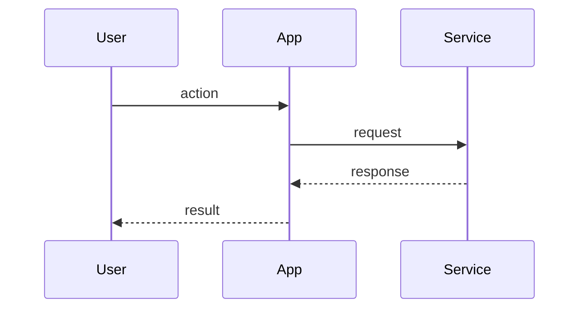

# Architecture — {{title}}

## 1. Traceability

- Specifications covered:
- ADRs:

## 2. Context

What problem in the specs does this design solve?

## 3. Goals & Non-Goals

### Goals

-

### Non-Goals

-

## 4. System Overview

## 5. Containers / Boundaries

| Component | Responsibility | Owns data? | Notes |
|-----------|----------------|------------|-------|
| | | | |

## 6. Key Flows

### Flow A

## 7. Cross-Cutting Concerns

- Authn / Authz:
- Observability:
- Failure modes:
- Security / privacy:

## 8. Alternatives Considered

| Option | Pros | Cons | Decision |
|--------|------|------|----------|
| | | | |

## 9. Open Questions

-

## 10. Implementation Guardrails

What Code **must / must not** do when implementing this design:
-
