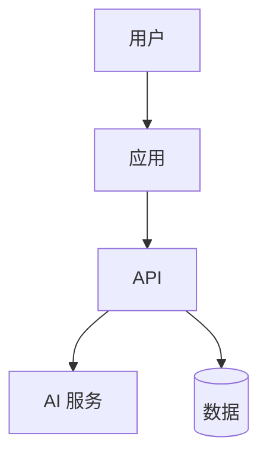
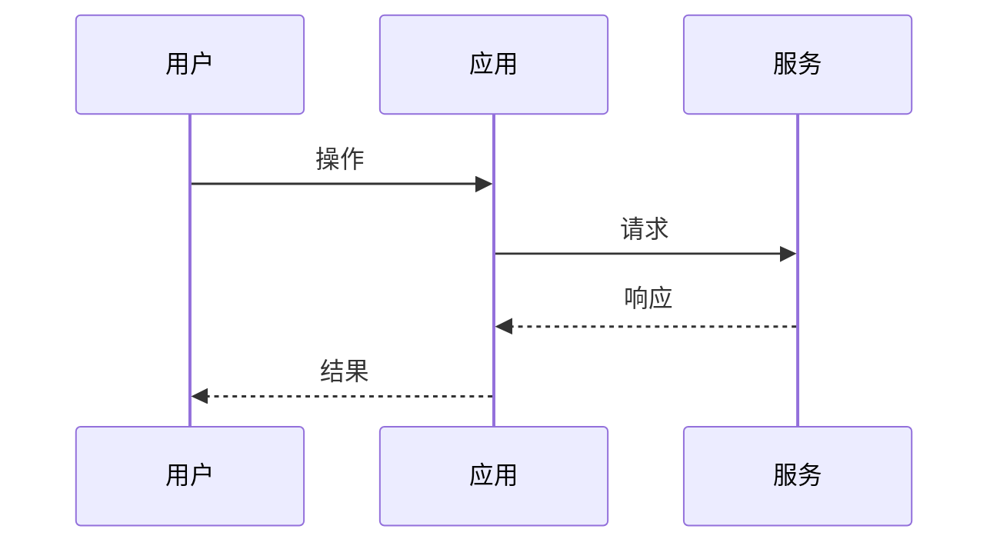

# 架构 — {{title}}

## 1. 可追溯性

- 覆盖的 Specification：
- ADR：

## 2. 上下文

本设计要解决 Spec 中的什么问题？

## 3. 目标与非目标

### 目标

-

### 非目标

-

## 4. 系统概览

## 5. 容器 / 边界

| 组件 | 职责 | 是否拥有数据 | 备注 |
|------|------|--------------|------|
| | | | |

## 6. 关键流程

### 流程 A

## 7. 横切关注点

- 认证 / 授权：
- 可观测性：
- 失败模式：
- 安全 / 隐私：

## 8. 备选方案

| 方案 | 优点 | 缺点 | 结论 |
|------|------|------|------|
| | | | |

## 9. 未决问题

-

## 10. 实现护栏

实现本设计时，代码**必须 / 禁止**做什么：
-
